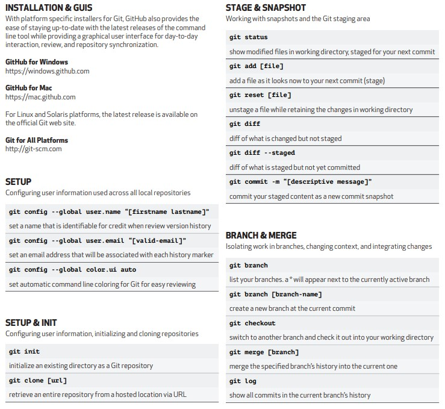

# Versiyon Kontrol Sistemi (Git)

### Bu bölümde alaşıdaki konulara değilnilmiştir.

- Versiyon Kontrolü Nedir ?
- Versiyon Kontrolüne Neden İhtiyacımız Var ?
- Git ile Github arasındaki farklar
- Git temel komutlarını
- proje clonlama ve pull/push işlemlerini
- git readme ile çalışma ve güzelleştirme
- git için kaynaklar : [git-scm.com](https://git-scm.com/doc)

---

## Versiyon Kontrolü Nedir? ve Versiyon Kontrolüne Neden İhtiyacımız Var ?

Dosyaların yada çalışmakta olduğumuz projenin herhangi bir anda kayıt altına alınmasına **versiyon** denir. Versiyon kontrolünü şöyle bir örnek ile açıklayalım. Diyelimki bir projemiz var ve biz de bu projenin belirli bir bölümünü yapacağız. Diğer takım arkadaşlarımızda diğer bölümlerini yapacaklar. Ancak ortak bir noktada buluşarak projeyi birleştirip tek parça haline getirmeli ve çalıştırmalıyız. İşte tam bu esnada ihtiyaç duyduğumuz bu yapı **versiyon kontrolü**'dür.  
Versiyon kontrol sistemleri en basit anlamda **dosyalarınızdaki değişikliklerin tarihçesini takip edip kayıt altında tutan** sistemlerdir. Bu nedenle versiyon kontrol sistemlerini yedekleme veya diğer yazılım geliştirme araçları ile karşılaştırmak doğru olmaz.

## Git ile Github arasındaki farklar

Git, versiyon kontrol sistemi olduğunu yukarıda öğrenmiştik. **GitHub** ise yazılımcılar için bir kod kütüphanesi ve bir çeşit sosyal medya ortamı diyebiliriz. _GitHub_ en sade şekilde GIT versiyon kontrol sistemini kullanan depolama servisi diyebiliriz.

**Başlıca bilmemiz gereken bazı terimler;**

- **untracked (izlenmeyen):** GIT tarafından henüz takip edilmeyen, yani yeni oluşturulmuş dosyaları ifade eder.
- **unstaged (hazırlanmamış):** Güncellenmiş ancak commit’lenmek için hazırlanmamış dosyaları ifade eder.
- **staged (hazırlanmış):** Commit’lenmeye hazır olan dosyaları ifade eder.
- **deleted (silinmiş):** Projeden silinmiş ama GIT üzerinden kaldırılmamış dosyaları ifade eder.

## Git En Çok Kullanılan Temel Komutları

**- git init :** ilk kez proje oluşturuken kullanılan komuttur.
**- git add &#60;file&#62;** commit işleminden önce dosyamızı eklediğimiz komuttur. Yani takibi yapılacak dosyayı girdiğimiz komuttur.
**- git add .(all)** bu komut ile o anda takip edilmesini istediğimiz bütün dosyaları otomatik ekler.
**- git commit -m "açıklama"** eklediğimiz dosyaları versiyonlamak için kullandığımız komuttur.
**- git status** o andaki versiyon durumumuzu öğrenmek için kullandığımız komuttur.
**- git diff** repository üzerinde yapılan değişikliklerden sonra dosyalar arasında oluşan farklılıkları göterir.
**- git checkout branchName** Branch’ler arası veya commit'ler arası geçiş yapmak istediğimizde kullanılır.
**- git push** projemizde aldığımız commit'leri, remote repository'e gönderir. _git push [variable name] master_
**- git pull** Bu komut, uzak sunucudaki değişiklikleri çalışma dizininize getirir ve birleştirir. _git pull [Repository Link]_
**- git clone** mevcut bir Remote Repository'de bulunan dosyaların bilgisayarımızda bir kopyasının oluşturulmasını sağlar.
**- git remote** bu komut, yerel depomuzu uzak sunucuya bağlamak için kullanılır. _git remote add [variable name] [Uzak Sunucu Linki]_

---

**Aşağıdaki resimlerde komutlar ve açıklamaları görülmektedir. İnceleyiniz:**  

## .gitignore Dosyası Ne İşe Yarar? Nasıl Kullanırız?

**.gitignore** dosyası projemizin kök diinine oluşturulan düz bir metin dosyasıdır. Versiyon kontrolü yapılmasını istemediğimiz yada diğer bir ifade ile versiyonlanmasını istemediğimiz dsoyaları belirttiğimiz dosyadır.

**Bu tür dosyalar :**

- Paket yöneticisinden indirilen bağımlılıklar,
- image ve video dosyalarınız(dosya boyutları çok fazla olabilir)
- IDE eklentileri( örneğin .vscode)
- Sadece kendi çalışma alanınızda olması gereken başkaları tarafından görülmemesi gereken dosyalarınız (veritabanınıza ilişkin konfigürasyonlar)
- API anahtarları, kimlik bilgileri veya hassas bilgiler içeren dosyalar(.env)
- Çalışma dizinizdeki geçici dosyalar
- Log dosyaları
- Yararsız sistem dosyaları (örneğin MacOS işletim sisteminin .DS_Store dosyası )
- dist gibi oluşturulan dosyalar
- Veya herhangi bir dosyanız da olabilir.

oluşturmak için terminalden _$ touch .gitignore_ yapabilir yada manual olarakoluşturabiliriz.

**SONUÇ OLARAK**
Bu eğitim de git nedir, neden git'e ihtiyaç duyarız, temel git komutları nelerdir ve bu temel komutlar ile nasıl bir versiyonlama oluştururuz ya da gitHub'ta açtığımız bir repoya nasıl push yaparız bunlara kabaca değindik. Daha iyi anlamak için bu komutlar ile uygulama yapmak önerilir.
Beklentilerinizi karşılaması dileklerimle...

_KAYNAKLAR_

- Bolca Google (#Google)
- Patika.dev
- Kodluyoruz.org
