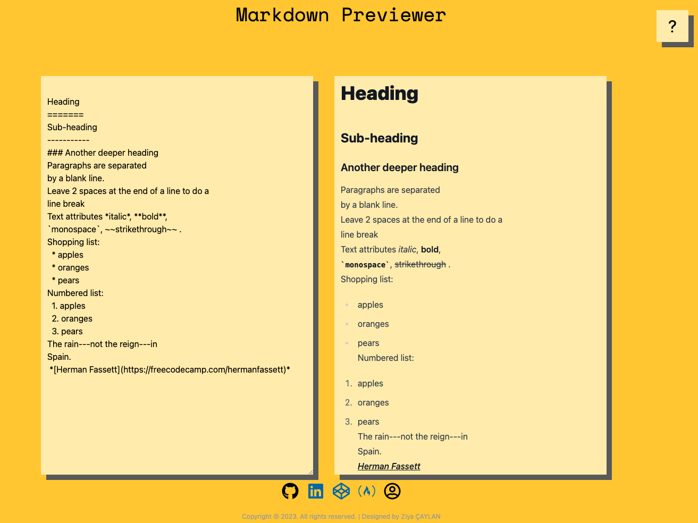

# Redux-TextGeneratorApp

## DEMO : https://ziyac-markdown-maker-app.netlify.app/

---

## Technology stack

- React.js
- Redux store
- reduxjs/toolkit
- axios
- tailwind.ui
- react-markdown
- remark-gfm

---

## Project Skeleton

```
|----README.md
├── public
│ ├── favicon.ico
│ ├── index.html
│ ├── logo192.png
│ ├── manifest.json
│ └── robots.txt
├── src
│ ├── assets
│ │ ├── screenShot.png
│ ├── components
│ │ ├── Content
│ │ │ └── index.js
│ │ ├── Footer
│ │ │ └── index.js
│ │ └── Header
│ │ └── index.js
│ ├── redux
│ │ ├── markdownSlice
│ │ │ └── index.js
│ │ └── store.js
│ ├── App.css
│ ├── App.js
│ ├── index.css
│ └── index.js
├── postcss.config.js
├── .gitignore
├── package-lock.json
├── package.json
└── tailwind.config.js
```

## Author

- Author - [Ziya ÇAYLAN]

---

## Contact

<p align="center">
<a href="https://codesandbox.io/u/ziyacaylan" target="blank"></a>
<a href="https://codepen.io/ziya-c" target="blank"></a>
<a href="https://www.linkedin.com/in/ziya-caylan/" target="blank"></a>
<a href="https://medium.com/@ziyacaylan" target="blank"></a>
</p>

---


