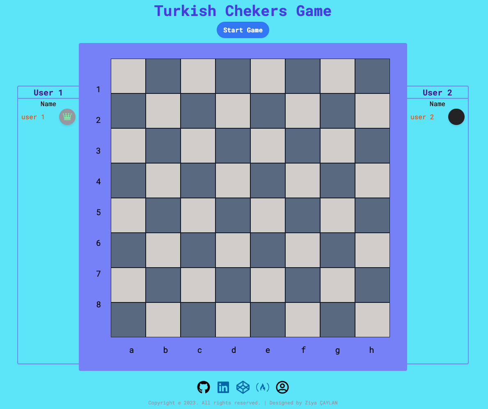
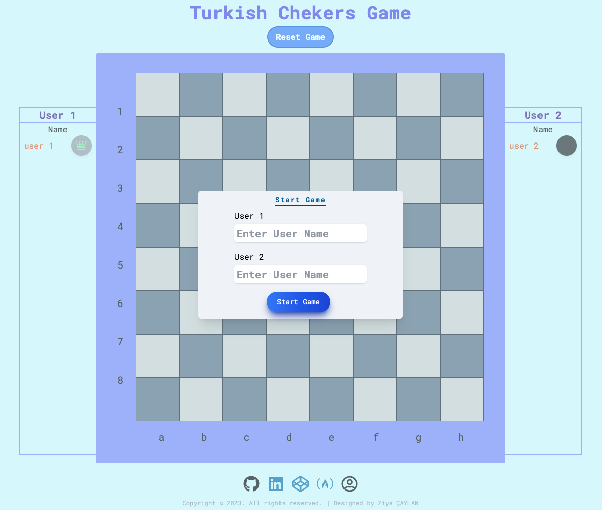
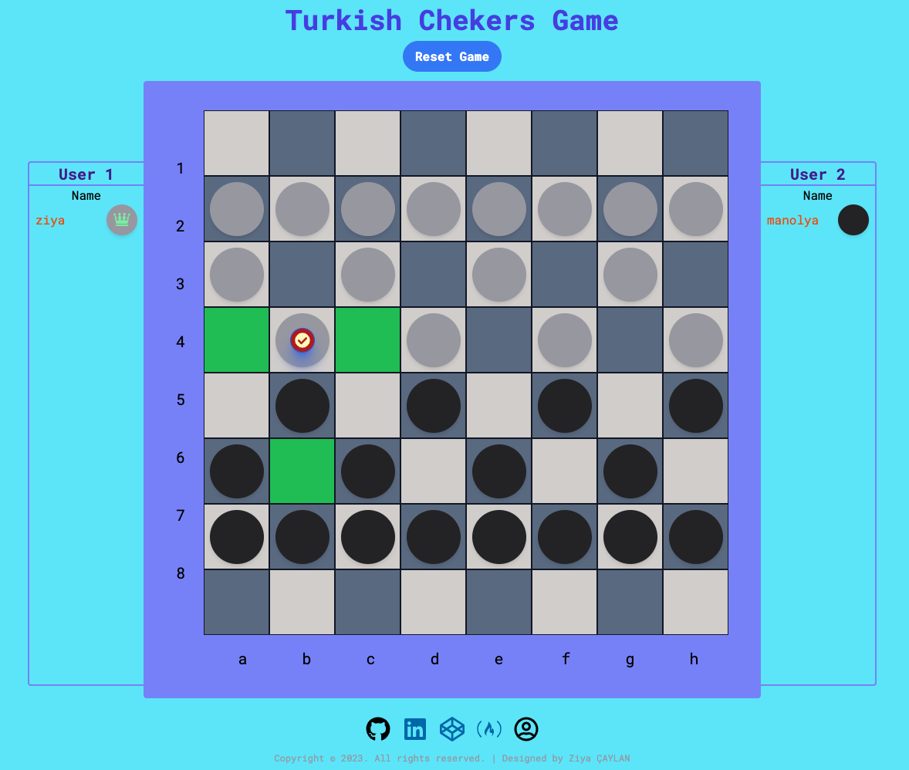
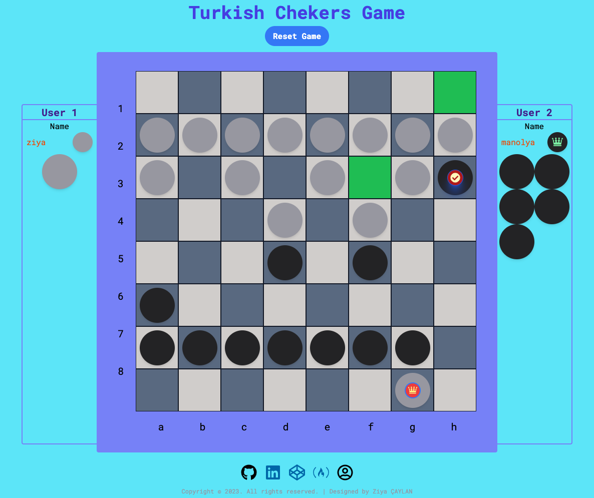
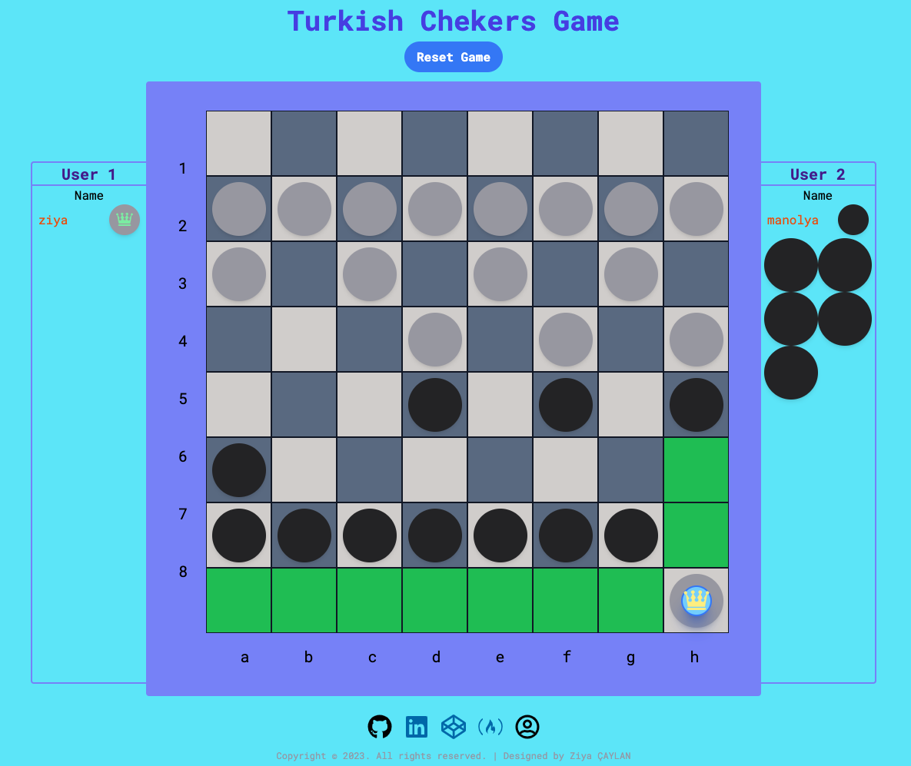
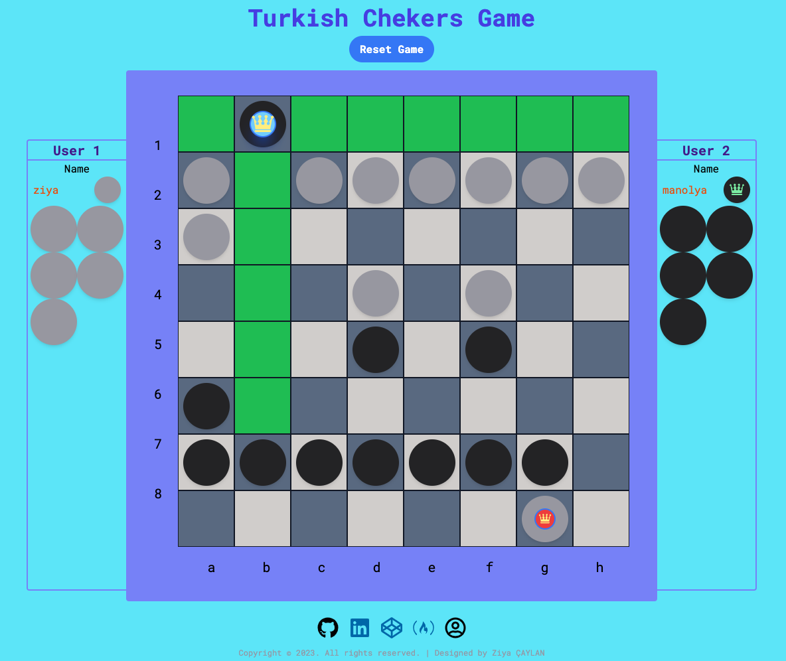
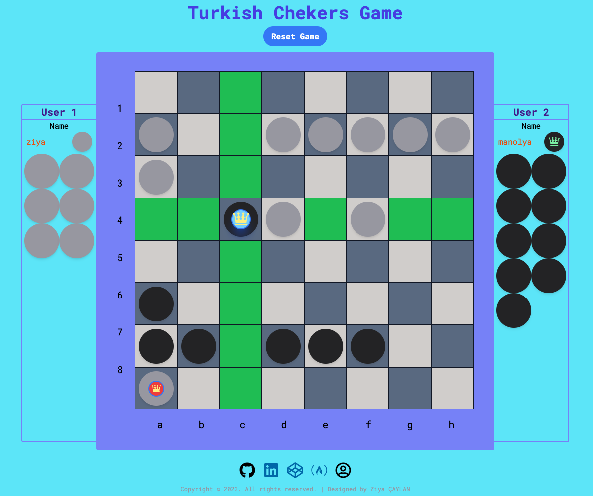
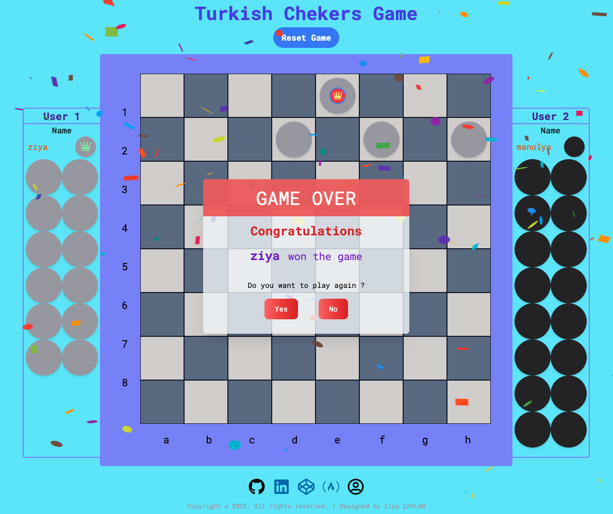

# Redux-Turkish-Checkers-App

## DEMO : [ziyac-checkers-game-app](https://ziyac-checkers-game-app.netlify.app/)

---

## Technology stack

- React.js
- Redux store
- reduxjs/toolkit
- tailwind.ui
- react-icons
- react-confetti
- react-hot-toast
- react-modal

---

## Project Skeleton

```
|----README.md
├── public
│ ├── checkers.ico
│ ├── checkers.png
│ ├── index.html
│ ├── logo192.png
│ ├── manifest.json
│ └── robots.txt
├── src
│ ├── assets
│ │ ├── backgroundImg_2.jpeg
│ │ ├── screenshot-1.png
│ │ ├── screenshot-2.png
│ │ ├── screenshot-3.png
│ │ ├── screenshot-4.png
│ │ ├── screenshot-5.png
│ │ ├── screenshot-6.png
│ │ ├── screenshot-7.png
│ │ └── screenshot-8.png
│ ├── components
│ │ ├── Board
│ │ │ ├── Cell
│ │ │ │ └── index.jsx
│ │ │ ├── Row
│ │ │ │ └── index.jsx
│ │ │ └── index.jsx
│ │ ├── MainContainer
│ │ │ └── index.jsx
│ │ ├── Modals
│ │ │ ├── Confetti
│ │ │ │ └── index.jsx
│ │ │ ├── GameOver
│ │ │ │  └── index.jsx
│ │ │ ├── StartGameModal
│ │ │ │  └── index.jsx
│ │ │ └──WarningModal
│ │ │    └── index.jsx
│ │ ├── ScoreBoard
│ │ │ └── index.jsx
│ │ ├── Stone
│ │ │ └── index.jsx
│ ├── redux
│ │ ├── GameSlice
│ │ │ └── index.js
│ │ └── store.js
│ ├── utils
│ │ └──  chekers
│ │   └── index.js
│ ├── App.js
│ ├── index.css
│ └── index.js
├── .gitignore
├── package-lock.json
├── package.json
└── tailwind.config.js
```

## Author

- Author - [Ziya ÇAYLAN]

---

## Contact

<p align="center">
<a href="https://codesandbox.io/u/ziyacaylan" target="blank"></a>
<a href="https://codepen.io/ziya-c" target="blank"></a>
<a href="https://www.linkedin.com/in/ziya-caylan/" target="blank"></a>
<a href="https://medium.com/@ziyacaylan" target="blank"></a>
</p>

---









