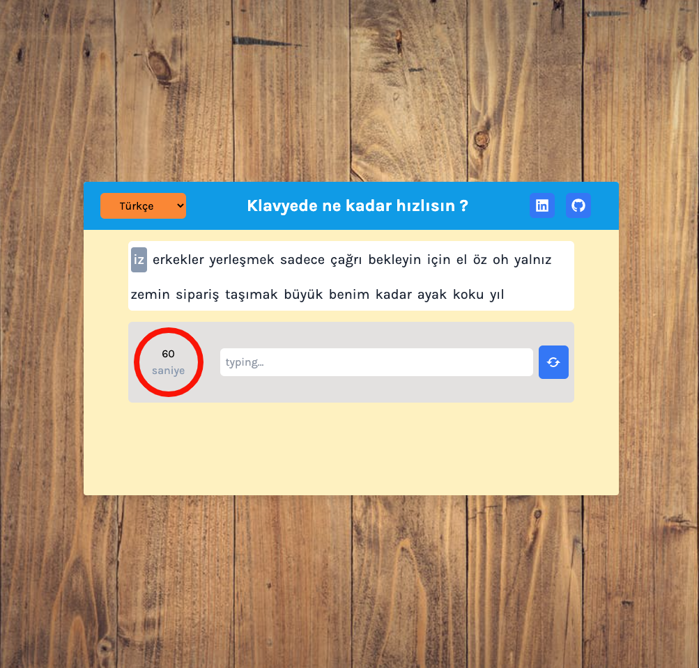
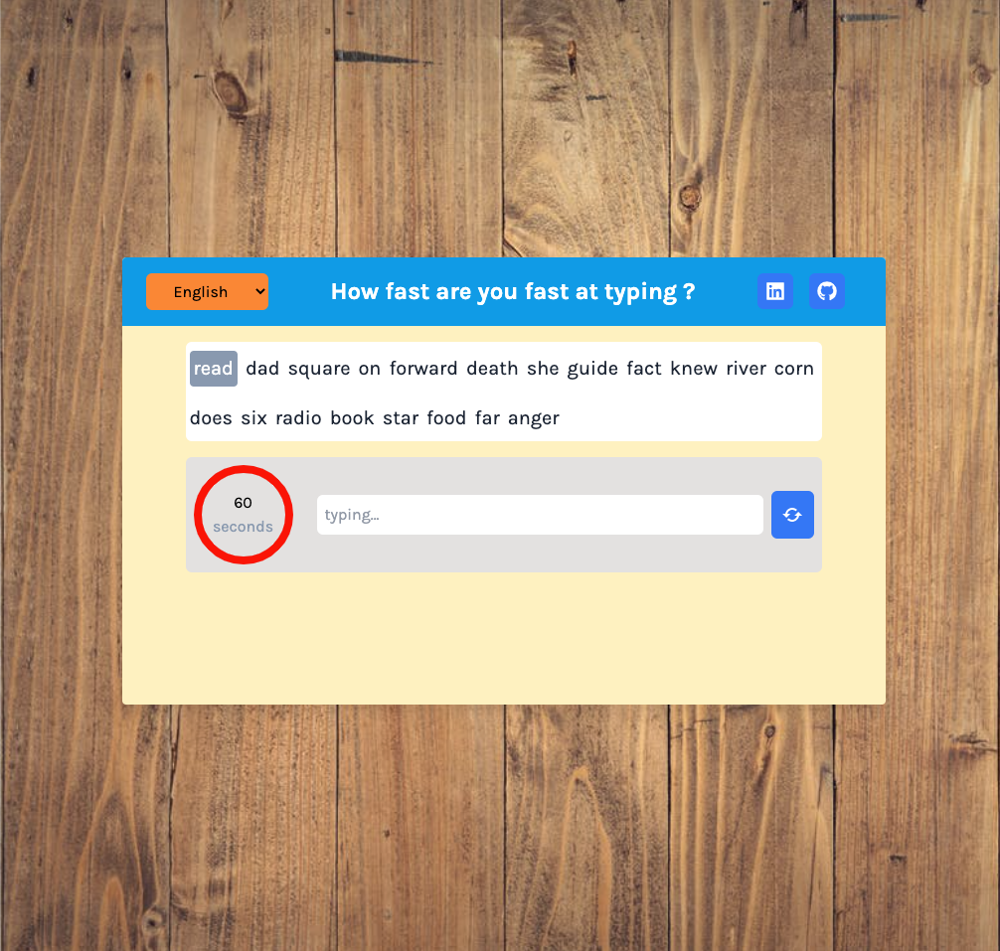
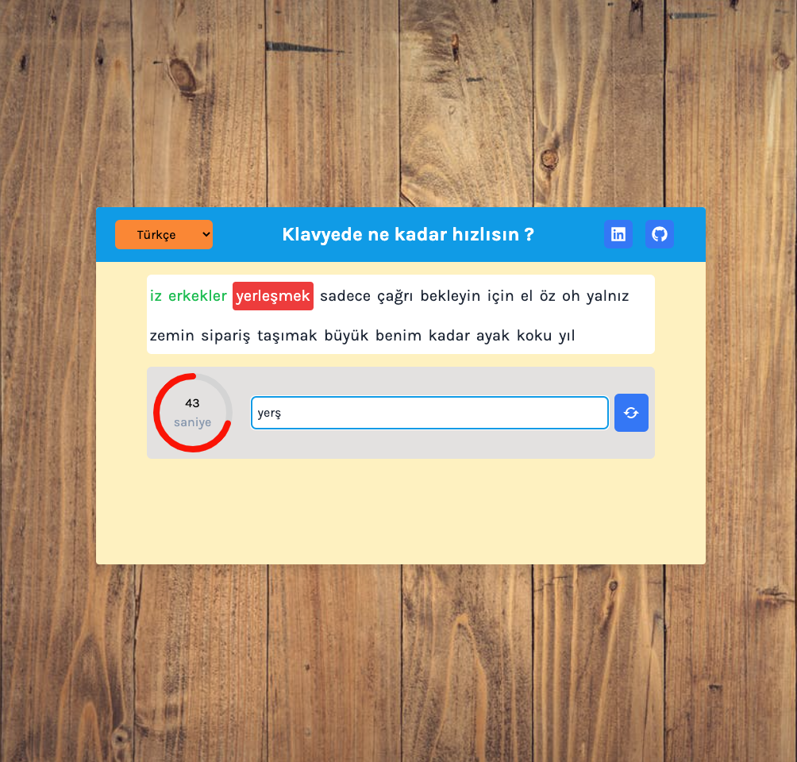
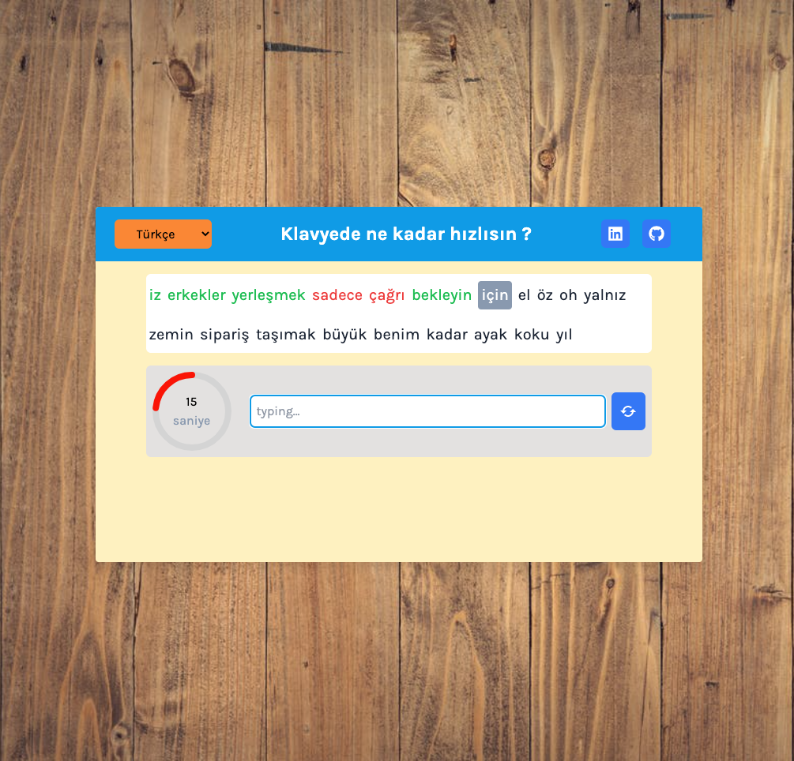
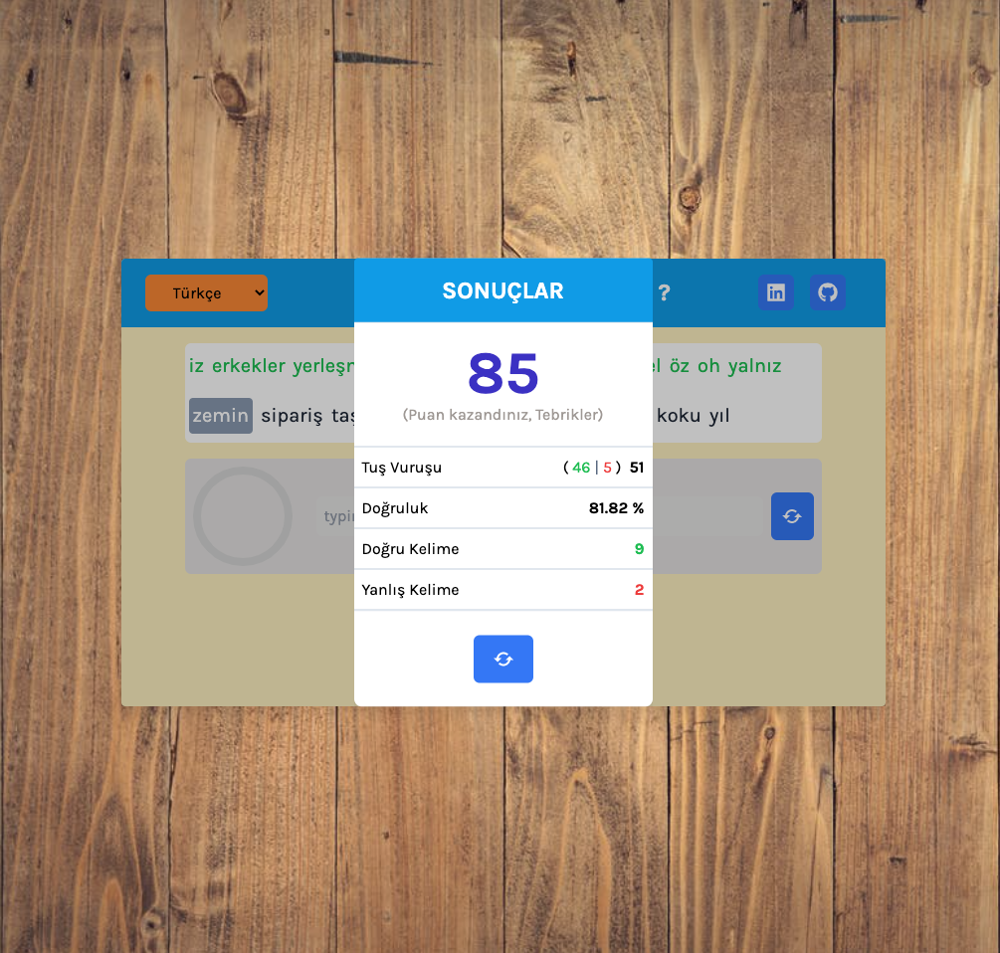

# Redux-TextGeneratorApp

## DEMO : https://ziyac-typing-speed-app.netlify.app/

---

## Technology stack

- React.js
- Redux store
- reduxjs/toolkit
- tailwind.ui
- react-icons

---

## Project Skeleton

```
|----README.md
├── public
│ ├── favicon.ico
│ ├── index.html
│ ├── logo192.png
│ ├── manifest.json
│ ├── weather_logo.png
│ ├── weather.ico
│ └── robots.txt
├── src
│ ├── assets
│ │ ├── backgroundImg_2.jpeg
│ │ ├── screenshot-1.png
│ │ ├── screenshot-2.png
│ │ ├── screenshot-3.png
│ │ ├── screenshot-4.png
│ │ └── screenshot-5.png
│ ├── components
│ │ ├── InputSection
│ │ │ ├── CircleTimer
│ │ │ │ └── index.jsx
│ │ │ ├── ResultModal
│ │ │ │  └── index.jsx
│ │ │ └── index.jsx
│ │ ├── Main
│ │ │ └── index.jsx
│ │ ├── WordsSection
│ │ │ └── index.jsx
│ │ └── Header
│ │ └── index.jsx
│ ├── Mock
│ │ └── wordData.json
│ ├── redux
│ │ ├── wordSlice
│ │ │ └── index.js
│ │ └── store.js
│ ├── App.js
│ ├── index.css
│ └── index.js
├── .gitignore
├── package-lock.json
├── package.json
└── tailwind.config.js
```

## Author

- Author - [Ziya ÇAYLAN]

---

## Contact

<p align="center">
<a href="https://codesandbox.io/u/ziyacaylan" target="blank"></a>
<a href="https://codepen.io/ziya-c" target="blank"></a>
<a href="https://www.linkedin.com/in/ziya-caylan/" target="blank"></a>
<a href="https://medium.com/@ziyacaylan" target="blank"></a>
</p>

---






