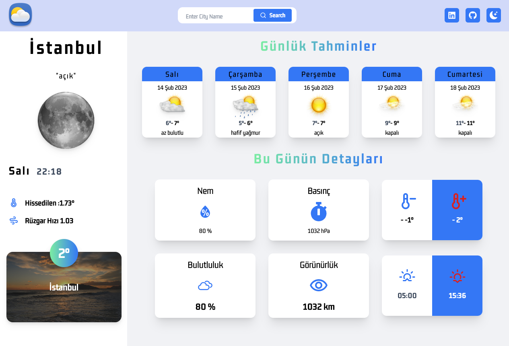
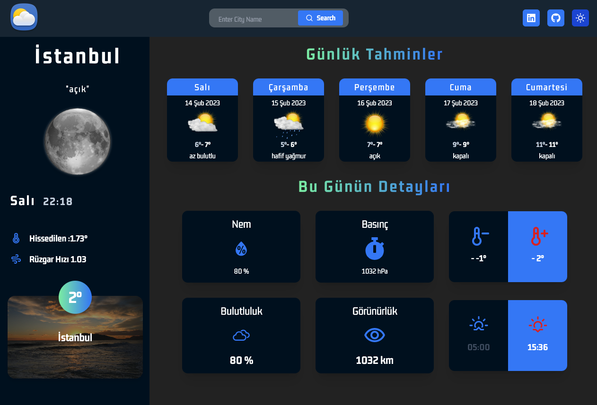

# Redux-TextGeneratorApp

## DEMO : https://weather-app-ziyac.netlify.app/

---

## Technology stack

- React.js
- Redux store
- reduxjs/toolkit
- createAsyncThunk
- axios
- tailwind.ui
- momentjs
- react-hot-toast
- react-icons

---

## Project Skeleton

```
|----README.md
├── public
│ ├── favicon.ico
│ ├── index.html
│ ├── logo192.png
│ ├── manifest.json
│ ├── weather_logo.png
│ ├── weather.ico
│ └── robots.txt
├── src
│ ├── assets
│ │ ├── icons
| | | ├── 01d.png
| | | ├── 01n.png
| | | ├── 02d.png
| | | ├── 02n.png
| | | ├── 03d.png
| | | ├── 03n.png
| | | ├── 04d.png
| | | ├── 04n.png
| | | ├── 09d.png
| | | ├── 09n.png
| | | ├── 10d.png
| | | ├── 10n.png
| | | ├── 11d.png
| | | ├── 11n.png
| | | ├── 13d.png
| | | ├── 13n.png
| | | ├── 50d.png
| | | ├── 50n.png
| | | └── weather_logo.png
│ │ ├── other
| | | ├── error.png
| | | ├── loading.png
| | | ├── screen-dark.png
| | | └── screen-light.png
│ │ └── views
| | | ├── 1.jpeg
| | | ├── 2.jpeg
| | | ├── 3.jpeg
| | | ├── 4.jpeg
| | | ├── 5.jpeg
| | | ├── 6.jpeg
| | | ├── 7.jpeg
| | | ├── 8.jpeg
| | | ├── 9.jpeg
| | | ├── 10.jpeg
| | | ├── 11.jpeg
| | | ├── 12.jpeg
| | | ├── 13.jpeg
| | | ├── 14.jpeg
| | | ├── 15.jpeg
| | | ├── 16.jpeg
| | | ├── 17.jpeg
| | | ├── 18.jpeg
| | | ├── 19.jpeg
| | | └── 20.jpeg
│ ├── components
│ │ ├── Aside
│ │ │ └── index.jsx
│ │ ├── DailyCard
│ │ │ └── index.jsx
│ │ ├── Error
│ │ │ └── index.jsx
│ │ └── Header
│ │ └── index.jsx
│ │ └── Loading
│ │ └── index.jsx
│ │ └── Main
│ │ └── index.jsx
│ │ └── MainContainer
│ │ └── index.jsx
│ │ └── Search
│ │ └── index.jsx
│ ├── redux
│ │ ├── Services
│ │ │ └── index.js
│ │ ├── WeatherSlice
│ │ │ └── index.js
│ │ └── store.js
│ ├── App.css
│ ├── App.js
│ ├── index.css
│ └── index.js
├── .env
├── .gitignore
├── package-lock.json
├── package.json
└── tailwind.config.js
```

## Author

- Author - [Ziya ÇAYLAN]

---

## Contact

<p align="center">
<a href="https://codesandbox.io/u/ziyacaylan" target="blank"></a>
<a href="https://codepen.io/ziya-c" target="blank"></a>
<a href="https://www.linkedin.com/in/ziya-caylan/" target="blank"></a>
<a href="https://medium.com/@ziyacaylan" target="blank"></a>
</p>

---



