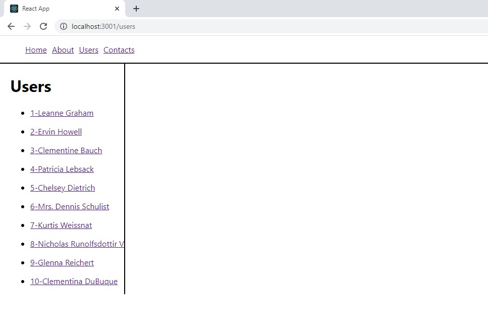
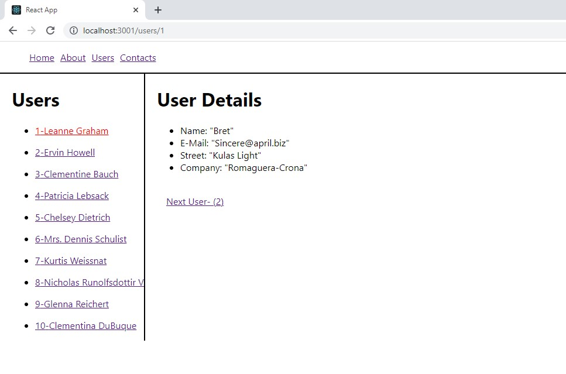

## React Routing

**Kaynaklar : **

- [Patika.dev](Patika.dev)
- [reactrouter.com] (https://reactrouter.com/)

## **[ ---> Patika Profilim](https://app.patika.dev/ziyacaylangmailcom)**

---




---

## 5.9-Routing

Bu kütüphane birleşenleri kullanıldığında sayfalar arası gezinmeler oldukça kolaylaşmaktadır.React geliştiricileri arasında router kütüphanalerinden en çok kullanılanı React Router kütüpahanesindir. Bize etkin şekilde, sayfa yenilenmeden (refresh) diğer bir sayfaya geçmemiz konusunda yardımcı olan bu kütüphane, BrowserRouter, HashRouter, HistoryRouter, MemoryRouter, NativeRouter, Router ve StaticRouter vs. seçenekler ile gelmektedir.
Bu kütüphane ile birlikte gelen hook'ları hem açıklayalım hemde örnek üzerinde inceleyelim. İçerin _version 6_ için yapılmıştır.
**Kurulumu ve Örnek Üzerinde Açıklama**

**Örnek :** Örnek projemizin içeriği aşağıdaki gibi olacak.

- Sayfamızda üst kısımda bir navbarımız olacak Navbar üzerinde Home,About,Users ve Contact linklerimiz olsun
- Users lara tıkladığımızda fake api üzerinden 10 adet user bilgisi çekip isimlerini sayfa içerisinde listeleyelim.
- Listelediğimiz user bilgilerinden herhangi birine tıkladığımızda ise yan tarafta o kullanıcı ait bazı bilgileri listeleyelim.
- Tabi yukarıdaki işlemler yapılırken sayfanın yenilenmemesi, sadece ilgili kısımların yenilenmesi gerekli.
  İşte bu işlemler için react-router kullanacağız.

**_Route_**
Bu en önemli komponentlerden biridir. Görevi bir konum link ile eşleştiğinde bazı komponentleri arayüzde oluşturmaktır. Aşağıdaki kod satırını inceleyelim.

```
import { BrowserRouter, Routes, Route, NavLink, Link } from "react-router-dom";

<Routes>
        <Route path="/" element={<Home />} />
        <Route path="about" element={<About />} />
        <Route path="users" element={<Users />}>
          <Route path=":id" element={<User />} />
        </Route>
        <Route path="contact" element={<Contact />} />
        <Route path="*" element={<Page404 />} />
      </Routes>
```

Yukarıdaki kodlarımıza biraz açıklık getirelim. _path_ ile uyuglamanın konumu bidirilir. Eğer konum _/_ (_path="/"_) ise uygulama <Home /> sayfasına yönlenecektir.
_path="about"_ ise uygulammız <About /> sayfasını görüntüleyecektir. Tabi bu işlemler esnasında sayfamızın yenilenmediğini gözlemleyeceğiz.  
 Diyelim ki user listesindeki herhangi bir isme tıkladığımızda sayfa üzerinde bir bölümde ilgili kullanıcıya ait bize gelen bilgileri görüntüleyelim. Bunu farklı bir örnekle de şöyle düşünebiliriz. Diyelim ki bir blog üzerine tıkladığımızda sayfayı yenilemeden sadece o bloğa ait yorumları görmek istiyoruz. İşteböyle bir durumdada yukarıdaki örnekte de görüldüğü gibi bir yapı kullanmalıyız. Yukarıdaki örneğimizin üzerinden giderek aşağıdaki kısmı üzerinde açıklamaya çalışalım.

```
 <Route path="users" element={<Users />}>
   <Route path=":id" element={<User />} />
 </Route>
```

User bilgilerimizi aynı sayfa üzerinde görüntülemek için _Route_ elementimizi _<Route />_ şeklinde değilde _<Route></Route>_ şeklinde kapattığımıza dikkat ediniz... Ve içerisinde ise user komponenetimizi kullandığımızı görebilirsiniz. V6 ile gelen yapı üzerinde bu şekilde user komponenetimizi çağırabiliyoruz.

**_useParams_**
Bir url de bir parametre gönderdiğimizde bu hook'u kullanırız. Yukarıdaki kod bloğumuzda user komponenetini çağırırken komponente _id_ parametresini gönderdiğimizi görebilirsiniz. İlgili komponenet içerisinde parametre bu hook ile alınamaktadır. Aşağıdaki kod bloğunda user datası api üzerinden çekerken id değerine ihtiyaç duymaktadır ve bu parametre url ile gönderilmiş ve _let { id } = useParams();_ satırında alınarak kullanılmıştır.

**_Outlet_**
Bu hook sayfa içerinde linkimizi hakgi kısımda görüntüleyecek ise o kısımda bir element olarak kullanılır. Route' umuz tıklandığında örneğimizde user detayları hemen users'larımızın sağ tarafında görüntülenecek şekilde sayfa düzenlenmiştir.

```
import { Outlet, NavLink } from "react-router-dom";
import { useState, useEffect } from "react";
import axios from "axios";

let activeStyle = {
  color: "red",
};

export default function Users() {
  const [users, setUsers] = useState([]);
  const [isLoading, setIsLoading] = useState(true);

  useEffect(() => {
    axios("https://jsonplaceholder.typicode.com/users")
      .then((res) => setUsers(res.data))
      .catch((err) => console.log(err))
      .finally(() => setIsLoading(false));
  }, []);
  return (
    <div
      style={{
        marginLeft: "20px",
        paddingRight: "20px",
        display: "flex",
      }}
    >
      <div style={{ borderRight: "solid 2px" }}>
        <h1>Users</h1>
        {isLoading && <h3>Loading...</h3>}
        <ul>
          {users.map(
            (user) =>
              !isLoading && (
                <li>
                  <NavLink
                    style={({ isActive }) => {
                      return {
                        display: "block",
                        margin: "1rem 0",
                        color: isActive ? "red" : "",
                      };
                    }}
                    key={user.id}
                    to={`/users/${user.id}`}
                  >
                    {user.id}-{user.name}
                  </NavLink>
                </li>
              )
          )}
        </ul>
      </div>
      <Outlet />
    </div>
  );
}

```

_<Outlet />_ hook'umuz userslerin bittiği kısmın hemen altında yazıldığını göreceğiz. Çeşitli css ayarlamalarıda yapılarakuser detayları users isimlerinin hemen sağ tarafında görüntülenecektir.

```

import { useState, useEffect } from "react";
import { useParams, Link } from "react-router-dom";

export default function User() {
  let { id } = useParams();

  useEffect(() => {
    axios(`https://jsonplaceholder.typicode.com/users/${id}`)
      .then((response) => setUser(response.data))
      .catch((err) => console.log(err))
      .finally(() => setIsLoading(false));
  }, [id]);
  return (
    <div style={{ paddingLeft: "20px" }}>
      <h1>User Details</h1>
      {isLoading && <h4>Loading...</h4>}

      <br />

      <Link
        style={{ padding: "0 1rem" }}
        to={`/users/${
          parseInt(id) === 10 ? parseInt((id = 1)) : parseInt(id) + 1
        }`}
      >
        Next User- ({parseInt(id) + 1})
      </Link>
    </div>
  );
}

```

**_Link, NavLink_**
Bu iki hook'da aslında aynı işi yapmaktadır ancak NavLink kullandığımızda style bilgileri gibi bazı kısımlarda daha esnek bir kullanım bize sunmaktadır. Daha detaylı bilgi için dokümantasyonu inceleyebilirsiniz.

Şimdi bir proje oluşturup üzerinde inleyelim ve gözlemleyelim.

- Öncelikle projemizi oluşturalım.
- _npm install react-router-dom@6_ komutu ile projemiz oluşturulduğunda react touter ı yükleyerek projemize dahil edelim.
- _npm install axios_ komutu ile api'dan veri çekmek için kullanacağımız yapıyı projemize yükleyerek dahil edelim.
- Şimdi _src_ klasörü altında ilgili komponenetlerimizi oluşturalım.
- Navbar üzerindeki linklere tıkladığımızda ilgili sayfa yüklenip sayfa içeriği görüntülenir. Userslara tıkladığımızda fake api üzerinden gelen 10 adet user bilgisi gelecek ve name'leri sayfaya yüklenecektir. Users name'lerinden birine tıkladığımızda ise hemen yan tarafta user detay bilgilerinden bazı parametreleri listelenecektir.
- Sayfa üzerinde bulunmayan bir linke tıklandığında örneğin _http://localhost:3001/users/sdASDasdASD_ gibi bir link çağırılmaya çalışılsın. _user/_ kısmından sonraki kısım bulunmadığından bir _Page404_ sayfası projemize dahil edelim. Ve linki olmayan bir değer girerek gözlemleyelim.
  inceleyebilirsiniz.

Devamı için üst dizinlere göz atınız...
