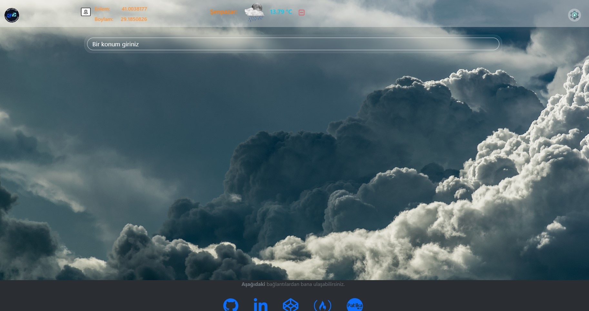
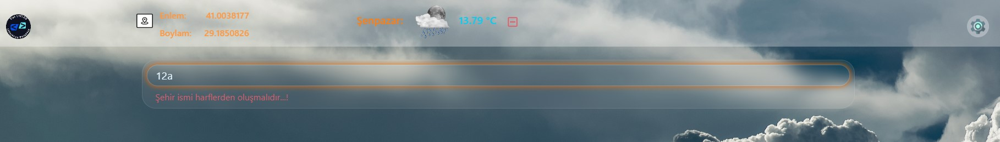
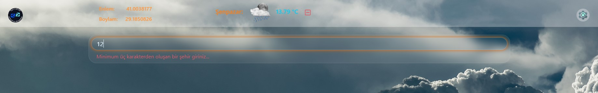
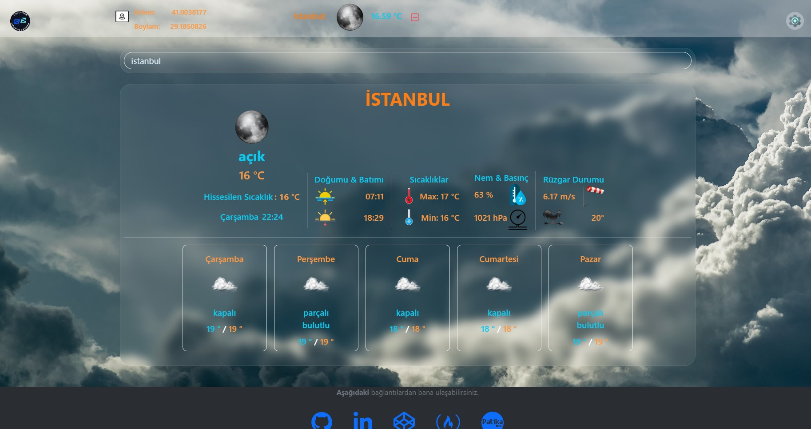
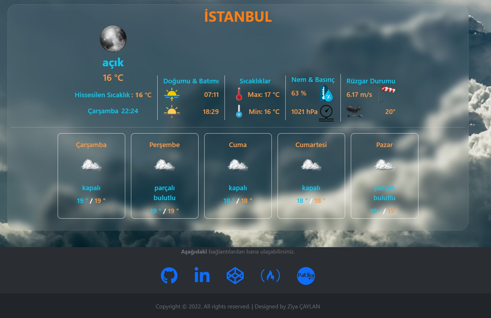

## Patika React Ödev 2

**Projenin Canlı Linki : [https://ziyac-todolist.netlify.app/](https://ziyac-todolist.netlify.app/)**

## **[ ---> Patika Profilim](https://app.patika.dev/ziyacaylangmailcom)**

## KULLANILAN TEKNOLOJİLER

---

✔️ React  
✔️ Context Api  
✔️ Formik  
✔️ Yup  
✔️ Fontawesome  
✔️ Bootstrap  
✔️ Axios  
✔️ Open Weather Api  
✔️ Animation  
✔️ GeoLocation  
✔️ JSON

## EKRAN GÖRÜNTÜLERİ

---

  
  
  
  
  

---
