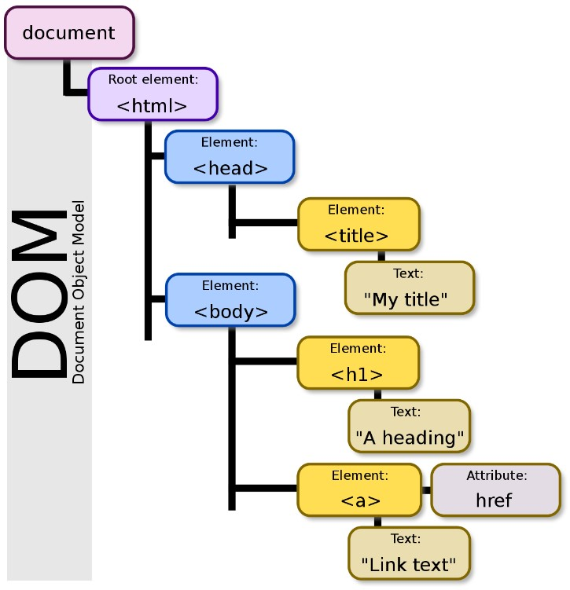
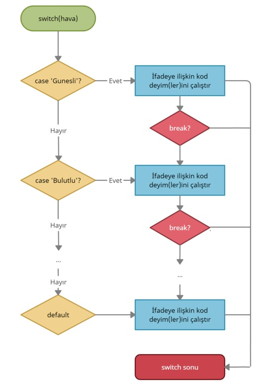
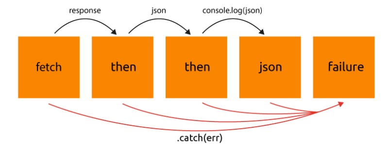

#     

# İÇİNDEKİLER

---

## 4. Javascript Dersleri

## 4.1-Javascript Nedir?

Javascript web programlama alanında yaygın olarak kullanılan dinamik bir programlama dilidir. Etkileşimli ve dinamik web sayfaları geliştirmeye yardımcı olur. İsminden dolayı Java programala dili ile karıştırılır ancak her iki dilde birbirinden çok farklı birer dildir. Aralarındaki benzerlik; yazım şekli ve standart kütüphanelerı dışında bir bağlantı yoktur.

C programlama dilinden türetilmiş, semantiği ve tasarımı ise Self ve Sheme programlama dillerinden esinlenmiştir.

Javascript dili 1997 yılında Netscape şirketinde çalışan Brendan Eich tarafından gliştirilmiştir. İlk çıktığı yıllarda o deneme iat web tarayıcıların büyük çoğunluğu tarafından yorumlanamıyordu ancak Brendan Eich bu dili geliştirmeye devam etti.Brendan Eich o dönemlerde Mozilla Vakfı’nı kurdu. Bu vakıf günümüzde hâlâ Javascript dilini geliştirmeye devam etmektedir.

### 4.2-ECMAScript'in Ortaya Çıkışı

1996 yılının kasım ayında Netscape firması Javascript'in endüstri standardı olarak belirlenmesi amacıyla ECMA International'a (Avrupa Bilgisayar Üreticileri Birliği) başvuruda bulunduğunu ilan etti. Bunun sonucunda standardize edilen sürüm ECMAJcript olarak isimlendirildi ve 1997 yılının haziran ayında ECMA International, ECMA-262 standartları çerçevesinde ilk sürüm ECMAScript (kısaca ES) yanımlandı.Haziran 1998'de ISO/IEC-16262 standardına uyumlu hale getirilecek değişiklikler yapılarak ECMAScript 2, Aralık 1999'da ise ECMAScript 3 yayınlandı.

ECMAScript 4 üzerinde ciddi bir çalışma yapılmasına rağmen asla tamamlanamadı, ancak beşinci sürüm için önemli bir ilham kaynağı oldu. ECMAScript 5, 2009 yılının Aralık ayında yayınlandı. En son yayınlanan versiyonu ECMAScript 2020, Haziran 2020'de yayınladı.

**ECMAScript Versiyonları**

```
1. ES1 / ECMAScript 1 (Haziran 1997)
2. ES2 / ECMAScript 2 (Haziran 1998)
3. ES3 / ECMAScript 3 (Aralık 1999)
- ES4 / ECMAScript 4 (Yayınlanmadı)
4. ES5 / ECMAScript 5 (Aralık 2009)
5. ES5.1 / ECMAScript 5.1 (Haziran 2011)
6. ES6 / ECMAScript 2015 (Haziran 2015)
7. ES2016 / ECMAScript 2016 (Haziran 2016)
8. ES2017 / ECMAScript 2017 (Haziran 2017)
9. ES2018 / ECMAScript 2018 (Haziran 2018)
10. ES2019 / ECMAScript 2019 (Haziran 2019)
11. ES2020 / ECMAScript 2020 (Haziran 2020)
```

## 4.3-JavaScript Kullanım Alanları

JavaScript'in tarihi konusunda da belirteceğimiz gibi, JavaScript'in ortaya çıkış amacı siteleri interaktif ve fonksiyonel hale getirmekti. Ancak ECMA Standartı ile hızla değişen ve gelişen JavaScript, yazılımcıların talepleri doğrultusunda sürekli üzerine koyarak ve yeni bir dönem başlatan Node.js'in geliştirilmesiyle, oldukça önemli güncellemeler de alarak her alanda kullanabilecek bir dil haline geldi. Böylece tüm dünyanın en çok kullanılan yazılım dili olarak son yıllarda hep ilk sıralarda yer edinmeyi başardı.

**JavaScript'in kullanılabileceği alanlar:**

- Front-end
- Back-end
- Mobil (Mobile)
- Masaüstü (Desktop)
- Oyun (Game)
- Makine Öğrenmesi, Derin Öğrenme ve Yapay Zeka (Machine Learning, Deep Learning & Artificial Intelligence)

## 4.4-Değişken (Variable) Tanımlama

Programlama dillerinde sıkça verileri bellek yani RAM de saklamamız gerekir. RAM işlem yapmak için son derece hızlı bir donanımdır.
Basitçe, bellke içerisindeki bir alanın adlandırılmasına ve ayrılmasına değişken tanımlamak denir.

- Değişken isimleri harf, \_ veya $ işareti ile başlayabilir. Fakat ES5 (ECMAScript 5) birlikte gelen özellikle UNICODE kodları kullanılırken kaçış karakteri olarak kullanılan \ işareti ilk karakter olarak kullanılabilir.
- İlk harften sonra değişken isimlerinde rakamlar da kullanılabilir. $ ve \_ dışında başka noktalama işaretleri kullanılamaz
- Değişken ismindeki harfler arasında boşluk kullanılamaz.

## 4.5-Değişkene Değer Atama ve Veri Türleri

Değişkenlere değer atama = operatörü ile yapılır.  
JavaScript loosely typed bir programlama dilidir. Yani bir değişkeni tanımlarken değişkenin türünü (sayısal, metinsel, boolean) belirtmemize gerek yoktur.  
Bir değişkene aşağıdaki veri tiplerini atayabiliriz.

- Boolean = Mantıksal ifadedir. _true_ veya _false_ değeri atanabilir
- Number = Sayısal ifadedir. 2^53 -1 değerine kadar sayısal değerler atanabilir.
- BigInt = 2^53-1 değerinden büyük değerleri atayabilir.
- String = Metinsel ifadelerdir. Metinsel ifade tanımlanırken ifade “ ” veya ‘ ’ işaretleri arasına yazılır.
- Object = Yukarıda ki 7 veri türü de primitive tiplidir. Objelerde ( nesne, dizi ) gibi referans tipler de değişkenlere atanabilir.

**var ile değişken tanımlama**
Global scope veya function scope'ta deklarasyon sağlayamaya yarayan keyword'dur. Scope özelliklerini daha sonra örneklerle açıklayacağız. var ile tanımlanan değişkenlerin özellikleri şunlardır.

- Değişken değerleri değiştirilebilir.
- Aynı isimle tekrardan tanımlanabilirler.
- var ile tanımlanan değişkenler global scope veya function scope'tur. Global scope'ta tanımlanan değişkenlere her yerden ulaşılabilir. Function içerisinde tanımlanan değişkenlere ise tanımlı olduğu fonksiyonda ulaşılabilir.

**Anahtar Notlar :**  
ES6 ile birlikte var kullanımı _decepricate_ olmuştur ve yerine _let_ ve _const_ gelmiştir. Bu keyword ler bize _var_ ın sağlayamadığı özellikleride sağlamaktadır.

**let ile değişken tanımlama**
Değişkenleri block scope'ta tanımlayan deklarasyondur. let ile tanımlanan değişkenlerin özellikleri şunlardır.

- Değişken değerleri değiştirilebilir.
- Aynı isimle tekrardan aynı blokta tanımlanamaz. Farklı block'larda aynı isimle tanımlanabilir.

**const ile değişken tanımlama**
Block scope da tanımlı, değeri sonradan değiştirilemez değişkenleri deklare etmek için kullanılan keyword'dür.

- Const ile tanımlanan objelerin özellikleri (properties) değiştirilebilir fakat objenin kendisi değiştirilemez. Diziler içinde aynısı
- geçerlidir. Dizi değerleri değiştirilebilir fakat dizinin kendisi değiştirilemez.

## 4.6-Hoisting

Değişkenlerden bahsederken, değişkenleri kullanıp daha sonra tanımlamamızı sağlayan hoisting kavramından da bahsetmemiz gerekir. JavaScript’te tanımlanan değişkenler yorumlanırken tanımladığınız değişkenler fonksiyon veya ifadenin yukarısına alınarak yorumlanır. Buna hoisting (yukarı alma) denir. Yukarıya alınan değişkenler var ile deklare edildiyse atandıkları değer yerine undefined değerini alır. let veya const ile deklare edildi ise ReferanceError hatası verir. let ve const ile deklare edilen değişkenler bloğun başlangıcından itibaren tanımının yapıldığı yere kadar kadar geçici (temporal dead zone) bölgededir.

## 4.7- Javascript Veri Türleri

Veri türleri her programlama dili için oldukça önemli bir kavramdır. Veri türü, değişkenler içinde saklanacak verinin türüne göre sınıflandırılması işlemidir.

JavaScript, C# veya Java gibi diğer programa dillerine benzer veri tiplerini içerir. Genel olarak iki veri türü olarak sınıflandırabiliriz;

1- İlkel (Primitive) Veri Türleri

- String
- Number
- Boolean
- Undefined
- Null
- Symbol
- Bigint

2- İlkel Olmayan (Reference) Veri Türleri

- Object
- Array
- Function

JavaScript dinamik bir dildir, yani bir değişken herhangi bir zamanda herhangi bir veri türünü tutabilir. Örneğin :

```
var x = 100;
x = "javascript";
x = false;
x = null;
x = undefined;

alert(x); // undefined
```

x değişkeni en son atanmış undefined değerini tutacaktır.

**typeof** operatörü ile bir değişkenin veri tipini öğrenebiliriz. Eğer ki object içindeki herhangi bir yapısal tipi kontrol etmek istersek, bunun için _typeof_ kullanmak anlamsız olur, çünkü her zaman “object” çıktısını alırız. Bu tarz bir durumda kesin bir sonuç alınamasa da **instanceof** operatörünü kullanmak mantıklı olabilir.

## 4.8-Number Veri Türü Kullanımı, Temel Aritmetik İşlemler ve İşlem Önceliği ve Arttırma ve Azaltma İşlemleri

**Number (Sayı) Veri Türü**

JavaScript dili weakly-typed yani güçsüz türlü bir dildir. Değişkenlerin ve parametrelerin türlerini bildirmek gerekmez. Tür kullanımdan dolaylı olarak çıkartılır.  
Örneğin:

```
let x = 3;
```

şeklindeki tanımlamada değişkenin değeri tam sayı (integer), aşağıdaki örnekte ise

```
let y = 3.14;
```

y değişkenin değer türü kayan sayı (float) türündedir. Sayının integer veya float olup olmadığı nokta (.) olup olmamasından anlaşılır.

**Aritmetik Operatörler**

- Toplama: +
- Çıkarma: -
- Çarpma: \*
- Üs Alma: \*\*
- Bölme: /
- Mod Alma: %
- Arttırma: ++
- Eksiltme: --

**Toplama:** Sayıları toplama işlemini gerçekleştirir. İşlem yönü soldan sağadır.

```
    var result = 3+5;
    console.log(result);
    //8
```

**Çıkarma:** İki sayıyı çıkarma işlemini gerçekleştirir. İşlem yönü soldan sağadır.

```
    var result = 5-2;
    console.log(result);
    //3
```

**Çarpma:** İki sayıyı çarpma işlemini gerçekleştirir. İşlem yönü soldan sağadır.

```
    var result = 5*2;
    console.log(result);
    //10
```

**Üs Alma:** ECMAScript6 ile gelmiştir. Soldaki değerin, sağdaki rakam veya sayı baz alınarak kendisiyle çarpılması şeklinde gerçekleşir.

```
    var result = 5**2;
    console.log(result);
    //25
```

**Bölme:** İki sayıyı bölme işlemini gerçekleştirir. İşlem yönü soldan sağadır.

```
    var result = 6/3;
    console.log(result);
    //2
```

**Mod Alma:** Operatörün solundaki değerin sağdakine kalanını bulmak için kullanılmaktadır. İşlem yönü soldan sağadır.

```
    var result = 6%3;
    console.log(result);
    //0
```

**Azaltma:** Bir sayıyı azaltmak için kullanırız. Değeri 1 azaltır. For ve While döngüleri içinde sık sık kullanılır. Arttırma operatöründe anlatılan başa veya sonraya operatör ekleme işlemi sonunda gerçekleşen durum azaltma operatörü içinde geçerlidir.

```
    let counter = 1;
    let a = --counter;
    alert(a); // 0
```

## 4.9-Boolean Veri Türü

Program yazarken sadece iki ifade ile çalışmak (evet yada hayır, _0_ yada _1_ gibi) programın anlaşılabilmesi ve yazım kolaylığı açısından çok işimize yarar. İşte bu veri türünde ise iki ifade vardır. Bunlar _true_ ve _false_ tir.

```
Boolean(10>9); // true
```

```
Boolean(10>11); // false
```

```
const b1 = Boolean(100); // true
const b2 = Boolean(3.14); // true
const b3 = Boolean(-15); // true
const b4 = Boolean("Hello"); // true
const b5 = Boolean('false'); // true
const b6 = Boolean(1 + 7 + 3.14); // true
```

```
const c1 = Boolean(undefined); // false
const c2 = Boolean(null); // false
const c3 = Boolean(""); // false
const c4 = Boolean(false); // false
const c5 = Boolean(NaN); // false
const c6 = Boolean(0); // false
const c6 = Boolean(-0); // false
```

## 4.10-Değişken Türünü Kontrol Etme

Çalıştığımız veriler her zaman kodumuz için uygun olmayabilir. Verilerin kontrolünü sağlayıp ona uygun kod yazabiliriz veya istediğimiz türe dönüştürerek ilerleyebiliriz.

Bu kontrolleri yaparken sıkça _typeof_ kullanılır.

```
console.log(typeof 42);
// beklenen output: "number"

console.log(typeof 'kodluyoruz');
//beklenen output: "string"

console.log(typeof true);
// beklenen output: "boolean"

console.log(typeof Variable);
// beklenen output: "undefined"
```

**Anahtar Notlar :**
Bir başka şekilde isInteger( ), isFinite( ) veya isNaN( ) kullanarak da kontrol sağlayabiliriz.

```
//isInteger( ) yöntemi, sayıların tam sayı olup olmadığını belirler.
Number.isInteger(123) //true
Number.isInteger(-123) //true
Number.isInteger(0.5) //false
//isFinite () yöntemi, bir değerin sonlu bir sayı olup olmadığını belirler.
Number.isFinite(0) //true
Number.isFinite('123') //false
Number.isFinite('Hello') //false
Number.isFinite(-Infinity) //false
Number.isFinite(0 / 0) //false
// Number.isNaN () yöntemi, bir değerin NaN (Not-A-Number) olup olmadığını belirler.

Number.isNaN(123) //false
Number.isNaN(0) //false
Number.isNaN('123') //false
Number.isNaN('Hello') //false
Number.isNaN('') //false
Number.isNaN(true) //false
Number.isNaN(undefined) //false
Number.isNaN('NaN') //false
Number.isNaN(NaN) //true
```

## 4.11-Değişken Türünü Değiştirmek (Type Coercion)

Type Coercion; bir değişkenin türünü, başka bir değişkene dönüştürmeye yarayan yöntemdir. İki tipi vardır. Bunlar explicit ve implicit dönüşümlerdir. Explicit için metodlarla yapılan dönüşüm denilebilir. Implicit ise operatörler ile veya Javascript in kendi yaptığı dönüşüm diyebiliriz.

**Explicit Coercion**

```
String(123) // “123”
ParseInt(“123”) // 12
```

**Implicit Coercion**

```
If(3<5) // true
console.log(‘ ’+123) // “123”
12/”6” // 2
```

**String Dönüşümü**

Bir değeri string e dönüştermek için String() fonksiyonu kullanılır. Binary (kili) ifatede _+_ operatörü birstring ifadeye uygulandığında ise implicit dönüşüm tetiklenir.

```
String(123) // “123” explicit
123 + ''    // “123”    implicit
```

**NOTLAR:**
Symbol’de durum biraz farklıdır, çünkü dönüşüm sadece explicit bir şekilde yapılabilir, implicit bir şekilde yapılamaz.

```
String(Symbol('my symbol')) // 'Symbol(my symbol)'
'' + Symbol('my symbol') // TypeError is thrown
```

**Boolean Dönüşümü**  
Bir değeri explicit boolean a dönüştürmek için Boolean() metodu kullanılır.  
İmplicit coercion dönüşüm ise mantıksal operatörlerin kullanıldığında tetiklenir.

```
Boolean(2) // explicit
var a=!!2 //explicit
if (2) { ... } // implicit due to logical context
!!2 // implicit due to logical operator
2 || 'hello' // implicit due to logical operator
```

**Örekler**

```
Boolean('') // false
Boolean(0) // false
Boolean(-0) // false
Boolean(NaN) // false
Boolean(null) // false
Boolean(undefined) // false
Boolean(false) // false

Boolean({}) // true
Boolean([]) // true
Boolean(Symbol()) // true
!!Symbol() // true
Boolean(function() {}) // true
```

**Nesneler (Objects) için Type Coercion**
Javascript te nesneler referans tipler olduğundan üzerlerinde değişiklik yapmak biraz zordur. Değişiklik yapabilmemiz için elimizde primitif tip olması gerekir. Yani referans tipler primitif tiplere zorlanır. Primitif olmayan herhangi bir değer yada obje (object veya array) dolu yada boş farketmez true değere dönecektir.

```
console.log(Boolean({})) // true
console.log(Boolean([])) // true
console.log(Boolean([1,2,3])) // true
console.log(Boolean({13:234})) //true
```

## 4.12-Template Literals Kullanımı

Template literals (öneki adı template Strings), kod okunabilirliği ve yazım kolaylığı sağlayan ES6 ile gelmiş bir string yazma şeklidir.

**Sağladığı faydalar**

- Çok satırlı dize yazımı

```
//Eski kullanım:
let eskiString = "En sevdiğim yemekler:\nİskender\nMantı"

//Yeni kullanım:
let yeniString = `En sevdiğim yemekler:
İskender
Mantı`
```

- İnterpolasyon : metin içerisinde değişken kullanmak anlamına gelir.

```
let ad= `Ziya`;
let soyad= `ÇAYLAN`;

//Eski kullanım
console.log("Benim adım "+ad+" "+ soyad);

//Yeni kullanım
console.log(`Benim adım ${ad} ${soyad}`);
```

- Html Şablonları : Çok satırlı dizeleri kolaylıkla kullanmak ve dizelerimize içerik eklemek için de Template Literal’den faydalanabiliriz.

```
//Değişkenlerimizi tanımlayalım
const ad =`Ziya`
const soyad =`ÇAYLAN`
const gozRengi =`Kahverengi`
const yas =39


const kisi = `
<p>${ad}</>
<p>${soyad}</>
<p>${gozRengi}</>
<p>${yas}</>
`;

document.body.innerHTML = kisi;

//Bu kullanım daha az karmaşık ve okunabilir.
```

**Kısaca Faydalarını sıralarsak**

- Kod okunabilirliğini kolaylaştırır
- String ifadeler içerisinde değişken yazma kolaylığı sağlar,
- Şablon etiketlerini daha karmaşık hale getirir.

[Linkteki örneği inceleyiniz.](./Javascript-Dersleri/template-literal-example/template-literal.js). Örnekte template literal kullanılarak web sayfasında kitaplar listelenmiştir.

## 4.13-String Veri Türü İşlemleri

**String nedir ?**

Javascript e metinlerin tümü _string_ veri tipinde tutulur.

**Length Özelliği**

String ifadenin uzunluğunu bize verir. Aşağıdaki örneği inceleyiniz.

```
const str = "javascript";
// bu ifadenin sonucu konsol ekranında 10 olarak görüntülenecektir.
console.log(str.length);
```

**indexOf Özelliği**

Metin içerisinde arama yapmak istediğimizde bize aradığımız değerin index numarasını verir.

```
const str = "Ziya çaylan";
// 'ya' nın başladığı index numarasını geri döner yani 2
console.log(str.indexOf("ya"));
```

**lastIndexOf Özelliği**

indexOf ile aynı çalışır ancak arasındaki fark; metin içerisinde arama yapmak istediğimizde aradığımız değerin en son karşılaştığı index numarasını geri döner. Aşağıdaki örnekte olduğu gibi

```
const str = "Ziya çaylan";
// 'a' nın en son görüldüğü index numarasını geri döner yani 9
console.log(str.indexOf("a"));
```

**Search - Metin İçerisinde Arama Yapma**

indexOf ile aynı şekilde çalışır ve _"Regular Expressions"_ işlemlerinde çok kullanılmaktadır.

```
const str = "Ziya çaylan";
// 'ya' index numarasını geri döner yani 2
console.log(
  `Search ile "ya" yı aradığımızda geri dönen değer ${str.search("ya")}`  // konsolda : Search ile "ya" yı aradığımızda geri dönen değer 2
);
```

**Slice - Metinden Parça Alma**

- Bu metod ile metinden bir parça almak istediğimizde almak istediğimiz yerin index numarasını vererek alabiliriz.

```
const str = "Ziya çaylan";

console.log(str.slice(2, 4)); // 2. index numarasından başlar ve 4. index numarasına kadar alır ancak 4. index dahil değildir.
```

- slice metoduna tek parametre verdiğimizde ise; verdiğimiz parametreden başlar ve metinin sununa kadar alır

```
const str = "Ziya çaylan";

console.log(str.slice(2)); // 2. index numarasından başlar ve sona kadar alır Konsolda : ya çaylan
```

- index numarası hiç yazmaz isek metini komple alır.

**Replace - Metodu (Metin bulma ve değiştirme)**

Aradığımz metini bulmamızı ve istediğimiz metin ile değiştirmemizi sağlar.

```
const str = "Ziya çaylan";

console.log(str.replace("çaylan", "ÇAYLAN")); // ""çaylan metinini bulur ver onun yerine "ÇAYLAN" yazar
```

**toUpperCase ve toLowerCase**

- toUpperCase ile metin büyük harfe çevrilir.
- toLowerCase ile de metin tamamı küçük harfe çevrilir.

```
const str = "Ziya çaylan";

console.log(str.toUpperCase()); // ZIYA ÇAYLAN
console.log(str.toLocaleLowerCase()); // ziya çaylan
```

**Concat - Metin Birleştirme**

- Elimizdeki iki string türünden veriyi birleştirmemize olanak sağlar

```
const myName = "ziya";
const surname = "çaylan";

console.log(myName.concat(" ", surname)); //myName den sonra belirttiğimiz gibi " " (bir boşluk bırakır ve surname i ekler) konsolda : ziya çaylan
```

**charAt- İndex Numarasına Göre Karakter Bulmak**

- Belirttiğimiz index numarasındaki karakteri geri döndürür.

```
const str = "Ziya çaylan";

console.log(str.charAt(2)); // y
console.log(str.charAt(3)); // a
```

**charCodeAt – İndex Numarasına Göre Karakterin Unicode Değerini Bulma**

- Belirttiğimiz index numarasındaki karakterin Unicode değerini geri döndürür.

```
const str = "Ziya çaylan";

console.log(str.charCodeAt(2)); // 121
```

**Split – Metni Diziye Çevirme**

- splite metodu ile metin diziye çevrilebilir.
- Kullanılan parametre ile de metinin nasıl parçalanacağı belirlenir.

```
const str = "Ziya çaylan";

const isimler = str.split(" ");
console.log(isimler); // [ 'Ziya', 'çaylan' ]

const metin = "ziya-ali-veli-hasan-hüseyin-mehmet-mahmut-canan-caner-eda-seda";
console.log(metin.split("-")); // ['ziya','ali','veli','hasan','hüseyin','mehmet','mahmut','canan','caner','eda','seda']
```

[Linkteki string örneklerini inceleyiniz.](./Javascript-Dersleri/string-ozellikleri/string.js).

**Bazı Örnekler**

```
// istenilen karakterden sonrasını alma
// Örnek --> ziyacaylan@gmail.com
// '@' işaretinden sonraki karakterleri alma

const email = "ziyacaylan@gmail.com";

const domain = email.slice(email.search("@") + 1);
console.log(domain);  // gmail.com

const userName = email.slice(0, email.search("@"));
console.log(userName);  // ziyacaylan
```

## 4.14-Document Object Model (DOM) Nedir ?

- 3C (World Wide Web Consortium) a göre DOM programların ve komut dosyalarının bir belge içeriğine yapısına ve stiline dinamik olarak erişmesine ve güncellemesine izin veren bir platform ve dilden bağımsız bir arayüzdür.
- HTML yapısını daha önce incelemiştik. Tarayıcının belgeyi temsil etmek için kullandığı veri yapısı bu şekli izler.Her kutu için, hangi HTML etiketini temsil ettiği ve hangi kutuları ve metni içerdiği gibi şeyleri bulmak için etkileşime girebileceğimiz bir nesne vardır. Bu temsil, **Document Object Model** veya kısaca **DOM** olarak adlandırılır.
- DOM bir ağaç dizini gibi bütün dokümanları birbirine bağlar.  
  

  [Linkteki örnekleri inceleyiniz.](./Javascript-Dersleri/dom/index.html)

**DOM içerisinden Etiket ve ID ile Öğe Seçimi**

- document objesinin getElemntById() metodu kullanılarak sayfadaki html elementlerinin ID leri referans alınarak seçim işlemi yapılabilir.
- ID'ler büyük-küçük harf duyarlıdır. Bu sayede HTML document içinde biriciklik gösterir ve her zaman geriye bir eleman döndürür. Bir eşleşme bulamazsa da geriye _null_ dönüşünü yapar.

```
document.getElementById('#root'); // null
document.getElementById('root'); // <section id=​"root">​…​</section>​
```

**Get Elements By Tag Name**

- Elemanları etiket isimlerine göre seçmek için document objesinin _getElemntByTagName()_ metodu kullanılır.
- Genelde birden çok elemana ulaşmak için kullanılır.
- Girdi olarak bir _html elementi_ alır ve geriye bir _HTMLCollection_ döndürür.

**Get Elements By Name**

- Elemanları isimleri göre getirmek için document objesinin _getElementByName()_ metodu kullanılır.
- Elemanları name değerlerine göre bir _NodeList objesi_ döndürür.

```
<input type="text" name="e-posta">
<input type="tel" name="telefon">
<input type="date" name="tarih">
```

telefon adını taşıyan elemanları getirelim

```
const tel = document.getElementsByName('telefon');
console.log(tel) // NodeList [input]
```

**Get Elements By Class Name**

- DOM da istediğimiz class name e sahip olan elementleri seçmek için _getElemntByClassName()_ metodu kullanılır.
- Bu metodda bize HTMLCollection döndürür.
- Kullanırken class name başına **nokta** _"."_ koymalıyız.

```
    <div class="baykuş kusu">🦉</div>
    <div class="guvercin kusu">🐦</div>
    <div class="kartal kusu">🦅</div>
    <div class="kedi">🐱</div>
```

```
    //Get Elements By Class Name
    const kuslar = document.getElementsByClassName("kusu");
    console.log(kuslar); // HTMLCollection(3) [div.baykuş.kusu, div.guvercin.kusu, div.kartal.kusu]
```

**Query Selector**

- QuerySelector () yöntemi, css seçicilere bağlı olarak DOM da html elemanlarını seçmemize olanak sağlayan iki modern javascript yönteminden biridir.
- Bu yöntem ile elementlerin hem class larını hemde id lerini kullanabiliriz.
- Bunu yaparken classların önüne "." id lerin önüne ise "#" kullanmamız gerekir.
- Sayfada ilk eşleşen eleman ı geriye döndürür.
- Belirtilen eleman ile eşleşmez ise geriye _null_ dönecektir.

**Query Selector All**

- querySelectorAll() metodu, QuerySelector () metodu ile aynı mantık ile çalışır tek farkı eşleşen ilk elamanı döndürmek yerine eşleşen tüm elemanları bir NodeList objesi olarak döndürmesidir.

**Prompt ile Kullanıcıdan bilgi alma**

- javascript te kullanıcıdan bilgi almak için kullanılır.
- alınan bilgi bir değişkene atanabilir; sözdizimi şu şekilde olacaktır: const _kelime = prompt("Lütfen bir kelime yazınız :");_

```
<div id="isim">Benim Adım :</div>
```

yukarıdaki html koduna javascript dosyamızdan ulaşarak bir isim girelim

```
/*prompt () kullanımı */
let myName = prompt("Lütfen adınızı yazınız :");
let isim = document.querySelector("#isim");

isim.innerHTML = `${isim.innerHTML} <strong style = "color : blue;"
>${myName}</strong>`;
```

Prompt mantığı şu şekildedir.

- Kullanıcı **Tamam** düğmesine tıkladığında geriye girilen değer döndürülür.
- Herhangi bir metin girmeden **Tamam** düğmesine tıklanır ise geriye boş bir dize döner.
- Kullanıcı **İptal** düğmesine tıklar ise işlev boş döndürür.

**DOM'a CSS Class Bilgisi Eklemek veya Çıkarmak**

- Javascript te css sınıflarına manipüle etmenin en iy i yollarından birisi **classList** kullanmaktır.
- **classList** bir öğenin sınıf isimlerini **DOMTokenList** olarak döndürür.
- **classList** özelliği bütün modern browserlarda çalışmaktadır.

```
<head>
<title>Dome Example</title>
    <style>
      .text-primary {
        color: blue;
      }
      .btn {
        display: inline-block;
        border: none;
        width: auto;
        height: 2rem;
        border-radius: 0.4rem;
      }
      .btn-primary {
        background-color: blue;
      }
      .text-white {
        color: white;
      }
      .text-secondary {
        color: darkviolet;
      }
    </style>
  </head>
  <body>
    <h1 id="baslik">Frontend Dersleri / Javascript / DOM</h1>
    <button id="btn" class="btn">Benim Butonum</button>

    <script src="./class-elkeme.js"></script>
  </body>
```

Yukarıdaki html sayfasına ulaşarak class isimlere ulaşıp ekleme ve class silme işlemlerini deneyelim.

```
/*Listeye ulaşmak ve eleman eklemek veya elemanı değiştirmek */

let lastItem = document.querySelector("ul#list>li:last-child");

//console.log(lastItem);

lastItem.innerHTML = "Son öğeye ulaşıldı ve değiştirildi";

// ilk öğeye ulaşmak
let firstItem = document.querySelector("ul#list>li:first-child");

firstItem.innerHTML = "İlk öğeye ulaşıldı ve değiştirildi.";

// listeye yeni bir öğe eklemek

let ulList = document.querySelector("ul#list");

let newItem = document.createElement("li");

newItem.innerHTML = "Yeni eleman eklendi";

ulList.append(newItem); // son eleman olarak ekleme yapar

ulList.prepend(newItem); // ilk eleman olarak ekler
```

**Properties**

- **add() :** HTML öğerise bir veya daha fazla class eklemek için kullanılır.
- **remove() :** HTML öğesinden bir veya daha fazla class silmek için kullanılır.
- **item() :** HTML de class'ı verilen index sırasına göre döndürür. Eğer index, class length'inden (sayısından) daha büyük veya length'ine eşit olursa undefined döner.
- **contains() :** HTML öğesinin verilen class ismini içeriyorsa _true_ içermiyorsa _false_ döner. Bu sayede işlem yaptırmadan önce kontrol sağlamış oluruz.
- **toggle() :** _classList.add()_ ve _classList.remove()_ yöntemini aynı anda çağırmak yerine _classList.toggle()_ yöntemini kullanılabilir.
  **Anahtar NOT :** Bu metodu kullanmadan önce contains() metodu ile sınıfın var olup olmadığını manuel olarak kontrol etmek gerekir.
- **replace() :** Bir css classını başka bir sınıf ile değiştirmek için kullanılır.
- **length() :** Bir öğenin sahip olduğu sınıf sayısını bulmak için kullanılır.

## 4.15-Karşılaştırma Operatörleri ve Mantıksal Operatörler

### Karşılaştırma Operatörleri

- **== Eşitse** Operatörü :

```
const a = 10;
const b = "10";
console.log(a == b); // true
```

- **=== Hem değeri hem de türü eşit ise** Operatöri

```
/*=== Hem değeri hem de türü eşit ise */
const a = 10;
const b = "10";

console.log(a === b); // false -> Değeri eşit fakat türü farklı olduğundan false
```

- **!= Eşit değilse** Operatörü

```
const a = 10;
const b = "10";

/*!= Eşit değilse */

console.log(a != b); // değerleri eşit fakat değili false

console.log(a !== b); // değeri eşit fakat türü farklı ancak değili true
```

- **< Küçükse** ve **<= Küçük veya eşitse** Operatörleri

```
const a = 10;
const b = 10;

/*< Küçükse */
console.log(a < b); // false

/*<= Küçük veya eşitse */
console.log(a <= b); // true
```

- **> Büyükse** ve **>= Büyük veya eşitse** Operatörleri

```
const a = 10;
const b = 10;

/* > Büyükse ve >= Büyük veya eşitse */

console.log(a > b); // false

console.log(a >= b); // true
```

### Mantıksal Operatörler

Mantıksal operatörler ile birden fazla koşula göre karşılaştıma yapabiliriz. Karşılaştırma sonucunda _true_ yada _false_ değeri döner

- **&& ve**

```
const a = 10;
const b = 10;
constc = 20;

//&& ve
console.log(`&& ve : ${a === b && a < c}`); // true
```

- **|| veya**

```
const a = 10;
const b = 10;
constc = 20;

// || veya
console.log(`|| veya : ${a === b || a > c}`); // true
```

- **! değil**

```
const a = 10;
const b = 10;
constc = 20;

// "! değil"
console.log(`! değili : ${!(a === b || a > c)}`); // false
```

## 4.16-if / else (koşul yapısı) Kullanımı

- If else yapısı içerisinde koşulun sağlandığı kodlar if içerisinde yer alırken, koşulun sağlanmadığı kodlar ise else içerisinde yer alır.
- Eğer ilk koşul yanlışsa başka bir koşul belirtmek amacıyla else if kullanılır.

```
if(kosul) {
    // Bu kod satırı çalışacaktır.
}

else {
    // Bu kod satırı çalışır.
}
```

**ÇALIŞMA SORUSU**

- Bilgisayar tarafından 1-10 arası belirlenen bir sayıyı, kullanıcıdan klavye ile girilen bir sayı ile hatmin edilmeye çalışılan yapıyı kurgulayarak yazınız.
- web sayfası üzerinde girilen sayı, tahmin edilen sayı ve sonuca göre doğru yada yanlış olduğunu belirtiniz.

**_CEVAP_**  
 [Linkten çalışma dosyasına ulaşarak inceleyiniz.](./Javascript-Dersleri/Karar-Yapilari-ve-Kosullar/karsilastirma-operatorleri-ve-mantiksal-operatorler/karsilastirma-operatorleri.js)  
[index.html sayfa linki](./Javascript-Dersleri/Karar-Yapilari-ve-Kosullar/index.html)

## 4.17-switch (çoklu koşul yapısı) Kullanımı

Javascriptte if-else yapısında koşul sayısının arttığı durumlarda kod okunurluğunu arrıtmak ve daha performanslı sayılabilecek bir yapı olan _switch_ kullanılır.

**Syntax**

```
switch(ifade) {
  case a:
    // kod bloğu
    break;
  case b:
    // kod bloğu
    break;
  default:
    // kod bloğu
}
```

**ÖRNEK**

```
let hava = "Gunesli";
switch(hava) {
  case "Yagmurlu":
      console.log("Semsiyeni yanina almayi unutma");
      break;
  case "Gunesli":
      console.log("Hafif giyin");
  case "Bulutlu":
      console.log("Disari cik");
      break;
  case "Karlı":
      console.log("Kalin giyin");
      break;
  case "Firtinali":
      console.log("Bir süre disari cikma");
      break;
  default:
      console.log("Bilinmeyen hava durumu:" , hava);
}
```

Aşağıda switch akış diyagramı örnek olarak verilmiştir ve nasıl çalıştığını inceleyebilirsiniz...  


## 4.18- Ternary Operatörü

- **Ternary Operator** 3 adet parametre alan tekJavascript operatörüdür
- _If_ kullanarak kontrol etmek istediğimiz koşullarda _ternary operator_ kullanarak satır sayısı olarak avantaj sağlayabiliriz.

**Ternary operatörünün aldığı 3 parametre şu şekildedir:**

- İlk önce bir condition belirtiriz ve sonra _?_ koyarız
- Sonra yazdığımız condition doğru ise ne yapmak istediğimizi yazarız ve sonuna _:_ koyarız
- Ve son olarakda condition false ise ne yapmak istediğimizi yazarız.

**Anahtar NOT:**
Ternary operatörleri aynı zamanda birbiri ardına zincirleyerek (chaining) kullanabiliriz. Bu sayede farklı olasılıkları da katarak daha detaylı senaryoları kontrol edebiliriz.

```
const para = 40;
const satinAlma =
    (para < 17) ? "Satın alamazsın..":
    (para > 30) ? "Satın alabilirsin..":
    "Para miktarını girmen gerekmektedir..";

console.log(satinAlma) // "Satın alabilirsin.."
```

## 4.19- Fonksiyon Nedir? Neden Kullanırız?

Fonksiyon bir işlevi yerine getirmek için tasarlanmış kod bloklarıdır. Kodlaerımıza işlevsellik katmak için sık sık kullanırız.

**Fonksiyon Adlandırma Fonksiyon Bildirimi(Function Declaration)**

- ilk olarak _function_ ibaresi yazılır ve sonra fonksiyonun ismi yazılır.
- fonksiyon isimleri belirlenirken bir eylem bildiren isimler kullanılmalıdır. Fonksiyon isimleri bazı ön ekler alabilirler.
- Örneğin bir değer almak istediğimizde **_get_**, bir değeri değiştirmek istediğimizde **_set_** yada duğru yada yanlış (true-false) gibi bir sonuç almak istediğimizde ise **_is_** ön eki eklenebilir.
- Bununla birlikte şunu da unutmamalıyız istendiğinde adı olmayan anonim bir fonksiyon da kullanılabilir. Aşağıda bu fonksiyon türünden bahsediliyor

- fonksiyon isminden sonra parantezler içerisinde parametreler verilir. Parametre girmek zorunlu olmadığı gibi fazla parametre girmek de kodun okunurluğunu bozabilir.
- parametre alan bu fonksiyonları kullandığımızda parametrelere kendmiz değer atarız. Atanan bu değerlere **_argüman_** adı verilir.
- fonksiyon isimleri küçük harf ile başlanmalı ve iki kelimenin yada daha fazla kelimenin birleşimi ile sonradan gelen kelimeler arasında boşluk v.b. kullanılmamalı ve ilk kelimeden sonraki kelimenin baş harfleri büyük yazılmalıdır.
- fonksiyon ismi ve var ise parantezler arasında parametreler verildikten sonra parantez kapatılır ve süslü parantezler açılarak javascript kodları eklenir. Bu süslü parantezler arasındaki kısım _fonksiyonun gövdesi_ denir.

```
function printHello(name) {
  console.log("Merhaba " + name);
}

printHello("Ziya");  // Merhaba Ziya
```

**Anahtar NOTLAR:**

- Fonksiyonun tanımı bir **_statement_** dır. (geriye değer döndürmez.)
- Ancak yazılan fonksiyon çalıştırılır ise **return** kullanmasa bile geriye değer döndürür Buna **_expression_** denir

**_Anonymous Functions_**
Bazen fonksiyonlara isim vermeden de kullanılır. Bunlar anonymous fonksiyonlardır. anonymous fonksiyonların bir isimi yoktur ve bir değişkene atanarak kullanılırlar.
Değişken adı kullanılarak çağrıldıkları için birden çok anonim fonksiyonu aynı dizide kullanabilirsiniz.Dahası bir değişkene atandıklarından bu değişkeni başka bir fonksiyonun parametresine koyarak **_callback_** (geri arama) yapabilirsiniz.

```
function addition(sayi1,sayi2){  //function name and parameters
        console.log(sayi1+sayi2);     //body
}
```

```
const add = function (sayi1,sayi2){  //Anonim bir fonksiyon oluşturduktan sonra bu
                                   //fonsksiyonu bir değişkene atadık
        console.log(sayi1+sayi2);
}
```

**Değer Döndüren Fonksiyonlar**

- Bazen fonksiyondan geriye değer döndürüp bunu da başka işlemler için kullanır yada başka bir fonksiyona parametre olarak verebiliriz.
- Böyle durumlarda **_return_** ifadesi kullanılarak geriye değer döndürülür.

```
function sum(number1,number2){
return (number1+number2);
}
const add = sum(5,10); // 15
```

**Fonksiyon Kapsamı**

- Javascriptte fonksiyon içerisinde tanımlanmış olan değişkene dışarıdaki herhangi bir yerden erişilemez.
- Tanımlanan değişken **_fonksiyon kapsamındadır._**
- Fonksiyon içerisinde kullanılan değişken **_lokal değişken_** adı verilir.
- Ancak fonksiyon tanımlandığı anda, tanımlandığı kapsamdaki **_global değişkenlere_** erişebilir.

```
const number1 = 3;
const number2 = 5;

function sum(sayi1,sayi2){
    let sayi3 = 0; /sayi3 adında lokal bir değişken tanımlıyoruz
    return sayi1+sayi2+sayi3;  //Fonksiyon içinde global ve local değişkenleri kullanıyoruz
}

function multiSum (){
    return number1 + number2 + sayi3; // error
}

```

**Callback Fonksiyonlar ve Asenkron Çalışma**

- javascriptte kodumuz yukarıdan aşağıya doğru okunur ve bir önceki satır bitmeden bir sonrakine geçilmez. Buna **_senkron çalışma_** denir.
- asenkron çalışmada ise fonksiyonların birbirlerini beklemelerine gerek yoktur.
- javascript asenkron yapıdaki bir programlama dilidir.
  Aşağıdaki örneği inceleyip anlamaya çalışalım:

```
const func1 = () => console.log("ilk fonksiyon çalıştı");

const func2 = () => {
  setTimeout(() => console.log("ikinci fonksiyon çalıştı"), 3000);
};

const func3 = () => {
  setTimeout(() => console.log("üçüncü fonksiyon çalıştı"), 2000);
};

func1();
func2();
func3();
```

Yukarıdaki programda sırasıyla fonksiyonlar çağırılmıştır. Ancak ekran çıktısı aşağıdaki şekilde olacaktır.

ilk fonksiyon çalıştı  
üçüncü fonksiyon çalıştı  
ikinci fonksiyon çalıştı

**Fonksiyon İfadeleri (Function Expressions)**

- Javascript bir değişkene fonksiyon atamaya ve daha sonra bunu fonksiyon olarak kullanmaya izin verir.

**Arrow Functions**

- Bu yöntem ile fonksiyon oluşturma ES6 ile birlikte gelmiştir.
- Daha okunabilir bir syntax yapısına sahiptir.

```
const func1 = function (param1,param1){
  return param1 + param2;
}
```

Yukarıda normal fonksiyonun arrow fonksiyon karşılığı aşağıdaki gibidir.

```
const func1 =(param1, param2) => param1 + param2;
```

- Arrow fonksiyon **_syntax_** yazılırken parametrelerden sonra kod bloğu yazılırken sadece tek bir kod çalıştırılacaksa süslü parantezlerin yazılmasına ve de **_return_** bildiriminin yapılmasına gerek yoktur.(Yukarıdaki arrow fonksiyon buna örnektir.)
- Ancak parametrelerden sonra birden fazla kod bloğu çalıştırılacak ise süslü parantezlerin konulması zorunludur ve geriye değer döndürülecek ise **_return_** bildiriminin yapılması zorunludur. (Aşağıdaki arow fonksiyon buna örnektir.)

```
// parantezler bize birden fazla statement yazmamızı sağlar.
let toplam = (a, b) => {
  let result = a + b;
  return result;
};
```

**Recursion**

- En basit tanım şekli ile bir fonksiyon kendisini tekrar çağırıyor ise buna recursion denir.

```
alert(pow(2, 3)); // 8
// recursion ile
function pow(x, n) {
  if (n == 1) {
    return x;
  } else {
    return x * pow(x, n - 1);
  }
}

alert(pow(2, 3)); // 8
```

Yukarıdaki örnekte n == 1 ise işlem yapmadan geriye 1 değerini döndürerek fonksiyonun çalışması sağlanır ancak n değeri 1 den farklı ise **_pow_** n == 1 olana kadar çağırılacak ve en sade haline gelene kadar dönecek ve sonunda sonucu bize döndürecektir.

```
const pow = (x, n) => n == 1 ? x : x * pow(x, n-1);
```

**Nested Functions**

- Nested functions (İç içe fonksiyonlar) Javascriptte yaygınolarak kullanılan bir yapıdır.
- Bir fonksiyon içerisinde başka bir foksiyon tanımladığımızda bu yapıya nedted funtions yapısı denir.

**Fonksiyona Parametre (params) Atamak ve Geridönüş (return) Alma**

Temel kurallar aşağıdaki gibidir.

- Bir fonksiyon bir veya daha fazla parametre alabilir veya hiç almaya dabilir.
- Bir fonksiyon geriye değer döndürüyor olabilir (return) yada döndürmüyor da olabilir.
- Mümkün olduğuölçüde fonksiyonun bağımlılıklarını azaltmak gerekir.

**_Anahtar Not:_**
Bir fonksiyon aşağıdaki bigi kullanıldığında ve parametreye değer atanmadığında parametre kullanıldığı noktada **_undefined_** olacak ve duruma göre hata alınabilir.

```
const hello = (firstName) => console.log(`Merhaba ${firstName}`);

hello (); // Merhaba undefined
```

Yukarıdaki hatalı durumdan kurtulmak için

- Kontrol sağlanabilir

```
const hello = (firstName) => console.log(`Merhaba ${firstName ? firstName : ""}`);

hello (); // Merhaba
```

- Yada default parametre atanabilir.

```
const hello = (firstName = "") => console.log(`Merhaba ${firstName ? firstName : ""}`);

hello (); // Merhaba
```

Fonksiyon aşağıdaki şekilde ise geriye değer döndürecektir.

```
// Geriye değer döndürecektir. tek kod satrırı kullandığımız için return yazmamıza gerek yoktur.
const hello = (firstName = "") => `Merhaba ${firstName ? firstName : ""}`;

let user = hello ("Ziya");
console.log(user); // Merhaba Ziya
```

**Çalışma Soruları**
1- Biz dizi veya film listesini parametre olarak alan bir arrow fonksiyon yazalım. Verdiğimiz parametreleri 1-den başlayarak alt alta yazdıran fonksiyonu yazalım.

```
const myFavoriteMovies = (movieList) => {
  movieList.forEach((movie, index) => {
    console.log(`${index + 1}: ${movie}`);
  });
};

myFavoriteMovies([
  "The Martian",
  "Passengers",
  "Fast&Furious Series",
  "Marvel Series",
  "Top Gun: Maverick",
]);
```

2- [1,2,3,4,5] aarayini alan bir arrow fonksiyon yazalım. Fonksiyon bu arrayi alsın ve sonuçta bize gene bir array dönsün. Geriye dönen bu yeni array ilk aldığı arraydeki tek sayiları 3, çift sayıları ise 2 ile çarpımından oluşsun.

```
const newArray = (arr) =>
  arr.map((number) => (number % 2 == 0 ? number * 2 : number * 3));

let myArr = newArray([1, 2, 3, 4, 5]);
console.log(myArr);
```

**DOM Etkinlikleri ile Çalışma**

```
<!DOCTYPE html>
<html lang="en">
  <head>
    <meta charset="UTF-8" />
    <meta http-equiv="X-UA-Compatible" content="IE=edge" />
    <meta name="viewport" content="width=device-width, initial-scale=1.0" />
    <title>DOM Eklentileri ile çalışma</title>
  </head>
  <body>
    <h1 id="my-title">Frontend Kodluyoruz.</h1>
    <script src="./dom-eklentileri.js"></script>
  </body>
</html>
```

Javascript kullanarak başlığımıza ulaşarak üzerine tıklandığında rengini değiştirelim.

```
// Başlığımıza ulaşarak üzerine tıklandığında rengini değiştirelim.
const myTitle = document.querySelector("#my-title");

myTitle.addEventListener("click", clicked);

function clicked() {
  this.style.color == "red"
    ? (this.style.color = "blue")
    : (this.style.color = "red");
}
```

Üzerine tıkladığımızda yazıyı değiştirelim.

```
const myTitle = document.querySelector("#my-title");

function clickON() {
  myTitle.innerHTML = "Üzerine tıklayarak Yazıyı DEĞİŞTİRDİK";
}

myTitle.addEventListener("click", clickON);
```

## 4.20- Local Storage

Web storage, web sayfalarında yapılan değişikliklerin kaydının tutulması şeklinde tanımlanır. Web sayfalarında yapılan değişikliklerin kaydını tutmak gerekebilir. Örneğin bir form doldurduğumuzu düşünelim ve sayfadan çıkıp yeniden girdiğimizde formu sıfırdan doldurmak sinir bozucu bir durum olarak karşımıza çıkar. Böyle durumlarda kayıtlar cookie yani çerezlerde tutulurdu. Ancak çerezlerin 4kb ile sınırlı olması ve de üçündü şahıslar tarafından kolayca erişilebilyor olması local storage kavramının yaygınlaşmasını sağlamıştır. HTML 5 ile birlikte web sayfasındaki bu ve benzeri bilgiler local storage lerde saklanabiliyor duruma gelmiştir.

HTML 5 ile tarayıcılar iki tane yerel kayıt türünü desteklemektedir.

- localStorage
- sessionStorage

Bu iki kayıt türü arasındaki temel fark local storage de kayıtlar zaman aşımı olmaksızın tutulabiliyorken sessionStorage de ise oturum sonlanana kadar yada veri kaybolana kadar tutulmaktadır.

**Veri Ekle**

```
localStorage.setItem("key", "value");  // birinci parametre key yani anahtar ikinci ise value yani anahtara karşılık gelen veri
```

**Veri Okuma**

```
localStorage.getItem("key");
```

**Veri Silme**

```
localStorage.removeItem("key");
	localStorage.clear();
```

[---> Ekteki örneği inceleyeren kendiniz denemeler yapınız](./Javascript-Dersleri/localStorage/index.html)

**LocalStorage İçine Farklı Türde Veriler Eklemek**
LocalStorage üzerinde farklı türden verileri saklamak için verileri _string_ türüne dönüştürmemiz gerekir.

- Farklı türden verileri stringe çevirerek localStorage de saklamak için **_JSON.stringify()_** metodu kullanılır.
- Farklı tüden verileri localStorage den çektiğimizde ise **_JSON.parse()_** metodu ile çevirmemiz gerekir. Aksi durumda object olarak görünecektir.

```
let user = {userName : "ziya", isActive : true};
localStorage.setItem("user", JSON.stringify(user));
```

**locakStorage den verileri çekme:**

```
let userInfo = JSON.parse(localStorage.getItem("user"));
```

**[---> localStorage UYGULAMA linkten inceleyiniz ](./Javascript-Dersleri/localStorage/uygulama/)**

## 4.21- Form ve Form Submit Yönetimi

- Formlar içinde bulundurdukları form elementlerinin name'leri sayesinde değerlerini alıp bu değerler ile işlem ypmammızı sağlayan yapılardır.
- Genelde backend e istek yapılacağında kullanılırlar( Örnek: verik gönderme).
- En önemli parametresi **_Metot_** parametresidir. **Metot**, **"get"** ve **"post"** olamk üzere iki farklı değer alabilir.

```
<form action="siteadi" Metot="get|post">*form elementleri*</form> // form bu şekilde tanımlanmaktadır.
```

**GET Metotu**

- form verilerini URL üzerinden gönderir.

```
<form Metot="GET"><input type="text" name="yas" placeholder="Yaşınızı giriniz." /><button type="submit">Gönder</button>
</form>
```

**POST Metotu**

- Verileri arka planda gönderir.
- Önemli verilerin (username, password,user email gibi) gönderilmesinde kullanıcıya gösterilmeden gönderim sağlanır.

```
<form Metot="POST"><input type="email" name="email" placeholder="Email adresinizi giriniz." /><button type="submit">Gönder</button>
</form>
```

**Giriş (Input) elementi/etiketi**

- Form oluşturulduktn sonra içerisine değişik tiplerde (text,button,şifre v.b.) giriş elementleri eklenir.

En çok kullanılan giriş tiplerine biraz göz atalım:

- `<input type="text">` Girilen veri text tipindedir. Yani diğer bir değişle string veri tipinde gelen veridir. Kullanıcı adı, ad, soyad v.b.
- `<input type="password">` Şifre tipinde veri girişi için tercih edilir.Textbox’a girilen ifadeler **“\*”** şeklinde gizlenerek gösterilir.
- `<input type="radio">` radio button tipinde , istenilen verieleri seçmek için geliştirilen bir inputtur.
- `<input type="button">` checkbox tipinde onay gerektiren durumlarda kullanılması için geliştirilmiş bir inputtur.
- `<input type="submit">` Klasik buton oluşturur.Varsayılan olarak herhangi bir işlem yapmaz. JavaScript vb. programlama dilleri ile birlikte işlevsel hale gelir.
- `<input type="reset">` Form içerisinde elementlere girilen verileri göndermede kullanılır. Action ile açılacak yeni sayfa veya mevcut sayfanın kendisine get ve post Metotuna göre değişik şekillerde veri gönderme işlemini gerçekleştirir. methot="get" kullanılmışsa action durumunda göre sayfanın adres çubuğundaki url’in sonunda, methot="post" kullanılmışsa sayfanın arka planında veriler saklanır.
- `<input type="color">` Button tipinde bir nesne oluşturur. Form içerisinde yer alan elementlere veri girilmiş halde iken reset e basıldığında elementler üzerinde görünen bütün veriler silinir ve form default haline geri döner.
- `<input type="date">` Renk çeşitlerini tasarımcıya sunan ve seçim yapmasını sağlayan giriş veri tipidir.
- `<input type="email">` Sadece email bilgisi girişi için tasarlanmış bir inputtur. Sayı dışındaki girişlerde, düzgün veri girişi yapılması gerektiği yönünde uyarı vermektedir. Safari dışındaki tüm tarayıcılar desteklemektedir.
- `<input type="number">` Sadece sayı girişleriiçin kullanılan bir inputtur. Sayı dışında veri girişi yapıldığında uyarı verir.
- `<input type="range">` Bir aralık belirtmemiz gerektiğinde, bu giriş tipini kullanmamız gerekmektedir. Dizi şeklinde veri gösterimi yapar. min="başlangıç değer" ve max="son değer" ile aralık belirlemesi yapılır. Tüm tarayıcılar tarafından desteklenmektedir.
- `<input type="search">` Arama yapmak için eliştirilmiş bir inputtur. Aktif olan form içerisinde girilecek veri aranır. Sadece Google Chrome ve Safari tarafından desteklenmektedir.
- `<input type="time">` Tarayıcıda saat gösterimini sağlayan tiptir. hh.mm varsayılan formatında görünür. Element üzerinde saat belirlemesi yapılması mümkündür. İnternet Explorer ve Mozilla Firefox dışındaki tarayıcılar tarafından desteklenmektedir.

**onSubmit ve onChange Eventleri**

- **onSubmit** From submit olduğu anda ne yapacağını söyleyeceğimiz eventtır.
- **onChange** Form'un içindeki form elementlerinin(input) value'su her değiştiğinde bu değişen value'yu bizim her defasında elde etmemize olanak sağlayan eventtir.

**Örnek**

```
<form Metot="GET">
  <input type="text" name="username" placeholder="Kullanıcı adınızı giriniz" />
  <input type="password" name="password" placeholder="Şifrenizi giriniz." />
  <button type="submit">Giriş</button>
</form>
```

Yukarıdaki örnek sonucunda submit ettiğimizde **url** imizin değiştiğini gözlemleyebilirsiniz.

**Form Özellikleri**
**- Action :** Form submit edildiğinde nasıl bir aksiyon alınacağını belirttiğimiz koddur. Genellikle form submit işleminden sonra data server a gönderilir.
**- Metot :** Form metodunun hangi metodla gönderileceğini belirtir. **"Get"** veya **"Post"** request olarak, bu özellik belirtilmemiş ise default değer olarak **"Get"** mettodu forma aktarılır.
**- AUTOCOMPLETE** formu otomatik tamamlama özelliğinin açılıp kapatıldığı komut, bu özellik açık olduğunda daha önceki entry lere göre form otomatik olarak tamamlanacaktır.
**- NOVALIDATE** aktif olduğu sürece form datamızın otomatik olarak doğrulanmamasını söyler.

**ANAHTAR NOTLAR**
Formumuzun içerisinde olmazsa olmaz sayılan temel elementler inputlar ve botunlardır. Input elementlerinin başlıca özellikleri şu şekildedir.
**- fname** Görünecek olan yazıyı belirler. Bu yazı adeta bit html etiketi gibi görünür.
**- type** formunuzun text/numerik bir form olacağına karar veririz.
**- name** Inputumuzun name özelliği dir. Genelde isimler küçük harf ile verilir.
**- value** Input içerisinde aktif olarak görünecek yazı için verilir.

**Input İçerisinden Değer Alma**

- Input oluşturma

```
let myInput=document.createElement("input"); // input oluşturuldu

/* Daha sonra inputumuza özellikler aktaralım.*/

myInput.setAttribute("id", "myInput");
myInput.setAttribute("type","text");
myInput.setAttribute("value","Buraya Yazın");
```

- oluşturduğumuz inputu html içerisine yerleştirelim.

```
let myDiv = document.createElement ("div"); // bir div oluşturup onun içerisine yerleştirelim.

/*appendChild fonksiyonu ile input u div e ekleyelim.*/
myDiv.appendChild(myInput);
```

- Inputun Değerini alalım.

```
let inputDeger = document.getElementById("myInput").value;
console.log(inputDeger); // konsolda inputun değeri gösterildi.
```

[---> Linkteki örneği inceleyiniz...](./Javascript-Dersleri/form/Uygulama/)

## 4.22- Array (Dizi) Oluşturma ve İçerisindeki Elemanlara Ulaşma

- Array birden fazla değeri (value) içerisinde barındıran yapıdır.
- Array oluşturmak için köşeli parantez kullanılır.

```
let numbers = [1,2,3,4,5,6]; // sayılardan oluşan bir array tanımlandı.

let arr = [1, 2, 3, true, "eleman", {name: "ziya", scrore : 99}]; // değişik tipte parametreli elemanlara sahip bir array tanımlandı.
```

**- Array çerisindeki elemana ulaşmak için:** array isminden sonra köşeli parantezler içerisinde ulaşmak istenilen elemanın index numarası belirtilir. Verilen index numarası dışında bir index verilir ise geriye **undefined** döner.

**Type Of Array**

- Arraylerin tipi _object_'dir.

```
let numbers = [1,2,3,4,5,6];
console.log(typeOf numbers); // object
```

**Arraylerin Deklare Edilmesi (Let || const)**

- Arraylerin let ile tanımlanan bir array daha sonradan yeniden tanımlanabilir.

```
let gunler = ['pazartesi','sali','carsamba']
gunler = ['cuma','cumartesi','pazar']; // array yeniden tanımlanarak içerik değiştirilerek yeniden tanımlanmıştır.
```

- const ile deklare edilen bir array daha sonradan yeniden tanımlanamaz.

```
let gunler = ['pazartesi','sali','carsamba']
gunler = ['cuma','cumartesi','pazar']; // Error 'TypeError: Assignment to constant variable'
```

- Ancak const ile tanımlanmış bir arrayın index ile ulaşarak elemanına değiştirmek let ile aynı yapılabilir.

```
let gunler = ['pazartesi','sali','carsamba']
gunler[0] = 'Cuma';

```

## 4.23- Önemli Array Metotları (Diziye Yeni Eleman Eklemek, Çıkartmak ve Güncellemek Diziye Yeni Eleman Eklemek)

**- Dizilere **_.push(), .unshift() ve .splice()_** metotlarıyla yeni eleman ekleyebiliriz.**

```
const arr = [];

arr.push("zero");
arr.push("one");
arr.push("two");
arr.push("three");

console.log(arr); // [ 'zero', 'one', 'two', 'three' ]
```

- **_.unshift()_** Metotu dizinin başına eleman ekler.

```
const arr = [];

arr.unshift(3);
arr.unshift(2);
arr.unshift(1);
arr.unshift(0);

console.log(arr); // [ 0, 1, 2, 3, 'zero', 'one', 'two', 'three' ]
```

**Diziden Elemena Silmek**

- Dizilerden eleman silmek için **_pop(), shift(), splice()_** metodları kullanılabilir.
  **_.pop() Metot_**

```
const arr = [ 0, 1, 2, 3, 'zero', 'one', 'two', 'three' ];

arr.pop();
arr.pop();
arr.pop();
arr.pop();

console.log(arr); // [ 0, 1, 2, 3 ]
```

**Anahtar NOT**

- pop() Metotu dizinin sonundan bir eleman siler. Her çalıştırıldığında sondan bir eleman silinecektir.
- pop() Metotu çalıştığında dizinin sonundan bir eleman silinir. Metot çıktısı olarakda silinen eleman geriye döndürülür. Yani istersek bir bu elemanı yakalayabiliriz.
- pop() Metotu parantez içerisine parametre almaz.

```
const arr = [ 0, 1, 2, 3, 'zero', 'one', 'two', 'three' ];
let decNum = arr.pop();
console.log("Silinen Eleman :", decNum); // Silinen Eleman : three
```

**_.shift() Metot_**

```
const arr = [ 0, 1, 2, 3, 'zero', 'one', 'two', 'three' ];

arr.shift();
arr.shift();
arr.shift();
arr.shift();

console.log(arr); // [ 'zero', 'one', 'two', 'three' ]
```

**Anahtar NOT**

- shift() Metotu dizinin başından bir eleman siler. Her çalıştırıldığında dizinin ilk elemanı silinecektir.
- diziden silinen ilik eleman geriye dönecektir.

```
const arr = [ 0, 1, 2, 3, 'zero', 'one', 'two', 'three' ];
let decNum = arr.shift();
console.log("Silinen Eleman :", decNum); // Silinen Eleman : 0
```

**_.splice() Metot_**

- splice() Metotu ile bir diziden hem eleman silinebilir hem de eleman eklenebilir.
- diziye eleman ekleme:

```
let nums = [1, 4];
console.log(nums); // [ 1, 4 ]

nums.splice(1,0,2,3); // 1. elemandan itibaren başla ve 0 tane sil ve 2, 3 elemanlarını ekle
console.log(nums); // [ 1, 2, 3, 4 ]
```

**Dizide Eleman Güncellemek**
Dizinin elemanlarına index numarasını kullanarak ulaşabiliriz. Bu sayede istenilen elemanı güncelleyebiliriz.

```
let myNums = [ 1, 2, 3, 4 ];
myNums[1] = "iki";
myNums[2] = "üç";
console.log(myNums); // [ 1, 'iki', 'üç', 4 ]
```

**_.includes() Metot_**

- Bu Metot dizi içerisinde bir elemanın bulunup bulunmadığını kontrol eder. Ve geriye Boolean (true/false) bir değer döner

```
const meyveler = ["elma", "armut", "kavun", "karpuz"];

const kavunvar = meyveler.includes("kavun");
console.log("Kavun var mı : ", kavunvar); // Kavun var mı :  true

```

**_.slice() Metot_**

- .slice() mthodu dizinin bil kısmını dilimlememize olanak sağlar. Ve geriye yeni bir dizi olarak döner.
- Parantez içerisine dilimlemek istediğimiz aralığın başlangıç ve bitiş ve bitiş indexlerini yazarız. Burada dikkat etmemiz gereken; bitiş index i almak istediğimiz aralığa dahil değildir.
- Bu Metot dizimizin orjinal halini değiştirmemekte yeni oluşan dizi ise farklı bir değişkende tutulmalıdır.

```
const someNumbers = [1, 2, 3, 4, 5, 6, 7, 8, 9];

const newArray = someNumbers.slice(2, 5);  // 2. indexten itibaren başla ve 5. elemana kadar al
console.log(".slice() ile oluşan yeni Array :", newArray); // .slice() ile oluşan yeni Array : [ 3, 4, 5 ]
console.log(someNumbers); // [1, 2, 3, 4, 5, 6, 7, 8, 9]
```

**_.join() Metot_**

- Bu Metot bir array içerisinde yer alan bütün elemanları birleştirerek _string_ bir ifade olarak geri döndürür.
- Parantes içerisinde herhangi bir değer vermez isek default değer olarak araya virgül koyarak string ifade oluşturulur.
- Mevcut diziye dokunmaz geriye string bir değer döner.

```
// const str = someNumbers.join(); //1. satır
// const str = someNumbers.join("-"); //2. satır
const str = someNumbers.join(""); //3. satır
// console.log(str); // 1,2,3,4,5,6,7,8,9 // 1.satır sonucu
// console.log(str); // 1-2-3-4-5-6-7-8-9 // 2.satır sonucu
console.log(str); // 123456789 // 3.satır sonucu
console.log(someNumbers); // [1, 2, 3, 4, 5, 6, 7, 8, 9]

```

**_.concat() Metot_**

- Bu Metot ise iki diziyi birleştirmekiçin kullanılır.
- Geriye oluşan yeni diziyi döner.

```
const numbers = [1, 2, 3, 4, 5, 6];
const strNums = ["bir", "iki", "üç", "dört", "beş"];

const newNumbers = numbers.concat(strNums);

console.log(newNumbers); // [1, 2, 3, 4, 5, 6, "bir", "iki", "üç", "dört", "beş"]
```

**_.forEach() Metot_**

- Bu Metot parametre olarak içerisine bir fonksiyon alır ve bu şekilde diziyi manipüle edebiliriz.
- Bu Metot sonunda **geriye herhangi bir değer DÖNMEZ.**

```
gunler.forEach((gun) => {
  console.log("Günler Büyük Harfle :", gun.toUpperCase());
});
```

**_.map() Metot_**

-Map metodu da forEach gibi kendisine verilen fonksiyonu dizinin her elemanı için uygular fakat forEach'ten farklı olarak sonucu yeni bir dizide tutar.

- Orijinal dizi olduğu gibi kalır.

```
const gunler = [
  "pazar",
  "pazartesi",
  "salı",
  "çarşamba",
  "perşembe",
  "cuma",
  "cumartesi",
];

const newDays = gunler.map((gun) => gun.toUpperCase());
console.log(newDays);  // ['PAZAR', 'PAZARTESI', 'SALI', 'ÇARŞAMBA', 'PERŞEMBE', 'CUMA', 'CUMARTESI']
```

**_.some() Metot_**

- Dizi içerisinde bir elemanın var olup olmadığını sorgulamak için kullanılır.
- Bu Metot da parametre olarak bir fonksiyon alır
- Dizinin bütün elemanları ile fonksiyon ektileşime girer ve sonuç olarak geriye true/false döner
- ektileşime giren değer dizi elemanlarından birinde bile true olsa geriye true döner.

```
const sayilar = [1, 2, 3, 4, 5, 6, 7, 8, 9];

const tekSayiVarmi = sayilar.some((sayi) => sayi % 2 !== 0);
console.log(tekSayiVarmi);  //true
```

Yukarıdaki örnek ile aşağıdakiörneği karşılaştırınız.

```
const sayilar = [2, 4, 6, 8, 10];

const tekSayiVarmi = sayilar.some((sayi) => sayi % 2 !== 0);
console.log(tekSayiVarmi); //false
```

Eşleşen tek bir değer bile olsa true döner

```
const sayilar = [2, 4, 6, 8, 9, 10];

const tekSayiVarmi = sayilar.some((sayi) => sayi % 2 !== 0);
console.log(tekSayiVarmi); //true
```

**_.every() Metot_**

- every metodu belirtilen bir koşulun dizideki tüm elemanlara uyup uymadığını kontrol ederiz.
- some metodunda olduğu gibi, Boolean yani true veya false olarak döner.
- Parametre olarak bir fonksiyon alır
- True dönebilmesi için dizideki tüm elemanların fonksiyondaki koşula uyması gerekir.

```
const sayilar = [2, 4, 6, 8, 9, 10];

const result = sayilar.every((sayi) => sayi >= 2); // dizinin sayıları 2 den büyük veya eşit mi?
console.log(result); // true
```

```
const sayilar = [2, 4, 6, 8, 9, 10];

const result = sayilar.every((sayi) => sayi > 5); // dizinin sayıları 5 den büyük mü?
console.log(result); // false
```

**_.filter() Metot_**

- filter metodu bir dizi içerisindeki belirli bir koşulu sağlayan elemanlar ile yeni bir dizi oluşturmamıza dolayısıyla dizi elemanlarını filtrelememize yarıyor.
- Geriye yeni bir dizi döner ve oluşan bu diziyi yeni bir değişkende saklıyoruz.
- Orjinal dizimiz üzerinde herhangi bir değişiklik yapmayacaktır.

```
const someNumbers = [1, 2, 3, 4, 5, 6, 7, 8, 9];

const tekSayilar = someNumbers.filter((sayi) => sayi % 2 !== 0);
console.log(tekSayilar); // [ 1, 3, 5, 7, 9 ]
```

**_.find() Metot_**

- Bu Metot belirtilen koşula uyan elemanı bulmamızı sağlar.
- Diğer metodların aksine _find_ Metotu elemanın kendisini döner
- koşulu sağlayanbirden fazla eleman var ise bulduğu ilk elemanı döner.
- Koşulu sağlayan bir eleman bulamaz ise _undefined_ döner

```
const someNumbers = [1, 2, 3, 4, 5, 6, 7, 8, 9];

const sonuc = someNumbers.find((sayi) => sayi > 4);
console.log(sonuc);  // 5
```

**_.sort() Metot_**

- Bu Metot ile dizi içerisindeki elemanları sıralama yapabiliriz.
- Orjinal dizi sıralanmış olarak geri döner.
- Eğer parametre olarak bir fonksiyon verilmezse dizi elemanları string'e çevrilir ve UTF-16 değerlerine göre sıralanır.
- Artan veya azalan olarak sıralamak için (sayi1-sayi2)-> artan, (sayi2-sayi1)-> azalan şeklinde parametreler verilir. Aşağıdaki örnekleri inceleyiniz.

```
const someNumbers = [1, 3, 2, 6, 4, 9, 5, 8, 7];
someNumbers.sort((a, b) => a - b);
console.log("Dizinin küçükten büyüğe sıralanması : ", someNumbers); //Dizinin küçükten büyüğe sıralanması : [1, 2, 3, 4, 5, 6, 7, 8, 9]

someNumbers.sort((a, b) => b - a);
console.log("Dizinin büyükten küçüğe sıralanması : ", someNumbers); //Dizinin küçükten büyüğe sıralanması : [1, 2, 3, 4, 5, 6, 7, 8, 9]
```

**_.reduce() Metot_**

- Bu metot dizimizi yalnızca bir değere indirger.
- Parantez içerisine parametre olarak bir fonksiyon ve accumulator'ün (toplayıcının) başlangıç değeri girilir
- Bu metot orijinal diziyi değiştirmez
- Tam olarak ne yaptığını anlamak için aşağıdaki örnekleri inceleyelim.

```
const sayilar = [10,20,30];

// Dizi içindeki sayıları toplayarak indirgeyecek bir fonksiyon yazalım:
function indirgeyici (akumulator, sayi) {
    return akumulator + sayi;
}

// Bu fonksiyonu ve toplamaya 0'dan başlayacağımızı belirten 0 sayısını metodumuza parametre olarak girelim ve sonucu bir değişkende tutalım:
const sonuc1 = sayilar.reduce(indirgeyici,0);

console.log(sonuc1);
//0 + 10 + 20 + 30 = 60 olacağından çıktı olarak 60 bekleriz.


// Eğer akümülatorümüzü 0 yerine 5'den başlatsaydık çıkabilecek sonucu görelim:

const sonuc2 = sayilar.reduce(indirgeyici, 5);

console.log(sonuc2);
// 5 + 10 + 20 + 30 = 65 olacağından çıktı olarak 65 bekleriz.
```

**Dizi İçerisinde Dizi Tanımlama**

- Dizi içerisinde dizi bir eleman olarak bir dizi alabilir.

```
const ogrenciler = [
  ["ziya", "caylan"],
  ["ali", "veli"],
  ["hasan", "hüseyin"],
  ["salim", "malim"],
];
```

[-->Daha iyi kavrayabilmek için linkteki örnekleri inceleyiniz ve örnekleri çoğaltınız.](./Javascript-Dersleri/Array/02-alistirmalar.js)

## 4.24- DÖNGÜLER

**JavaScript for Döngüsü Kullanımı**
For döngüsünde koşul sağlandığı sürece döngü tekrarlanacak koşul sağlanmadığı anda döngüden çıkılacaktır. Syntax aşağıdaki gibidir.

```
for (BaşlangıçAtaması; Koşulİfadesi; döngüSonundaÇalışacakİfade) {
  "Koşul sağlanıyorsa(true) çalışmasını istediğim komutlar."
};
"Koşul sağlanmazsa(false) döngüden çıkılır."
```

**Örnek :**

```
for(let i = 1; i < 5; i++) {
    console.log(i); // ekrana index değeri yazdırılıyor
};
```

**Break ve Continue Kullanımı**

- Bazen döngülerde istediğimiz anda istediğimiz bilgi sağlanmış ve artık döngünün dönmesine ihtiyaç kalmamış olabilir. Böyle bir durumda döngünün devam etmesine gerek yoktur. Döngüden çıkmamız gerekir. İşte bböyle bir durumda _break_ ifadesi kullanılır.
- Break ifadesi bulunduğu döngüden çıkılmasını sağlar. Yani iç içe döngüler var ise sadece bulunduğu döngüden çıkacak ancak bir üstteki döngü dönmeye devam edecektir.
- Koşul sonsuz söngü olursa sozsuz dönmeye devam edecektir. Bazen böyle durumlar isteriz. Böyle durumlardan çıkmak için ise döngü içerisinde kontrol ifadeleri kullanırız.

```
const users = ["ziya", "ali", "veli", "hasan", "eda", "meda"];

for (let i = 0; i < users.length; ++i) {
  if (users[i] === "veli") {
    break;
  }
  //...
  console.log(users[i]); // ekranda "ziya" ve "ali" yazacak diğerleri yazılmayacak.
}

```

- Continue ifadesinde ise döngü dönmeye devam eder ancak program continue ifadesine geldiğinde döndü o kısımda dönmeyi bırakır yani göngünün geri kalan komutlarını uygulamayı bırakır ve sanki o andaki döngü tamamlanmış gibi döngünün başına giderek kaldığı yerden itibaren dönmeye devam eder. Aşağıdaki örneği incelediğimizide daha iyi anlaşılacaktır.

```
const users = ["ziya", "ali", "veli", "hasan", "eda", "meda"];

for (let i = 0; i < users.length; ++i) {
  if (users[i] === "veli") {
    continue;
  }
  //...
  console.log(users[i]); // ekranda "ziya", "ali", "hasan", "eda", "meda" yazacak "veli" ise yazılmayacaktır.
}

```

// sonsuz döngü ve çıkılması örnek
let idx = 0;
for (;;) {
console.log(`idx = ${idx}`);
if (idx === 25) {
break;
}
++idx;
}

**JavaScript While Döngüsü Kullanımı**

- for döngüsü benzeridir.
- koşul sağlandığı sürece dönmeye devam edecektir.
- Syntax aşağıdaki gibidir.

```
while(koşul) {
  // Yapılacak işlem/işlemler;
}
```

```
const users = ["ziya", "ali", "veli", "hasan", "eda", "meda"];

let i = 0;
while (users[i]) {
  console.log(users[i]);  // "ziya", "ali", "veli", "hasan", "eda", "meda"
  ++i;
}

```

```
// while sonsuz döngü ve istenildiği zaman çıkılması önneği
let idx = 0;
while (true) {
  console.log(`idx = ${idx}`);
  if (idx === 25) {
    break;
  }
  ++idx;
}
```

**JavaScript forEach Kullanımı**

- forEach döngüyü sırayla çalıştırmamızı sağlayan bir array metodudur.
- forEach fonksiyonu item, index, array olmak üzere 3 parametre alabilir.
- geriye herhangi bir değer dönmez.Bir arrayın herbir elemanı için bir fonksiyon çalıştırır ve geriye herhangi bir değer dönmeyecektir.

```
arr.forEach(function(value, index, array) {
  // index ve array kullanmak opsiyoneldir
}
```

```
// farklı bir örnek
const names = [
  "ziya",
  "ali",
  "veli",
  "hasan",
  "eda",
  "meda",
  "seda",
  "ecrin",
  "mecrin",
];

names.forEach((value, index, arr) => {
  console.log("value: ", value); // names lerin o andi değerini ekrana yazdırır
  console.log("value parametresinin aldığı index :", index); // döndüğü esnadaki index değeri yazdırılır.
  console.log("arr:", arr); // bütün arr her seferinde yazdırılır
});
```

```
// names leri büyük fark olarak ekrana yazdıralım.
names.forEach((name) => console.log(name.toUpperCase()));
console.log(names); // dikkat edilir ise orjinal arrayimizde bir değişiklik olmamıştır.

const myResult = names.forEach((name) => console.log(name.toLocaleLowerCase()));
console.log(myResult); // undefined geriye bir değer dönmediği gözlemlenmiştir.
```

**Filter ile Array İçerisinde Sadece İstenilen Bilgilerin Yeni Listeye Eklenmesi**
**Filter Metotu**

- Bu array Metotu dizi elemanlarını döngüye sokarak istediğimiz koşulu sağlayan elemanları alarak yeni bir array oluşturmamızı sağlar.
- Bu array Metotu, bir fonksiyon alır ve sonunda yeriye yeni bir array döndürür. Mevcut array üzerinde herhangi bir değişiklik yapmaz.

```
const products = ["Mikrofon","Kablo","Telefon","Bilgisayar","Mouse","Klavye","Ekran"];

const newProducts = products.filter((product) => product.length > 5); // string uzunluğu 5 ten büyük olanları yeni dizi olarak döner
console.log(newProducts); // [ 'Mikrofon', 'Telefon', 'Bilgisayar', 'Klavye' ]
```

```
// Aşağıdaki users dizisindeki nesneler içerisinden isActive'i true olanları almak istiyorum.
const users = [
  { fullName: "Mehmet Veli", isActive: false },
  { fullName: "Ali Duran", isActive: true },
  { fullName: "Ahmet Yılmaz", isActive: true },
  { fullName: "Oğuz Şahin", isActive: false },
];

const isActiveUsers = users.filter((user) => user.isActive === true);
console.log(isActiveUsers); // [{ fullName: 'Ali Duran', isActive: true },  { fullName: 'Ahmet Yılmaz', isActive: true }]
```

[---> Linkteki alıştırma sorularını inceleyiniz.](./Javascript-Dersleri/D%C3%B6ng%C3%BCler/04-filter.js)

**Map ile Array İçerisideki Yapının Değiştirilerek Yeni Liste Oluşturulması**

- .map() bir array Metotudur.
- Bu Metot mevcut arrayın üzerinde değişiklikler yaparak yeni bir array olarak geriye döner.

```
const names = [
  "ziya",
  "ali",
  "veli",
  "hasan",
  "eda",
  "meda",
  "seda",
  "ecrin",
  "mecrin",
];

const newNames = names.map((oneName) => oneName.toUpperCase());

console.log(names);    // ['ziya','ali','veli','hasan','eda','meda', 'seda','ecrin','mecrin']
console.log(newNames); //['ZIYA','ALI','VELI','HASAN','EDA','MEDA','SEDA','ECRIN','MECRIN']
```

```
const names = [
  "ziya",
  "ali",
  "veli",
  "hasan",
  "eda",
  "meda",
  "seda",
  "ecrin",
  "mecrin",
];


const USER_OBJ = names.map((user) => ({
  userName: `${user}`,
  shortName: `${user[0].toUpperCase()}`,
  newName: `${user[0].toUpperCase()}${user.slice(1).toLocaleLowerCase()}`,
}));
console.log(USER_OBJ);
```

Yukarıdaki örneğin sonucunda konsolda görüntüleneek yeni obje aşağıdaki gibidir.

```
// yukarıdaki örneğin konsol çıktısı
[
  { userName: 'ziya', shortName: 'Z', newName: 'Ziya' },
  { userName: 'ali', shortName: 'A', newName: 'Ali' },
  { userName: 'veli', shortName: 'V', newName: 'Veli' },
  { userName: 'hasan', shortName: 'H', newName: 'Hasan' },
  { userName: 'eda', shortName: 'E', newName: 'Eda' },
  { userName: 'meda', shortName: 'M', newName: 'Meda' },
  { userName: 'seda', shortName: 'S', newName: 'Seda' },
  { userName: 'ecrin', shortName: 'E', newName: 'Ecrin' },
  { userName: 'mecrin', shortName: 'M', newName: 'Mecrin' }
]
```

```
// Örnek 2: Maaş zam hesaplama; İşçilerin aldıkları maaşlara ait bir dizi olsun. Maaşı 3000 TL'nin üzerinde olanlarınkine %15, altında olanlarınkine de %25 zam yapan bir array map oluşturalım.

const maaslar = [1100, 13000, 2500, 4500, 1500, 25000, 2000];

const newSalary = maaslar.map((salary) =>
  salary > 3000 ? Math.round(salary * 1.15) : Math.round(salary * 1.25)
);

console.log(`eski maaşlar: ${maaslar}`); // eski maaşlar: 1100,13000,2500,4500,1500,25000,2000
console.log(`Zamlı maaşlar: ${newSalary}`);  // Zamlı maaşlar: 1375,14950,3125,5175,1875,28750,2500
```

## 4.25- Object (Nesne) Nedir? Nasıl Oluşturulur?

Object yani objeler javascript te çok önemli bir yere sahiptir. Nasıl çalıştıklarını anlamak bir frontend developer için hayati öneme sahiptir. Bu nedenle çok iyi anlamamız gerekir.
**_Tanımı :_** Obje içerisinde birden fazla değeri depolayan yapılardır. _Property_ olarak bilinen bu değerler _primitive(String, number, boolean v.b.)_ veya başka objeler olabilir ve her bir değer string veya sembol ile isimlendirilebilir.

```
const cars = {
  model: "auris",
  brand: "toyota",
  release_year: 1998,
  users: { user1: "ziya", user2: "eda" },
};

```

**Obje Oluşturma**

- Obje 3 şekilde oluşturulabilir.
- _new_ keyword'ü iel oluşturulabilir.
- Süslü parantezler ( { } ) kullanılarak oluşturulabilir.
- Son yöntem ise _Object.create()_ yöntemidir. Şimdi bu yöntemleri örnekler ile inceleyelim.

```
// new keyword'ü ile oluşturma
let student = new Object();
student.name = "ziya";
student.lastname = "çaylan";
student.age = 39;

console.log(student); // { name: 'ziya', lastname: 'çaylan', age: 39 }
```

```
// Süslü parantezler kullanılarak oluşturma
let phone = {
  brand: "samsung",
  model: "S7-edge",
  capacity: "32GB",
  ram: "4GB",
};

console.log(phone);  // { brand: 'samsung', model: 'S7-edge', capacity: '32GB', ram: '4GB' }
```

```
// Object.create yöntemi
/*Herhanbi bir yerden kalıtım almayacaksa _null_ parametresi atamamız gerekecektir.  */
let noInheritence = Object.create(null); //herhangi bir kalıtım(inheritence) almaz

/*standartObject isimli obje örneği, object literal ve new object keyword ile oluşturulan objelerin prototiplerini parametre olarak aldığı için, onlar gibi çalışır.*/
let standartObject = Object.create(Object.prototype); //standart obje kalıtımı alır.

let myPhone = Object.create(phone);
myPhone.brand = "Samsung";
myPhone.model = "S7";
myPhone.capacity = "96GB";
myPhone.ram = "4GB";

console.log(myPhone); // { brand: 'Samsung', model: 'S7', capacity: '96GB', ram: '4GB' }
```

**Object Anahtar(Key) ve Değer(Value) Yapısının Kullanımı ve Metodları**
Bir objenin Syntax' ı aşağıdaki gibidir.

_let-const object_name = { key : value }_

```
let car = {
 brand: "BMW", 	// key(anahtar) "brand" "BMW" value(değerini) tutar
 year: 2020,  		// key(anahtar) "year" 2020 value(değerini) tutar
};
```

- Property değerlerine noktalı yazım(dot notation) kullanarak erişilebilir

```
console.log(car.brand); // "BMW"
```

- Birden fazla kelime içeren property name kullanabiliriz, ancak bunlar tırnak (" ") içinde kullanılmalıdır:

```
let car = {
  brand: "BMW",
  year: 2020,
 "is manual" : true,
};
```

**- Köşeli Parantez (Square brackets ) Kullanımı**

- Birden fazla kelime içeren property'ler için dot notation kullanamayız. Bunun yerine “square bracket notation” yani köşeli parantezli yazım kullanılır:

```
let person= {};                     // set (oluştur)
person["likes sea"] = true;         // get (getir)
console.log(person["likes sea"]);   // true (doğru)
delete person["likes sea"];         // delete (sil)
```

- Köşeli parantezli yazım aynı zamanda property name getirmede kullanılabilir:

```
let animal= {};           // set
let key = "flies";        // key atama
animal[key] = true;       // value atama
```

**Computed property kullanımı**

- Bir obje oluştururken key'ler için köşeli parantezler yardımı ile dinamik değerler (variable) kullanabiliriz. Buna hesaplanmış öaellikler (Computed property) denir.
- Computed properties, objedeki hangi property'nin güncelleneceğini dinamik olarak seçmemize olanak tanır.

```
// Computed property

let updateObj = (key_1, value_1, key_2, value_2, key_3, value_3) => {
  return { [key_1]: value_1, [key_2]: value_2, [key_3]: value_3 };
};

let myCar = updateObj(
  "brand",
  "qashqai",
  "model",
  "qashqai",
  "release year",
  2016
);

console.log(myCar); //{ brand: 'qashqai', model: 'qashqai', 'release year': 2016 }
```

**Kompleks Objeler Kullanımı**
Objelerin asıl amaçlarından biride yazılan uygulamaların state'lerini yönetmektir. Bu nedenle kompleks uygulamalarda da kompleks objeler kullanılmaktadır. Aşağıdaki örneği inceleyiniz:

```
let state = {
	users:[
		{name: "Brock", age: 25, favoriteColor: "red"},
		{name: "Jessie", age: 17, favoriteColor: "yellow"},
		{name: "James", age: 41, favoriteColor: "blue"},
		{name: "Winnie", age: 18, favoriteColor: "purple"}
	],
	settings:{
		version: "1.0.5",
        DNS: "105.xx.xx.xx",
        website: "https://www.example.com/"
	},
	banList: ["Ash", "Angelica", "Tom", "Jerry"]
}
```

Yukarıdaki örnekte propertilere ulaşmayı deneyelim.

```
console.log(state);

console.log(state.users[1].name); // state objesinin users property'sinin (ki bu property bir dizidir) 1. index'teki elemanının ( buda bir objedir.) name property'si

console.log(state.settings.website); // https://www.example.com/
```

**JSON Veri Tipini Obje Olarak Kullanmak**
Projenizde JSON dosyalarıyla çalışabilmeniz için önce onu dosyada import etmeniz ve obje şekline çevirmeniz gerekmektedir. Bu işlem çok basit bir şekilde yapılabilir.

```
const veri = require("./dosyanizin/dizini/veri.json") // Bu işlemde require fonksiyonu ile dosyanızı import etmektesiniz

// Bu işlemden sonra veri bileşenini obje şeklinde kullanabilirsiniz.
```

**_Anahtar NOTLAR :_** **ÖZET**

- Objeler, birkaç özel niteliğe sahip ilişkilendirilebilir array(dizi)'lerdir.
- Key / value şeklinde property'leri saklar.
- Key ifadesi string veya sembol olmalıdır.
- Value ifadesi herhangi bir değer alabilir.
- Belli bir property'e erişmek için kullanabileceklerimiz:
  - Dot notation: obj.property
  - Square brackets notation obj[“property”]. Bu özellik key'in obj[varWithKey] gibi bir değişkenden alınmasına izin verir.

Bu zamana kadar bahsettiğimiz objeler “plain object” olarak isimlendirilir.

**Obje Metotları**

- Object.keys(obj) – Key’lerden oluşan bir array döner(return).
- Object.values(obj) – Value’lardan oluşan bir array döner.
- Object.entries(obj) – [key, value] çiftlerinden oluşan bir array döner.

Tüm bu Object.\* metotları array veri tipinde değer döner.

```
let person = {
  name: “Jack”,
  age: 20
};

console.log(Object.keys(person)); //["name", "age"]
console.log(Object.values(person)); //["Jack", 20]
console.log(Object.entries(person)); //[ ["name","Jack"], ["age",20] ]
```

**JSON Metotları**

- Objenizi String veri türüne çevirip, projenizde objelerinizi direk sayfaya basmak isterseniz, onun içinde bir metot bulunmakta.

```
//JSON Metotları

let human = {
  name: "ziya",
  lastName: "çaylan",
  age: 39,
};
let stringObject = JSON.stringify(human); // JSON tipine dönüştürüldü
console.log(stringObject);  // {"name":"ziya","lastName":"çaylan","age":39}

let newHuman = JSON.parse(stringObject); // JSON tipinden obje tipine dönüştürüldü.

console.log(newHuman);  // { name: 'ziya', lastName: 'çaylan', age: 39 }
```

**Nesnelere Nasıl Metot Ekleriz?**

- Nesnenin bir özelliği bir fonksiyonu işaret ediyor ise buna metot denir.
- Metod nesneye iki şekilde eklenebilir.
  Birincisi : Nesneye property olarak elkeme
  İkincisi : Nesneye prototype (prototip) fonksiyonu üzerinden eklemek.

```
/*Nesneye fonksiyon ekleme */
let developer = {
  name: "Ziya",
  surname: "ÇAYLAN",
  age: 39,
  city: "İstanbul",
  introduce: function () {
    console.log(
      `My name is ${this.name} ${this.surname}, I'm ${this.age} years old.`
    );
  },
};

console.log(developer);
console.log(developer.introduce());
```

**Aşağıdaki örnekte _constructor_ kullanarak da bir nesne tanımlama yapılmıştır.**

```
// Constructor
function ogrenci(isim, yas) {
  this.isim = isim;
  this.yas = yas;
}

const ali = new ogrenci("ali", 21);
console.log(ali.yas); // 21
console.log(ali);  // ogrenci { isim: 'ali', yas: 21 }

ali.yeniOzellik = "Sonradan eklenmiş bir özellik";
console.log(ali.yeniOzellik); // "Sonradan eklenmiş bir özellik"

console.log(ali.yas); // 21
console.log(ali); // ogrenci { isim: 'ali', yas: 21 }
```

**Objeye prototype yardımıyla fonksiyon eklemek :**

```
//Sınıfa Prototype yardımıyla fonksiyon eklemek :
ogrenci.prototype.yeniFonksiyon = () => {
  console.log("Merhaba Kodluyoruz");
};
const ayse = new ogrenci("ayşe", 22);
ayse.yeniFonksiyon(); // "Merhaba Kodluyoruz"

ayse.__proto__.enYeniFonksiyon = () => {
  console.log("Tekrar Merhaba Kodluyoruz!");
};

ayse.enYeniFonksiyon();
// Output : "Tekrar Merhaba Kodluyoruz!"
```

**Object ve Array Destructuring Kullanımı**
**Destructuring Nedir?**
Destructuring bir obje veya bir arrayın içindeki her bir elemanının alınıp bir değişken içerisine kaydedilmesine denilmektedir.

```
const foo = {name: "ali", age:"25"}
```

```
// Object Destructuring
let settings = {
  userName: "ziya",
  password: "123456a",
  isActive: true,
  ip: "127.0.0.1",
  serverName: "kodluyoru.org",
};

const userName = settings.serverName;
console.log(userName);

let { userName: user, password: sifre, ...otherSettings } = settings;

console.log(user, sifre, otherSettings);
console.log(user);
console.log(sifre);
console.log(otherSettings);
```

**Rest Operator**
Aşağıdaki örnekte tanımlamadığımız parametreleri kullanırsak, yani fazladan değer ataması yaparsak hata alırız.

```
const toplama = ({ sayi1, sayi2 }) => {
  // dikkat sadece 2 sayi
  return sayi1 + sayi2 + sayi3 + sayi4 + sayi5;
};
const numaralar = {
  sayi1: 8,
  sayi2: 4,
  sayi3: 7,
  sayi4: 9,
  sayi5: 11,
};
toplama(numaralar); //ReferenceError: sayi3 is not defined
```

Bu hatayı düzeltmek için aşağıdaki gibi _rest_ operatörü kullanarak sorunu çözümleyebiliriz.

```
const toplama = ({ sayi1, sayi2, ...args }) => {
  let sonuc = sayi1 + sayi2;
  for (let sayi in args) {
    sonuc += args[sayi];
  }
  return sonuc;
};
const someNumbers = {
  sayi1: 8,
  sayi2: 4,
  sayi3: 7,
  sayi4: 9,
  sayi5: 11,
};
console.log("Sayıların Toplamı :", toplama(someNumbers)); // 39 doner
```

```
// Array Destructuring

const someStudents = ["ali", "veli", "hasan", "hüseyin", "mehmet", "ahmet"];

const [ali, veli, hasan, ...otherStudents] = someStudents;

console.log(ali);
console.log(otherStudents);
```

## 4.26- Hata Yakalama (Try Ve Catch Kullanımı)

_try...catch_ kısaca bir iş yaparken herhangi bir hata ile karşılaşma durumunun ele alınması anlamını ifade etmektedir.
**try** kelimesi kodları çalışma zamanında test etmek için kullanılırken **catch** anahtar kelimesi ise hata ile karşılaşılması durumunda bu hatayı yakalamak için kullanılır.

Syntax aşağıdaki gibidir.

```
try {
  //Çalıştırılacak kodlar
}catch(hata) {
  //Hata yakalandığında çalışacak kodlar
}finally {
  //try tamamlandıktan sonra hata olsada olmasada çalışacak olan kodlar.
}
```

**Throw İle İstisnalar Oluşturma**
Normalde kod çalışırken herhangi bir hata ile karşılaşılırsa Javascript durur ve bir hata mesajı oluşturur.

- JavaScript aslında iki özelliğe sahip bir Error nesnesi oluşturacaktır: isim ve mesaj.
- **throw** ifadesi bize özel hatalar oluşturmamıza olanak tanır. Teknik olarak _throw_ ile bir istisna _(hata)_ atılabilir.

## 4.27- Fetch API ile Çalışmak

Fetch APİ kaynakların getirilmesine yönelik basit bir arayüzdür. Asenkron olarak veri alıp göndermemize olanak sağlamaktadır. Yani _Promise_ tabanlı olduğundan _async_ yapıdadır. _Promise_ özelliği _ES6_ ile birlikte gelen bir özelliktir. Callback fonksiyonu yerine yazabiliriz.  
Bunu bir örnekle açıklamak gerekir ise; diyelimki biz bir kasadan sipariş verdik ve siparişi kasada bekliyoruz. Şayet sipariş gelene kadar kasada beklersek bir sonraki kişinin sipariş vermesini engellemiş oluruz. İşte bu noktada siparişi verip kenarda beklerken kasa, "tamam ben senin siparişini aldım sana söz veriyorum _(Promise)_ siparişini teslim edicem" deyip sıradakinin de siparişini alması durumu bize uyugn bir örnek olacaktır.

**- fetch()**, bu yöntem bir kaynak almak için kullanılır.

**- Headers**, response/request başlıklarını temsil ederek bunları sorgulamanıza ve sonuçlara bağlı olarak farklı eylemler gerçekleştirmenize olanak tanır.

**- Request** , bir kaynak talebini temsil eder.

**- Response**, bir isteğe verilen yanıtı temsil eder.

**Temel Fetch Kullanımı**
_fetch(url)_ Fetch api'yi kullanmak için bu metoda istek yapacağımız url'i parametre olarak veriyoruz.

```
const url = "istek yapıacak adres";

fetch(url);
```

- fetch() metodunun sonuna _then()_ promise metodunu ekleyebiliriz.

```
.then(function() {
})
```

Aşağıdaki örneği inceleyelim:

```
const url = "https://jsonplaceholder.typicode.com/todos";

fetch(url).then((response) => response.json()) //parse json data
          .then(function (todos) {
                  todos.forEach((todo) => {
                    console.log(todo.title); // başlıklarkonsola yazdırılıyor.
                  });
          });
```

```
💭 POST isteği ile verimizi servera gönderelim
let payload = {
    title: "Blog Title",
    body: "lorem ipsum",
    userId:1
  }
  fetch('https://jsonplaceholder.typicode.com/posts', {
    method: "POST",
    body: JSON.stringify(payload),
    headers: {"Content-type": "application/json; charset=UTF-8"}
  })
  .then(response => response.json())
  .then(json => console.log(json))
  .catch(err => console.log(err));
```

**Aşama aşama fetch().then().then().catch() yapısı:**  
Şayet bir noktadahata ile karşılaşırsan catch ile hatayı yakalarız.  


Fetch-Api için verimli bir örnek;

```
let isError = false;
function getCategory() {
  return new Promise((resolve, reject) => {
    setTimeout(() => {
      if (!isError) {
        resolve("phone");
      } else {
        reject("error");
      }
    }, 1500);
  });
}

function getProducts(category) {
  return new Promise((resolve) => {
    setTimeout(() => {
      resolve(`5 products in ${category}`);
    }, 1500);
  });
}

getCategory()
  .then(getProducts)
  .then((res) => console.log(res));

async function getProduct() {
  try {
    let category = await getCategory();
    let result = await getProducts(category);

    console.log(result);
  } catch (err) {
    console.log(err);
  }
}

```

**KAYNAKLAR**  
_- patika.dev_  
_- developer.mozilla.org_  
_- w3schools.com_  
_- medium.com_  
_- ethemkeskin.com_  
_- Json Placeholder API_  
_- Udemy_
