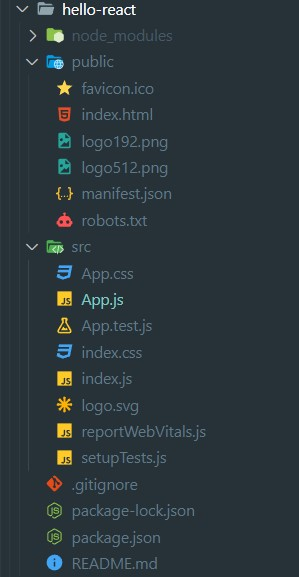
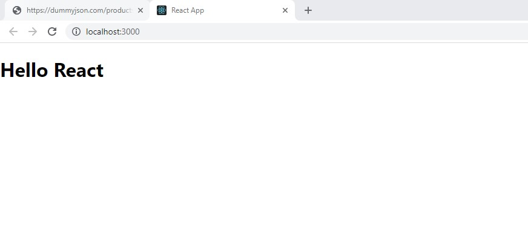
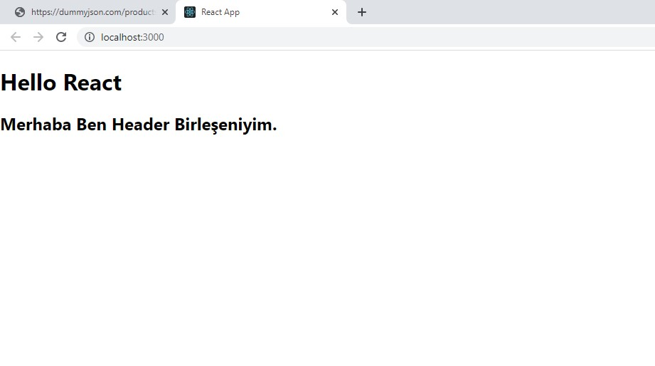

#         

# İÇİNDEKİLER

**---> Bu kısım, daha sonra güncellenecektir\_**

---

# 5. REACT JS DERSLERİ

## 5.1- React Nedir ve React Geliştirme Ortamının Hazırlanması

**React Js Nedir ?**
React _facebook_ ekibi tarafından geliştirilmiş ve kullanıma sunulmuş bir javascript kütüphanesidir. Oldukça popüler bir kütüphane olmasından dolayı kullanımı çok yaygındır. Açık kaynak kodlu, bileşen bazlı ve front-end bir kütüphane olan React, sadece uygulamanın görünüm katmanından sorumludur.  
React resmi web sitesi : **https://reactjs.org**

**React Geliştirme Ortamının Hazırlanması**  
React kullanmaya başlamadan önce bazı kurulumları tamamlamamız gerekir.

- Öncelikle _Node.js_ kurulumunu yapmalıyız. **https://nodejs.org/en/** sitesinden bize uygun olan kurulumu seçerek bilgisayarımıza kuralım.
  Yükleme işlemi tamalandıktan sonra bilgisayarımızda **"command"** (komut satırı) yada **PowerShell** gibi bir terminal ekranından yada vs code üzerinde termanlden kurulumun tamamlanıp tamalanmadığını kontrol edebiliriz.
- Olmazsa olmaz editörümüz ise _visual studio code_ editörüdür. Bu editörüde **https://code.visualstudio.com** adresinden indirerek bilgisayarımıza kuralım.

**Real Dom / Virtual DOM**

Öncelikle DOM nedir? Bundan biraz bahsedelim. **DOM (Document Object Model);** **HTML,XML** gibi gibi belgelerin programlama dilleri ve script dilleriyle iletişim kurabilmesi için geliştirilmiştir.  
**Virtual DOM,** real (gerçek) DOM'un bellekteki kopyasıdır.Bellekte aynı anda hem real DOM hem de Virtual DOM bulunur. React her component’in state değişikliğinde real DOM’u render etmek yerine, Virtual DOM’a yansıtır. Virtual DOM ile güncellenmesi gereken kısınlar sadece render edilerek değişiklikler real DOM'a yansıtılır. Böylece gereksiz yere tüm sayfanın render edilmesinin de önüne geçilmiş olur.

## 5.1- Bir Node.js Projesi oluşturma

İşlem basamaklarıaşağıdaki gibidir. Visual Studio Code terminal ekranımızdan aşağıdaki komut adımlarını uygulayarak projemizi oluşturalım.

- Öncelikle projemizi oluşturacağımız klasöre terminlimizde konumlanmamız gerekiyor.
  ```
  cd [konumlanılacak_klasor_yolu]  // şeklinde yolumuzu belirtiyoruz.
  ```
- _npm init_ ile proje oluşturma işlemi başlatılır.
- Sırası ile bizden istediği bilgileri rirerek projenin oluştuulması aşaması tamamlanır.

  ```
  packace name: [istenilen_isim]
  decription:  // tanımlama girmek istersek yazalım ismemezsek 'enter' a basarak geçelim
  entry point : (index.js) // başlangış dosyasını belirtiyoruz.
  git repository :  // bir repomuz var ise burada belirtiyoruz, yoksa boş geçiyoruz
  keywords:  // proje arandığında hangi keyword lerle erişilebilsin diye burada istersek belirtiyoruz.
  licanse: (ISC)  // lisans seçimi yapabiliriz.
  {
    "name": "learning-node",
    "version": "1.0.0",
    "description": "patika.dev",
    "main": "index.js",
    "type": "module",
    "scripts": {
      "start": "node index"
    },
    "author": "ziyacaylan",
    "license": "ISC"
    }
    Is this OK ? (Yes)   // yukarıdaki json dosyasını bize lisans seçiminden sonra üretir ve sonunda herşey yolundamı gibi bir soru ile işlem tamamlanır.
  ```

## 5.2- React Uygulaması Oluşturma

Öncelikle _react_ ile proje oluşturmadan önce yukarıda da değindiğimiz gibi node.js bilgisayarımızda yüklü (react geliştirme ortamının hazır olması) olması gerekmektedir. React baştan sona aşamalı olarak kullanılabilecek şekilde tasarlanmıştır. Yani ihtiyacımıza göre kullanmak mümkündür.(İstediğimiz kısımları kurup çalıştırabiliriz.)

- create-react-app komutu ile hızlı bir şekilde bir proje oluşturmak mümkündür.
  Terminal ekranında projeyi oluşturacağımız dizine fokus olduktan sonra aşağıdaki komutu çalıştırıp bizim için projenin oluşturulmasını bekleriz.

```
npx create-react-app [proje_ismi]  // proje_ismi yazan bölüme projemizin ismini yazarak projenin oluşturulmasına başlanır. Bu işlem kısa bir süre sürecektir.
```

- Kurulum tamalandığında proje klasörümüz içerisine fokus olalım.

```
cd [proje_ismi]  // proje isiminin olduğu klasörün içerisine girdik.
```

- *npm start*komutu ile oluşturduğumuz projemizi çalıştırırız. Çalışma tamamlandığında browserda ilk ekrnımız bizi karşılayacaktır.
  Konsolda proje çalıştığında aşağıdaki çıktıyı alacağız.

```
Compiled successfully!

You can now view hello-react in the browser.

  Local:            http://localhost:3000
  On Your Network:  http://192.168.1.35:3000

Note that the development build is not optimized.
To create a production build, use npm run build.

webpack compiled successfully
```

Projenin klasöy yapısı aşağıdaki gibi olacaktır.



**Proje Yapımızı biraz tanıyalım**

- _node_modules_ klasörü bizim bağımlılıklarımızın olduğu bir klasördür. İhtiyaç duyduğumuz bağımlılıklarımızı yüklediğimizde bu klasör altında toplanacaktır.Proje _gitHob_' a yüklenirken genelde yüklenmez.
- _public_ klasörümüz ise build edildiğinde çıktının oluşacağı klasördür.
- _src_ klasörü ise işte bizim geliştirme ortamımızda kullanacağımız bolca işlem yapacağımız klasördür. Konular ilerledikçe içerisindeki dosyalara denineceğim.

Diğer dosyalara sırası geldikçe konu içerisinde bağsedeeğim.

## 5.3-Component Nedir?

Companenetler, uygulamamızı tekrar kullanılabilir parçalara ayırmamıza ve her parçayı ayrı ayrı dizayn etmemize izin veren yapılardır. Sitenizi büyük bir puzzle olarak düşünün. React ile önce teker teker puzzle parçalarını oluşturup ardından bunları birleştirerek büyük resmi oluşturacaksınız.

Componentler aslında fonksiyon gibi çalışır. Parametre gönderilebilir (bunları props diye adlandırıyoruz), yapacağı spesifik işlemi yapar ve ekranda neler görüneceğini açıklayan React elementleri return ile döndürürler.

**Component Oluşturmak/Kullanmak**
İlk kompanentimizi oluşturmadan önce projemizi oluşturduğumuzda gelen hazır yapımıza bir bakalım ve inceleyelim. Daha sonra ise kendi components klasörümüzü oluşturarak içerisinde kendi ilk kompanentimizi oluşturalım.

```
import logo from "./logo.svg";
import "./App.css";

function App() {
  return (
    <div className="App">
      <header className="App-header">
        
        <p>
          Edit <code>src/App.js</code> and save to reload.
        </p>
        <a
          className="App-link"
          href="https://reactjs.org"
          target="_blank"
          rel="noopener noreferrer"
        >
          Learn React
        </a>
      </header>
    </div>
  );
}

export default App;
```

_App.js_ dosyamızın içeriği yukarıdaki gibidir. Browser'ımız çalıştığında ekranda olan görüntüyü bize sunan yapı şu anda bu fonksiyondur.

```
import React from 'react';
import ReactDOM from 'react-dom/client';
import './index.css';
import App from './App';
import reportWebVitals from './reportWebVitals';

const root = ReactDOM.createRoot(document.getElementById('root'));
root.render(
  <React.StrictMode>
    <App />
  </React.StrictMode>
);

// If you want to start measuring performance in your app, pass a function
// to log results (for example: reportWebVitals(console.log))
// or send to an analytics endpoint. Learn more: https://bit.ly/CRA-vitals
reportWebVitals();
```

_index.js_ dosyamız içerisine import edilen _App.js_ ReactDOM ile sayfamızdaki ilgili element seçilip içerisinde metodumuz çalıştırılır. Yukarıdaki _index.js_ kodlarından da görüldüğü üzere _root_ _id_'si yakalanmış ve bu element içerisinde hazırlanan kompanent yerleştirilmiştir. Şimdilik bu kısımda herhangi bir işimiz yoktur.  
Önce _App.js_ içerisindeki bu fonksiyonu silerek kendimiz yeniden yazalım ve browser'ımız üzerinde değişiklikleri gözlemleyelim.

```
import "./App.css";

import Header from "./components/Header";

function App() {
  return (
    <div>
      <h1>Hello React</h1>
    </div>
  );
}

export default App;
```

Browserımızdaki çıktı :  


**Şimdi ise kendi componentimizi oluşturalım :**

- önce componenetlerimizi tutacağımız bir _components_ isimli klasör ekleyelim ve içerisine örnek olarak _Header.js_ isimli bir dosya ekleyelim. Bu dosya içerisinde kendi fonksiyonumuzu yazalım ve bu fonksiyonu dışarıya export etmeyi unutmayalım.

```
function Header() {
  return (
    <div>
      <h2>Merhaba Ben Header Birleşeniyim.</h2>
    </div>
  );
}

export default Header;
```

Atık komponentimiz hazır ve bunu _App.js_ içerisine import ederek kullanabiliriz.

```
import "./App.css";

import Header from "./components/Header";

function App() {
  return (
    <div>
      <h1>Hello React</h1>
      <Header></Header>
    </div>
  );
}

export default App;
```

Ekran çıktımız :  

