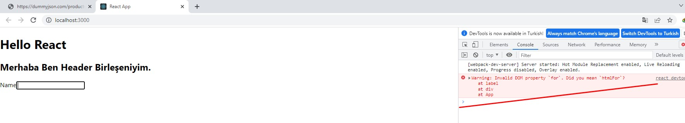

#         

# İÇİNDEKİLER

**---> Bu kısım, daha sonra güncellenecektir\_**

---

# 5. REACT JS DERSLERİ

## 5.1- React Nedir ve React Geliştirme Ortamının Hazırlanması

**React Js Nedir ?**
React _facebook_ ekibi tarafından geliştirilmiş ve kullanıma sunulmuş bir javascript kütüphanesidir. Oldukça popüler bir kütüphane olmasından dolayı kullanımı çok yaygındır. Açık kaynak kodlu, bileşen bazlı ve front-end bir kütüphane olan React, sadece uygulamanın görünüm katmanından sorumludur.  
React resmi web sitesi : **https://reactjs.org**

**React Geliştirme Ortamının Hazırlanması**  
React kullanmaya başlamadan önce bazı kurulumları tamamlamamız gerekir.

- Öncelikle _Node.js_ kurulumunu yapmalıyız. **https://nodejs.org/en/** sitesinden bize uygun olan kurulumu seçerek bilgisayarımıza kuralım.
  Yükleme işlemi tamalandıktan sonra bilgisayarımızda **"command"** (komut satırı) yada **PowerShell** gibi bir terminal ekranından yada vs code üzerinde termanlden kurulumun tamamlanıp tamalanmadığını kontrol edebiliriz.
- Olmazsa olmaz editörümüz ise _visual studio code_ editörüdür. Bu editörüde **https://code.visualstudio.com** adresinden indirerek bilgisayarımıza kuralım.

**Real Dom / Virtual DOM**

Öncelikle DOM nedir? Bundan biraz bahsedelim. **DOM (Document Object Model);** **HTML,XML** gibi gibi belgelerin programlama dilleri ve script dilleriyle iletişim kurabilmesi için geliştirilmiştir.  
**Virtual DOM,** real (gerçek) DOM'un bellekteki kopyasıdır.Bellekte aynı anda hem real DOM hem de Virtual DOM bulunur. React her component’in state değişikliğinde real DOM’u render etmek yerine, Virtual DOM’a yansıtır. Virtual DOM ile güncellenmesi gereken kısınlar sadece render edilerek değişiklikler real DOM'a yansıtılır. Böylece gereksiz yere tüm sayfanın render edilmesinin de önüne geçilmiş olur.

## 5.1- Bir Node.js Projesi oluşturma

İşlem basamaklarıaşağıdaki gibidir. Visual Studio Code terminal ekranımızdan aşağıdaki komut adımlarını uygulayarak projemizi oluşturalım.

- Öncelikle projemizi oluşturacağımız klasöre terminlimizde konumlanmamız gerekiyor.
  ```
  cd [konumlanılacak_klasor_yolu]  // şeklinde yolumuzu belirtiyoruz.
  ```
- _npm init_ ile proje oluşturma işlemi başlatılır.
- Sırası ile bizden istediği bilgileri rirerek projenin oluştuulması aşaması tamamlanır.

  ```
  packace name: [istenilen_isim]
  decription:  // tanımlama girmek istersek yazalım ismemezsek 'enter' a basarak geçelim
  entry point : (index.js) // başlangış dosyasını belirtiyoruz.
  git repository :  // bir repomuz var ise burada belirtiyoruz, yoksa boş geçiyoruz
  keywords:  // proje arandığında hangi keyword lerle erişilebilsin diye burada istersek belirtiyoruz.
  licanse: (ISC)  // lisans seçimi yapabiliriz.
  {
    "name": "learning-node",
    "version": "1.0.0",
    "description": "patika.dev",
    "main": "index.js",
    "type": "module",
    "scripts": {
      "start": "node index"
    },
    "author": "ziyacaylan",
    "license": "ISC"
    }
    Is this OK ? (Yes)   // yukarıdaki json dosyasını bize lisans seçiminden sonra üretir ve sonunda herşey yolundamı gibi bir soru ile işlem tamamlanır.
  ```

## 5.2- React Uygulaması Oluşturma

Öncelikle _react_ ile proje oluşturmadan önce yukarıda da değindiğimiz gibi node.js bilgisayarımızda yüklü (react geliştirme ortamının hazır olması) olması gerekmektedir. React baştan sona aşamalı olarak kullanılabilecek şekilde tasarlanmıştır. Yani ihtiyacımıza göre kullanmak mümkündür.(İstediğimiz kısımları kurup çalıştırabiliriz.)

- create-react-app komutu ile hızlı bir şekilde bir proje oluşturmak mümkündür.
  Terminal ekranında projeyi oluşturacağımız dizine fokus olduktan sonra aşağıdaki komutu çalıştırıp bizim için projenin oluşturulmasını bekleriz.

```
npx create-react-app [proje_ismi]  // proje_ismi yazan bölüme projemizin ismini yazarak projenin oluşturulmasına başlanır. Bu işlem kısa bir süre sürecektir.
```

- Kurulum tamalandığında proje klasörümüz içerisine fokus olalım.

```
cd [proje_ismi]  // proje isiminin olduğu klasörün içerisine girdik.
```

- *npm start*komutu ile oluşturduğumuz projemizi çalıştırırız. Çalışma tamamlandığında browserda ilk ekrnımız bizi karşılayacaktır.
  Konsolda proje çalıştığında aşağıdaki çıktıyı alacağız.

```
Compiled successfully!

You can now view hello-react in the browser.

  Local:            http://localhost:3000
  On Your Network:  http://192.168.1.35:3000

Note that the development build is not optimized.
To create a production build, use npm run build.

webpack compiled successfully
```

Projenin klasöy yapısı aşağıdaki gibi olacaktır.


**Proje Yapımızı biraz tanıyalım**

- _node_modules_ klasörü bizim bağımlılıklarımızın olduğu bir klasördür. İhtiyaç duyduğumuz bağımlılıklarımızı yüklediğimizde bu klasör altında toplanacaktır.Proje _gitHob_' a yüklenirken genelde yüklenmez.
- _public_ klasörümüz ise build edildiğinde çıktının oluşacağı klasördür.
- _src_ klasörü ise işte bizim geliştirme ortamımızda kullanacağımız bolca işlem yapacağımız klasördür. Konular ilerledikçe içerisindeki dosyalara denineceğim.

Diğer dosyalara sırası geldikçe konu içerisinde bağsedeeğim.

## 5.3-Component Nedir?

Companenetler, uygulamamızı tekrar kullanılabilir parçalara ayırmamıza ve her parçayı ayrı ayrı dizayn etmemize izin veren yapılardır. Sitenizi büyük bir puzzle olarak düşünün. React ile önce teker teker puzzle parçalarını oluşturup ardından bunları birleştirerek büyük resmi oluşturacaksınız.

Componentler aslında fonksiyon gibi çalışır. Parametre gönderilebilir (bunları props diye adlandırıyoruz), yapacağı spesifik işlemi yapar ve ekranda neler görüneceğini açıklayan React elementleri return ile döndürürler.

**Component Oluşturmak/Kullanmak**
İlk kompanentimizi oluşturmadan önce projemizi oluşturduğumuzda gelen hazır yapımıza bir bakalım ve inceleyelim. Daha sonra ise kendi components klasörümüzü oluşturarak içerisinde kendi ilk kompanentimizi oluşturalım.

```
import logo from "./logo.svg";
import "./App.css";

function App() {
  return (
    <div className="App">
      <header className="App-header">
        
        <p>
          Edit <code>src/App.js</code> and save to reload.
        </p>
        <a
          className="App-link"
          href="https://reactjs.org"
          target="_blank"
          rel="noopener noreferrer"
        >
          Learn React
        </a>
      </header>
    </div>
  );
}

export default App;
```

_App.js_ dosyamızın içeriği yukarıdaki gibidir. Browser'ımız çalıştığında ekranda olan görüntüyü bize sunan yapı şu anda bu fonksiyondur.

```
import React from 'react';
import ReactDOM from 'react-dom/client';
import './index.css';
import App from './App';
import reportWebVitals from './reportWebVitals';

const root = ReactDOM.createRoot(document.getElementById('root'));
root.render(
  <React.StrictMode>
    <App />
  </React.StrictMode>
);

// If you want to start measuring performance in your app, pass a function
// to log results (for example: reportWebVitals(console.log))
// or send to an analytics endpoint. Learn more: https://bit.ly/CRA-vitals
reportWebVitals();
```

_index.js_ dosyamız içerisine import edilen _App.js_ ReactDOM ile sayfamızdaki ilgili element seçilip içerisinde metodumuz çalıştırılır. Yukarıdaki _index.js_ kodlarından da görüldüğü üzere _root_ _id_'si yakalanmış ve bu element içerisinde hazırlanan kompanent yerleştirilmiştir. Şimdilik bu kısımda herhangi bir işimiz yoktur.  
Önce _App.js_ içerisindeki bu fonksiyonu silerek kendimiz yeniden yazalım ve browser'ımız üzerinde değişiklikleri gözlemleyelim.

```
import "./App.css";

import Header from "./components/Header";

function App() {
  return (
    <div>
      <h1>Hello React</h1>
    </div>
  );
}

export default App;
```

Browserımızdaki çıktı :  


**Şimdi ise kendi componentimizi oluşturalım :**

- önce componenetlerimizi tutacağımız bir _components_ isimli klasör ekleyelim ve içerisine örnek olarak _Header.js_ isimli bir dosya ekleyelim. Bu dosya içerisinde kendi fonksiyonumuzu yazalım ve bu fonksiyonu dışarıya export etmeyi unutmayalım.

```
function Header() {
  return (
    <div>
      <h2>Merhaba Ben Header Birleşeniyim.</h2>
    </div>
  );
}

export default Header;
```

Atık komponentimiz hazır ve bunu _App.js_ içerisine import ederek kullanabiliriz.

```
import "./App.css";

import Header from "./components/Header";

function App() {
  return (
    <div>
      <h1>Hello React</h1>
      <Header></Header>
    </div>
  );
}

export default App;
```

Ekran çıktımız :  


**ANAHTAR NOTLAR:**

- Kompanenet içerisinde fonksiyon yazarken dikkat etmemiz gereken fonksiyon isminin büyük harf ile başlayarak yazılmasıdır. Bunun sebebi ise biz daha sonra _render_ ederken bazen yazmış olduğumuz kompaneneti render edeceğiz bazen ise bir html elementini render edeceğiz. Bunların karışmaması gerekmektedir. Bu kod yazım standartlarına uymamız gerekmektedir.
- Kompanenetimizin _render_ edilebilmesi için birde kapsayıcı bir elemana ihtiyacımız vardır.

```
import "./App.css";

import Header from "./components/Header";

function App() {
  return (
    <div>
      <h1>Hello React</h1>
      <Header></Header>
    </div>
  );
}

export default App;
```

Yukarıdaki kod satırında kapsayıcı eleman _div_ elementimizdir. Şayet kullanmak istemezsek alternatifleri de mevcuttur. İstersek boş bir element olarak (_<> </>_)
da kullanabiliriz. Ya da *React.Fragment*kullanabiliriz.

```
function App() {
  return (
    <>
      <h1>Hello React</h1>
      <Header></Header>
    </>
  );
}

```

- Elemntlerimizi oluşturuken Javascriptin özel tanımlı keyword'lerini kullanmamamız gerekir. Aşağıdaki kod bloğunda label'ın for attribut' ü yazılmıştır. html sayfası üzerinde _Name_'e tıkladığımızda _input_'a fokus oluyoruz ancak konsol ekranını incelediğimizde hata alırız.

```
import "./App.css";

import Header from "./components/Header";

function App() {
  return (
    <div>
      <h1>Hello React</h1>
      <Header></Header>
      <label for="my-input">
        Name
        <input id="my-input"></input>
      </label>
    </div>
  );
}

export default App;
```



Bu elemen içerisinde _for_ yerine _htmlFor_ attribute'ünün kullanmalıyız.

```
import "./App.css";

import Header from "./components/Header";

function App() {
  return (
    <div>
      <h1>Hello React</h1>
      <Header></Header>
      <label htmlFor="my-input">
        Name
        <input id="my-input"></input>
      </label>
    </div>
  );
}

export default App;
```

**Componentlerde Değişken Render Etmek**
Bunu örnek kodlarımız üzerinde inceleyelim ve uygulayalım. _App.js_ içerisnde tanımladığımız değişkenleri süslü parantezler içerisinde yada **Template literals**'ler içerisinde aşağıdaki gibi tnımlayarak kullanabiliriz.

```
import "./App.css";

import Header from "./components/Header";
const myName = "Ziya";
const mySurname = "Çaylan";
function App() {
  return (
    <>
      <h1>
        Merhaba, Benim Adım {myName} {mySurname}
      </h1>
      <hr />
      <h1>{`Merhaba, Benim Adım ${myName} ${mySurname}`}</h1>
    </>
  );
}

export default App;
```

**Koşullu Render İşlemi**

```
import "./App.css";

import Header from "./components/Header";
const myName = "Ziya";
const mySurname = "Çaylan";
const isLoggedIn = false;  // true olursa Merhaba, Benim Adım Ziya Çaylan, false olursa 'Giriş yapmadızın...' yazacaktır.
function App() {
  return (
    <>
      <h1>
        {isLoggedIn
          ? `Merhaba, Benim Adım ${myName} ${mySurname}`
          : "Giriş yapmadızın..."}
      </h1>
    </>
  );
}

export default App;
```

## 5.4-Props Nedir? Nasıl Kullanılır?

Oluşturacağımız komponenetlerde parametre geçmek isteyebiliriz.Props’lar , bir componentten başka bir componente veri aktarımı yapmamızı sağlar. Props’lar salt okunur (read-only) dir. Değiştirilemezler. Data; ana componentten alt componentlere geçerken alt componentler tarafından herhangi bir değişime uğramaz.

İlk oluşturduğumuz projemize **components** klasörüne bir _User_ componenti ekleyerek bunun üzerinde _props_'ları inceleyelim.  
**User.js** içeriğine fonksiyonumuzu yazalım ve dışarıdan göndereceğimiz _props_'ları alarak kullanalım.

```
const User = (props) => {
  return (
    <>
      <h1>
        {props.isLoggedIn
          ? `${props.name} ${props.surname}`
          : "Giriş yapmadınız..."}
      </h1>
    </>
  );
};

export default User;
```

Daha sonra ise bu componeneti App.js içerisine import ederek komponentimize props'ları gönderelim.

```
import "./App.css";
import User from "./components/User";

function App() {
  return (
    <>
      <User name="Ziya" surname={"ÇAYLAN"} isLoggedIn={true} />
    </>
  );
}

export default App;

```

Browserda projemizi çalıştırdığımızda _isLoggedIn=true_ gönderdiğimizde ekranda ismimizin yazdığını gözlemleyebilirsiniz. _Eğer isLoggedIn=false_ gönderir isek ekranda bu sefer _"Giriş yapmadınız..."_ yazacaktır. Komponente props göndermenin diğer bir şekli de aşağıda verilmiştir.

```
const User = ({ name, surname, isLoggedIn }) => {
  return <h1>{isLoggedIn ? `${name} ${surname}` : "Giriş yapmadınız..."}</h1>;
};

export default User;
```

Her defasında _props_ yazacağımıza süslü parantezler içerisinde gönderdiğimiz parametreleri yazabiliriz. Yazdığımız bu parametrelerin sıralı olmasına gerek yoktur. Karmaşık sıra ilede yazılabilir.

**Props olarak Bir Array Geçmek**  
Komponentimize prop olarakbir array geçmek istediğimizde bizden benzersiz bir _key_ bekleyecektir. Şimdi bunu aşağıdaki kodlarda inceleyelim.

```
import "./App.css";
import User from "./components/User";

//const friends =
function App() {
  return (
    <>
      <User
        name="Ziya"
        surname="ÇAYLAN"
        isLoggedIn={true}
        age={39}
        friends={[
          "Ali",
          "Veli",
          "Hasan",
          "Hüseyin",
          "Eda",
          "Seda",
          "Meda",
          "Canan",
        ]}
      />
    </>
  );
}

export default App;
```

Yukarıda _App.js_ dosyamozda _array_'imizi _prop_ olarak **User.js** komponenetimize geçtik. bizden beklediği keydeğerinide _index_ olarak verdik ve elementimizde kullandık. İnceleyiniz: Bu _key_ değeri mutlaka en dıştakı elemana verilmesi gereklidir.

```
const User = ({ name, surname, isLoggedIn, age, friends }) => {
  return (
    <>
      <h1>
        {isLoggedIn
          ? `Benim Adım : ${name} ve Soyadım : ${surname}, Yaşım : ${age}`
          : "Giriş yapmadınız..."}
      </h1>
      {friends.map((friend, index) => (
        <h3 key={index}>
          {" "}
          {index} - {friend}
        </h3>
      ))}
    </>
  );
};

export default User;
```

Yukarıda kullandığımız ve komponenetin bizden beklediği _key_ değeri illa _index_ olmak zorunda değildir. Bunun yerine benzersiz bir parametrede verebiliriz.

```
import "./App.css";
import User from "./components/User";

const friends = [
  { id: 1, fname: "Metin" },
  { id: 2, fname: "Ali" },
  { id: 3, fname: "Veli" },
  { id: 4, fname: "Emel" },
  { id: 5, fname: "Temel" },
  { id: 6, fname: "Kazım" },
];

function App() {
  return (
    <>
      <User
        name="Ziya"
        surname="ÇAYLAN"
        isLoggedIn={true}
        age={39}
        friends={friends}
      />
    </>
  );
}

export default App;
```

Yukarıdaki kod satırından da görüleceği üzere bu sefer _props_ olarak komponentimize _object_'ten oluaş bir _array_ gönderdik. Nu object içerisinde _id_ bizim kullanabileceğimiz benzersiz bir parametredir. Doylayısı ile index yerine bunu kullanabiliriz.

```
const User = ({ name, surname, isLoggedIn, age, friends }) => {
  return (
    <>
      <h1>
        {isLoggedIn
          ? `Benim Adım : ${name} ve Soyadım : ${surname}, Yaşım : ${age}`
          : "Giriş yapmadınız..."}
      </h1>
      {friends.map((friend) => (
        <h3 key={friend.id}>
          {friend.id} - {friend.fname}
        </h3>
      ))}
    </>
  );
};

export default User;
```

**Prop Types**  
Gönderdiğimiz _props_'ların tiplerini belirleyebileceğimiz araç _propTypes_'dır. Yazmış olduğumuz komponenti sadece biz kullanmayacağımızı düşünürsek; örneğin bir grup çalışması yapıyoruz ve bazı kısımları biz baılarınıise arkadaşlarımız geliştiriyor varsayalım. Gönderilecek props'ların tiplerini eğer baştan belirtir isek geliştirme aşamasında farklı bir geliştirici komponentimizi kullanırken yanlış tipte bir parametre kullanır ise hata vereektir. Böylece hatayı düzeltmek zorunda kalacağından hatalarınönüne de geçilmiş olur. Aşağıdaki kodları inceleyiniz.

```
import "./App.css";
import User from "./components/User";

const friends = [
  { id: 1, fname: "Metin" },
  { id: 2, fname: "Ali" },
  { id: 3, fname: "Veli" },
  { id: 4, fname: "Emel" },
  { id: 5, fname: "Temel" },
  { id: 6, fname: "Kazım" },
];

function App() {
  return (
    <>
      <User
        fname={123}
        surname="ÇAYLAN"
        isLoggedIn={true}
        age={39}
        friends={friends}
      />
    </>
  );
}

export default App;
```

Yukarıdaki kod satırında _fname_ **Number** olarak gönderilmiştir.

```
import PropTypes from "prop-types";

function User({ fname, surname, isLoggedIn, age, friends }) {
  return (
    <>
      <h1>
        {isLoggedIn
          ? `Benim Adım : ${fname} ve Soyadım : ${surname}, Yaşım : ${age}`
          : "Giriş yapmadınız..."}
      </h1>
      {friends.map((friend) => (
        <h3 key={friend.id}>
          {friend.id} - {friend.fname}
        </h3>
      ))}
    </>
  );
}

User.propTypes = {
  fname: PropTypes.string,
  surname: PropTypes.string,
  age: PropTypes.number,
  isLoggedIn: PropTypes.bool,
  friends: PropTypes.array,
};
export default User;
```

Yanlış yani _invalid_ gelen parametreden dolayı konsol ekranında görüntülenecek hata mesajı aşağıdaki gibi olacaktır.  


**Prop Types: isRequired**

Proptypes lerini belirtirken gönderilmesi zorunlu alanları da işaretleyebiliriz. Böylece paramatre olarak mutlaka gönderilmesi gerekecektir. Bu işlem için propsTypes'lar belirtilirken tipten sonra nokta koyarak _isRequired_ yazmamız yeterli olacaktır.

```
function User({ fname, surname, isLoggedIn, age, friends }) {
  return (
    <>
      <h1>
        {isLoggedIn
          ? `Benim Adım : ${fname} ve Soyadım : ${surname}, Yaşım : ${age}`
          : "Giriş yapmadınız..."}
      </h1>
      {friends.map((friend) => (
        <h3 key={friend.id}>
          {friend.id} - {friend.fname}
        </h3>
      ))}
    </>
  );
}

User.propTypes = {
  fname: PropTypes.string.isRequired,
  surname: PropTypes.string,
  age: PropTypes.number,
  isLoggedIn: PropTypes.bool,
  friends: PropTypes.array,
};
export default User;
```

**Prop Types: oneOfType**
Gönderilen parametreler içerisinde bazılarını yada duruma göre istenilen bazı parametreleri bir veri tipinde değilde birden fazla veri tipinde kabul edilebilir. Böyle bir durumda ise _oneOfType_ keyword'ünü kullanırız.

```
function User({ fname, surname, isLoggedIn, age, friends }) {
  return (
    <>
      <h1>
        {isLoggedIn
          ? `Benim Adım : ${fname} ve Soyadım : ${surname}, Yaşım : ${age}`
          : "Giriş yapmadınız..."}
      </h1>
      {friends.map((friend) => (
        <h3 key={friend.id}>
          {friend.id} - {friend.fname}
        </h3>
      ))}
    </>
  );
}

User.propTypes = {
  fname: PropTypes.string.isRequired,
  surname: PropTypes.string,
  age: PropTypes.oneOfType([PropTypes.string, PropTypes.number]),
  isLoggedIn: PropTypes.bool,
  friends: PropTypes.array,
};
export default User;
```

**Prop Types: shape**
Obje olarak gönderdiğimiz porps'larda shape adında bir özelliğimiz daha vardır. Örneğin obje olarak bir adres bilgisi props' u gönderelim. Objemizin _title_ ve _zicode_ isimli iki adet _key_ değeri olsun bait olarak. Bunlarında tiplerinin belirtilmesi gerektiğinde _shape_ özelliğini kullanırız.

```
import "./App.css";
import User from "./components/User";

const friends = [
  { id: 1, fname: "Metin" },
  { id: 2, fname: "Ali" },
  { id: 3, fname: "Veli" },
  { id: 4, fname: "Emel" },
  { id: 5, fname: "Temel" },
  { id: 6, fname: "Kazım" },
];

function App() {
  return (
    <>
      <User
        fname={1231}
        surname="ÇAYLAN"
        isLoggedIn={true}
        age={39}
        friends={friends}
        address={{ title: "Çekmeköy/İSTABUL", zipcode: 34660 }}
      />
    </>
  );
}

export default App;
```

```
import PropTypes from "prop-types";

function User({ fname, surname, isLoggedIn, age, friends, adress }) {
  return (
    <>
      <h1>
        {isLoggedIn
          ? `Benim Adım : ${fname} ve Soyadım : ${surname}, Yaşım : ${age}`
          : "Giriş yapmadınız..."}
      </h1>
      {friends.map((friend) => (
        <h3 key={friend.id}>
          {friend.id} - {friend.fname}
        </h3>
      ))}
    </>
  );
}

User.propTypes = {
  fname: PropTypes.string.isRequired,
  surname: PropTypes.string,
  age: PropTypes.oneOfType([PropTypes.string, PropTypes.number]),
  isLoggedIn: PropTypes.bool,
  friends: PropTypes.array,
  adress: PropTypes.shape({
    title: PropTypes.string,
    zipcode: PropTypes.number,
  }),
};
export default User;
```

**Default Props**
Herhangi bir tanım yapılmamışbir prop'a default bir değer atanabilir.

```
import "./App.css";
import User from "./components/User";

const friends = [
  { id: 1, fname: "Metin" },
  { id: 2, fname: "Ali" },
  { id: 3, fname: "Veli" },
  { id: 4, fname: "Emel" },
  { id: 5, fname: "Temel" },
  { id: 6, fname: "Kazım" },
];

function App() {
  return (
    <>
      <User
        fname={1231}
        surname="ÇAYLAN"
        age={39}
        friends={friends}
        address={{ title: "Çekmeköy/İSTABUL", zipcode: 34660 }}
      />
    </>
  );
}

export default App;
```

Yukarıdaki kod satırlarında _isLoggedIn_ değerinin gönderilmediğine dikkat ediniz. Aşağıdaki komponenet içeriğimizde default değer olarak bu parametreye _false_ atanmış ve yapılan kontroller ile erken _render_ işlemi gerçekleştirimiştir.

```
import PropTypes from "prop-types";

function User({ fname, surname, isLoggedIn, age, friends, adress }) {
  if (!isLoggedIn) {
    return <h2>Giriş yapmadınız...</h2>;
  }
  return (
    <>
      <h1>
        {isLoggedIn
          ? `Benim Adım : ${fname} ve Soyadım : ${surname}, Yaşım : ${age}`
          : "Giriş yapmadınız..."}
      </h1>
      {friends.map((friend) => (
        <h3 key={friend.id}>
          {friend.id} - {friend.fname}
        </h3>
      ))}
    </>
  );
}

User.propTypes = {
  fname: PropTypes.string.isRequired,
  surname: PropTypes.string,
  age: PropTypes.oneOfType([PropTypes.string, PropTypes.number]),
  isLoggedIn: PropTypes.bool,
  friends: PropTypes.array,
  adress: PropTypes.shape({
    title: PropTypes.string,
    zipcode: PropTypes.number,
  }),
};

User.defaultProps = {
  isLoggedIn: false,
};
export default User;
```

## 5.5-State Nedir? Nasıl Oluşturulur?

_State_, kabaca komponenetlerimiz değerinin değişip değişmediği tutan bir javascript objesidir diyebiliriz. Komponenetin herhangi bir anında değerinin değişme potansiyeli olan bir veri bir state olarak tanımlanır ve değeri değiştiği anda bu komponente yansıtılır.  
Bu tanımı daha iyi anlayabilmek için uygulama üzerinde görmeye çalışalım. Bir proje oluşturup bunun üzerinde anlatacağım.
Repo içerisinde _state-nedir_ adlı klasörün içerisine terminalden fokus olalım.  
Terminal Ekranına:

```
npx create-react-app .  // proje ismi kısmına nokta koyarsan yeni bir klasör içerisinde değilde fokus olduğu klasörün içerisine proje oluşturulacaktır.
```

Yukarıdaki komut ile projemizi oluşturduk. _App.js_ içerisinde _state_ kavramını inceleyeceğiz, bu nedenle komponentimizin default olarak içerisinde gelen verileri temizleyelim.

- Sayfamıza bir tane _h1_ etiketi ekleyelim içerisinde _"Benim adım : Ziya, Yaşım : 39"_ yazdıralım. Ve stateleri kullanarak isim ve yaş kısımlarını değiştirelim.
- Değiştirlem işlemi h1 elementimizin altına koyacağımız iki butona (buton-1: İsmi Değiştir, Buton-2: Yaşı Değiştir) tıklandığında gerçekleşecek.

```
import "./App.css";
import { useState } from "react";

function App() {
  const [name, setName] = useState("Ziya");
  const [age, setAge] = useState(35);

  return (
    <div className="App">
      <h1>
        Merhaba {name} Yaşım : {age}
      </h1>
      <button onClick={() => setName("Rüya")}>İsmi Değiştir</button>
      <button onClick={() => setAge(39)}>Yaşı Değiştir</button>
    </div>
  );
}

export default App;
```

**_useState_** kavramını öncelikle sayfamıza import ediyoruz.

```
import { useState } from "react";
```

fonksiyonumuz içerisine return işleminden öncesine state'imizi tanımlamamız gerekiyor. Bu kısımda köşeli parantezler içerisine ilk olarak parametre ismi verilir daha sonra ise bu parametreyi değiştirecek olan callback fonksiyon ismi yazılır. Burada fonksiyon ismi yazılırken genel yazım standardı dikkate alınarak yazılmaya özen gösterilmelidir. Yani değeri değşecek parametremiz bizim burada _name_ olduğundan _setName_ şeklinde **_camelCase_** kullanılarak isim yazılır. Bu bir kural değil genel yazım standartlarından gelen yazım şeklidir.  
[Projeyi linkten inceleyiniz.](./React-Dersleri/state-nedir/)

\***\*ANAHTAR NOT : \*\***
_State_' lerde veri tipi ne ise o veri tipinde atamayapmamız gerekmektedir. Yapılan en büyük hataların başında değiştirilecek veri tipine dikkat etmeden değişikliğe gitmeye çalışmak gelir.
İkinci en büyük hatalardan biri de state ile değişiklik yaparken mevcut verinin korunması gerektiği kısmıdır. Yani state ile durum güncellemesi yaparken şayet eski veri üzerine ilave yapılıyorsa bu verinin varlığı unutulmamalıdır. Aşağıdaki örnekte bu konuya değinilmiştir.

**Array States**
Bir array'i state ile değerlerini değiştirmek istersek bunu nasıl yapılacağını program üzerinde görelim.

```
import "./App.css";
import { useState } from "react";

function App() {
  const [name, setName] = useState("Ziya");
  const [age, setAge] = useState(35);
  const [friends, setFriends] = useState(["Emel", "Temel"]);

  return (
    <div className="App">
      <h1>
        Merhaba {name} Yaşım : {age}
      </h1>
      <button onClick={() => setName("Rüya")}>İsmi Değiştir</button>
      <button onClick={() => setAge(39)}>Yaşı Değiştir</button>
      <hr />
      <br />
      <br />
      <h2>Friends</h2>
      {friends.map((friend, index) => (
        <div key={index}>{friend}</div>
      ))}
      <button onClick={() => setFriends([...friends, "Ayşe", "Fatma"])}> // ... ile eski veri silinmeden eklemeler yapılmıştırk. ****DİKKAT****
        Yeni Arkadaşları Ekle
      </button>
    </div>
  );
}

export default App;
```

Yukarıdaki örnekte _friends_ arrayi için bir state oluşturulmuş ve içerisindeki array verisi üzerine eklemeler yapılmıştır. Ekleme yapılırken eski verinin kaybolmadığına dikkat ediniz.  
[Projeyi linkten inceleyiniz.](./React-Dersleri/state-nedir/)

**Object States**
Şimdide bir state'i object olarak belirleyip nasıl güncelleyebiliriz, nanüple edebiliriz ona bakalım.

```
import "./App.css";
import { useState } from "react";

function App() {
  const [name, setName] = useState("Ziya");
  const [age, setAge] = useState(35);
  const [friends, setFriends] = useState(["Emel", "Temel"]);
  const [address, setAddress] = useState({ city: "İstanbul", zipcode: 34660 });

  return (
    <div className="App">
      <h1>
        Merhaba {name} Yaşım : {age}
      </h1>
      <button onClick={() => setName("Rüya")}>İsmi Değiştir</button>
      <button onClick={() => setAge(39)}>Yaşı Değiştir</button>
      <hr />
      <br />
      <br />
      <h2>Friends</h2>
      {friends.map((friend, index) => (
        <div key={index}>{friend}</div>
      ))}
      <button onClick={() => setFriends([...friends, "Ayşe", "Fatma"])}>
        Yeni Arkadaşları Ekle
      </button>
      <hr />
      <br />
      <br />
      <h2>Address</h2>
      <h3>
        Adress : {address.city} / {address.zipcode}
      </h3>
      <button onClick={() => setAddress({ ...address, city: "Kastamonu" })}>
        Değişiklik Yap
      </button>
    </div>
  );
}

export default App;
```

Yukarıdaki kod satırında _object_ olarak tanımlanan _state_ içerisinde address _property_' si değiştirilmiştir. Değişiklik aynı kurallar çerçevesinde yapılmıştır.  
[Projeyi linkten inceleyiniz.](./React-Dersleri/state-nedir/)  
Şimdide bir sayaç uygulaması yaparak state kavramını pekiştirmeye çalışalım. Mevcut projemiz üzerine yeni bir komponenet ekleyerek bu komponenti düzenleyelim.

```
import { useState } from "react";

function Counter() {
  const [count, setCount] = useState(0);
  return (
    <div>
      <h1>{count}</h1>
      <button onClick={() => setCount(count + 1)}>Increase</button>
      <button onClick={() => setCount(count - 1)}>Decrease</button>
    </div>
  );
}

export default Counter;
```

Yukarıdaki kod satırlarında da görüldüğü gibi arttırma butonuna tıklandığında sayaç artmakta ve state sayacı yanı _<h1>_ etiketimizin içeriğini güncellemektedir. Azaltma butonuna basıldığında ise state'imiz değeri azaltmaktadır.

```
import React from "react";
import ReactDOM from "react-dom/client";
import "./index.css";
// import App from './App';
import Counter from "./components/Counter";
import reportWebVitals from "./reportWebVitals";

const root = ReactDOM.createRoot(document.getElementById("root"));
root.render(
  <React.StrictMode>
    <Counter />
  </React.StrictMode>
);

// If you want to start measuring performance in your app, pass a function
// to log results (for example: reportWebVitals(console.log))
// or send to an analytics endpoint. Learn more: https://bit.ly/CRA-vitals
reportWebVitals();
```

Hazırladığımız counter componentini bu sefer i*ndex.js* dosyası içerinde çalıştırdık. _App.js_ komponentini burada çağırma işlemini iptal ettiğimize dikkat ediniz.

State işlemini yapan fonksiyonumuzu herzaman element içerisinde yazmamıza gerek yoktur. İstersek bu fonksiyonu dışarıda da yazabilriz. Öyleki ilerleyen zamanlarda büyük projelerde çok fazla data ile çalışmak gerektiğinde işimizi kolaylaştırak yöntem tercih edilecektir.

```
import { useState } from "react";

function Counter() {
  const [count, setCount] = useState(0);

  const increase = () => {
    setCount(count + 1);
  };
  const decrease = () => {
    setCount(count - 1);
  };
  return (
    <div>
      <h1>{count}</h1>
      <button onClick={increase}>Increase</button>
      <button onClick={decrease}>Decrease</button>
    </div>
  );
}

export default Counter;
```

Yukarıda fonksiyonlar element içerisinde değilde dışarıda yazılmıştır. increase ve decrease fonksiyonlar elementin onClick özelliğine verilmiştir.

**Input için State Tanımı Yapmak**
Bu kısımda ise inputlar ile çalışırken state kavramını nasıl kullanabiliriz bunu ele alalım. Bunun için projemize _InputExample.js_ isimli bir komponent ekleyin _index.js_ altında bu komponentimizi çağıralım.

```
import { useState } from "react";

function InputExample() {
  const [name, setName] = useState("Ziya");
  const [surname, setSurname] = useState("ÇAYLAN");
  return (
    <div>
      <br />
      <br />
      Please enter your name
      <br />
      <input value={name} onChange={(event) => setName(event.target.value)} />
      <br />
      Please enter your surname
      <br />
      <input
        value={surname}
        onChange={(event) => setSurname(event.target.value)}
      />
      <br />
      <br />
      <br />
      {name} {surname}
    </div>
  );
}

export default InputExample;
```

Alıştırma olması açısından state işlemini yapanbu fonksiyonlarımızı bir de dışarıda yazalım.

```
import { useState } from "react";

function InputExample() {
  const [name, setName] = useState("Ziya");
  const [surname, setSurname] = useState("ÇAYLAN");

  const onChangeName = (event) => setName(event.target.value);
  const onChangeSurname = (event) => setSurname(event.target.value);
  return (
    <div>
      <br />
      <br />
      Please enter your name
      <br />
      <input value={name} onChange={onChangeName} />
      <br />
      Please enter your surname
      <br />
      <input value={surname} onChange={onChangeSurname} />
      <br />
      <br />
      <br />
      {name} {surname}
    </div>
  );
}

export default InputExample;

```

Yukarıdaki kodları biraz daha kısaltalım. Yazacağımız state fonksiyonu iki tane ve diyelimki bizim birçokinput v.s. form elementimiz olsun. Herbiri için fonksiyon yazmak maliyetli bir iş olacaktır. Bu durumda bir fonksiyon yazıp bu fonksiyon üzerinden state işlemini gerçekleştirmek mantıklı olacaktır.

```
import { useState } from "react";

function InputExample() {
  const [form, setForm] = useState({ name: "", surname: "" });

  const onChangeInput = (event) => {
    setForm({
      ...form,
      [event.target.name]: event.target.value,
      [event.target.surname]: event.target.value,
    });
  };
  return (
    <div>
      <br />
      <br />
      Please enter your name
      <br />
      <input name="name" value={form.name} onChange={onChangeInput} />
      <br />
      Please enter your surname
      <br />
      <input name="surname" value={form.surname} onChange={onChangeInput} />
      <br />
      <br />
      <br />
      {form.name} {form.surname}
    </div>
  );
}

export default InputExample;
```

Bir fonksiyon ile işi böylece tamamladık. Bu tarz kullanımda dikkat etmemiz gereken kısım inputların _name_'leri de atanmıştır. İlerleyen derslerimizde bu form işlemlerini daha kolay gerçekleştiren kütüphaneler anlatılacaktır. Ancak arka planın nasıl işlediğinin bilinmesi adına bu uygulamalar öen marz etmektedir.

## 5.6-Lifecycle

**useEffect**
React komponenetlerinin yaşam döngülerini ele alacağız. Yani bir komponenet güncellendiğinde, oluşturulduğunda yada kaldırıldığında durumlarını yakalayıp istersek işlem yapacağız. Proje üzerinde inceleyelim.

```
import "./App.css";
import { useState, useEffect } from "react";

function App() {
  const [number, setNumber] = useState(0);
  const [name, setName] = useState("Ziya");

  useEffect(() => {
    console.log("Component mount edildi.");
  }, []);

  useEffect(() => {
    console.log("Component mount edildi.");
  }, [number]);

  useEffect(() => {
    console.log("Component mount edildi.");
  }, [name]);

  return (
    <div className="App">
      <h1>increase number</h1>
      <h2>{number}</h2>
      <button onClick={() => setNumber(number + 1)}>Click</button>
      <hr />
      <h2>{name}</h2>
      <button onClick={() => setName("Ziya ÇAYLAN")}>Change the name</button>
    </div>
  );
}

export default App;
```

Yukarıdaki kodlarda da görüldüğü üzere yeni projemizin _App.js_ komponenti altında elementlerimizi ekleyip yaşam döngülerini inceleyelim.Burada elementin mount olduğu anda yani DOM üzerinde oluşturulduğu anı yine react altındaki bir _hook_ ile yakalayıp işlem yapabiliyoruz. _useState_' de olduğu gibi bu seferde _useEffect_ keywor'ünü kullanacağız.

```
useEffect(() => {
    console.log("Component mount edildi.");
  }, []);
```

Yukarıdaki kod satırı fonksiyonumuzda return işleminden önce yazılmalıdır. Bir üstteki kod penceresinden de gözlemleyiniz. Burada _useEffect_'leri oluştururken dikkat etmemiz gereken başka bir husus ise bir kontrole sokmamamızdır. Yani _if_ veya farklı bir kontrol içerisinde _useEffect_' i belirtemeyiz.  
useEffect içerisinde fonksiyonumuz yazıldıktan sonra, süslü parantezlerden sonra bir virgül konularak köşeli parantez yazılır. Köşeli parantez içerisinde bir değer belirtilmez ise bu sefer rayfa yüklendiğinde, elementler oluştuğunda fonksiyonumuz çalışacaktır. Yani her element mount olduğunda fonksiyonumuz bir kere çalışacaktır.

```
useEffect(() => {
    console.log("Component mount edildi.");
  }, [number]);
```

useEffect içerisinde bir değer belirtir isek bu defa sadece o elementi takip edecek ve staeinin durumunu yakalayacaktır.

**Component Unmount**
Komponenetlerin yaşam döngüsü bittiğindede aynewn mount edildiği andaki gibi yakalayabilir ve bu bilgiyi programımız içerisinde kullanabiliriz. Şimdi bu işlemi naıl yapıyoruz bir örnek program üzerinde incelemeye çalışalım.

- Projemize components dizini altına yeni bir Counter.js komponenti ekleyelim.
- _App.js_ içerisindeki counter elementimii buraya taşıyalım ve App componentimize sadece bir button ekleyelim.
  _App.js_ aşağıdaki gibi olacaktır.

```
import { useState } from "react";
import "./App.css";
import Counter from "./components/Counter.js";

function App() {
  const [isVisible, setVisible] = useState(true);
  return (
    <div className="App">
      {isVisible && <Counter />}
      <button onClick={() => setVisible(!isVisible)}>Toggle</button>
    </div>
  );
}

export default App;
```

_Counter.js_ komponentimizi ise aşağıdaki gibi düzenleyelim.

```
import { useState, useEffect } from "react";

function Counter() {
  const [number, setNumber] = useState(0);

  useEffect(() => {
    console.log("Component mount edildi.");
    const interval = setInterval(() => {
      setNumber((n) => n + 1);
    }, 1000);
    return () => clearInterval(interval);
  }, []);

  useEffect(() => {
    console.log("Component state güncellendi.");
  }, [number]);

  return (
    <div>
      <h1>increase number</h1>
      <h2>{number}</h2>
      <button onClick={() => setNumber(number + 1)}>Click</button>
    </div>
  );
}

export default Counter;
```

Olayımızı şu şekilde kurguladık. _setInterval_ metodumuzu kullanarak counter değerini her bir saniyede bir arttırıyoruz. Bu işlem için konsol ekranından elementin her seferinde render edilme işlemi takip edebiliriz. Aynı zamanda _App.js_ dosyamızdaki buton vasıtası ile visible/inVisible olayını takip edip elementin unmount olduğu anı gene konsol ekranından gözlemleyebiliriz.  
Aklımıza şu aşamada gelen soru şu _"Neden bir elementin unMount yani DOMdan kaldırılması işlemine ihtiyacımız olsun ?"_ Bu sorunun cevabını ise örnek olarak şu şekilde vermeye çalışalım. Diyelim ki bir butonumuz var ve mount olduğu anda bir data çekiyor ve biz bu datayı biyerlerde depoluyoruz. Ancak elementiunmount ettiğimizde bu işlemin yani data çekme işleminin de sonlandırılması gerekiyor olabilir. Tabi senaryoları çoğaltabiliriz. Bu veya benzeri durumlarda ihtiyaç duyabiliriz. Bunun için nasıl çalıştığını bilmemiz gerekmetedir.

## 5.7-Stillendirme Temelleri

Hazırlamakta olduğumuz komponentler içerisinde stillendirme yaparken; sıklıkla olmasa bazen inline-css kullanmak zorunda kalabiliriz. Böyle durumlarda aşağıdaki kurallara uyarak css kodu ekleyebiliriz.

- Komponenet içerisinde css kodu yazarken _stye=_ keyword'ünden sonra tırnak değil süslü parantez ({}) kullanmalıyız.
- Süslü parantez içerisinde css özelliklerimizi ise birobje olarak yazmamız gerekiyor. Yani süslü parantezler içerisine bir süslü parantez daha açıp bunun içerisine css kodlarımızı key-value şeklinde belirtmemiz gerekiyor.
- Bir diğer dikkat etmemiz gereken kural ise, örneğin _background-color_ verecek isek bu ifadeyi bu şekilde yazamayız. Sebebi ise javascriptte değilşekleri orta tire kullanarak tanımlayamamaktayız. Bunun yerine bu ifadeyi _camelCase_ kullanarak yazmak zorundayız. Öyleyse _backgroundColor_ şekilnde yazabiliriz. Aşağıda bu kurallara ilişkin örnek kod satırı verilmiştir.

```
function Header() {
  return (
    <div>
      <h2
        style={{
          backgroundColor: "#3f3f3f",
          color: "red",
          padding: "10px",
          borderRadius: "5px",
          textAlign: "center",
        }}
      >
        Merhaba Ben Header Birleşeniyim.
      </h2>
    </div>
  );
}

export default Header;

```

- Hazır olan bir css kütüphanesi ise kullanmak istersek bu şekilde tercih edilmese de css linkimizi aşağıdaki gibi _public_ klasörümüz altında yer alan _index.html_ altına ekleyerek de kullanabiliriz. Örneğin aşağıdaki kod satırında _bootstrap_ kütüpkanesi eklenmiştir.

```
<!DOCTYPE html>
<html lang="en">
  <head>
    <meta charset="utf-8" />
    <link rel="icon" href="%PUBLIC_URL%/favicon.ico" />
    <meta name="viewport" content="width=device-width, initial-scale=1" />
    <meta name="theme-color" content="#000000" />
    <meta
      name="description"
      content="Web site created using create-react-app"
    />
    <link
      rel="stylesheet"
      href="https://cdnjs.cloudflare.com/ajax/libs/bootstrap/5.2.1/css/bootstrap.min.css"
      integrity="sha512-siwe/oXMhSjGCwLn+scraPOWrJxHlUgMBMZXdPe2Tnk3I0x3ESCoLz7WZ5NTH6SZrywMY+PB1cjyqJ5jAluCOg=="
      crossorigin="anonymous"
      referrerpolicy="no-referrer"
    />

    <link rel="apple-touch-icon" href="%PUBLIC_URL%/logo192.png" />

    <link rel="manifest" href="%PUBLIC_URL%/manifest.json" />

    <title>React App</title>
  </head>
  <body>
    <noscript>You need to enable JavaScript to run this app.</noscript>
    <div id="root"></div>

  </body>
</html>
```

Sayfamıza bazı bootstrap elemanları ekleyelim.

```
import "./App.css";
import User from "./components/User";
import Header from "./components/Header";

const friends = [
  { id: 1, fname: "Metin" },
  { id: 2, fname: "Ali" },
  { id: 3, fname: "Veli" },
  { id: 4, fname: "Emel" },
  { id: 5, fname: "Temel" },
  { id: 6, fname: "Kazım" },
];

function App() {
  return (
    <>
      <User
        fname={1231}
        surname="ÇAYLAN"
        isLoggedIn={true}
        age={39}
        friends={friends}
        address={{ title: "Çekmeköy/İSTABUL", zipcode: 34660 }}
      />
      <Header />
      <button type="button" class="btn btn-primary ms-3 p-2 px-5 mt-5">
        Primary
      </button>
      <button type="button" class="btn btn-secondary ms-3 p-2 px-5 mt-5">
        Secondary
      </button>
      <button type="button" class="btn btn-success ms-3 p-2 px-5 mt-5">
        Success
      </button>
      <button type="button" class="btn btn-danger ms-3 p-2 px-5 mt-5">
        Danger
      </button>
      <button type="button" class="btn btn-warning ms-3 p-2 px-5 mt-5">
        Warning
      </button>
      <button type="button" class="btn btn-info ms-3 p-2 px-5 mt-5">
        Info
      </button>
      <button type="button" class="btn btn-light ms-3 p-2 px-5 mt-5">
        Light
      </button>
      <button type="button" class="btn btn-dark ms-3 p-2 px-5 mt-5">
        Dark
      </button>
    </>
  );
}

```

**Module CSS**

- komponentlerimiz içerisinde css dosyalarımızı yazarken isimlnedirme esnasında _module_ kavramını kullanmamız sayfalar içerisinde style atamaları yaparken yada isimlendirmelerde bizlere benzersiz stil isimleri oluşturur böylece olası css kod çakışmalarının da önüne geçilecektir.

**_style.module.css_**  
**_Header.module.css_**  
**Footer.module.css\_**  
yukarıdaki isimler örnek olarak yazılmıştır.

## 5.8-Fetching

**Native Fetch**

Bu kısımda daha önceki derslerde işlediğimiz fetch işlemlerini uygulama üzerinde fake bir APİ'dan data çekerek sayfamızda göstereceğiz. Fake Api olarak *https://jsonplaceholder.typicode.com/users* kullanacağız.

- Önce yeni bir proje oluşturalım.
- Komponent klasörünü oluşturup içerisine _Users.js_ komponentini oluşturalım ve bu komponentimizi _App.js_ içerisine ekleyelim.
- Verileri _fetch_ kullanarak çekelim ve sayfa üzerinde _users_'ların _name_'lerini gösterelim.

```
import { useEffect, useState } from "react";

function Users() {
  const [users, setUsers] = useState([]);
  const [isLoading, setIsLoading] = useState(true);
  useEffect(() => {
    fetch("https://jsonplaceholder.typicode.com/users")
      .then((response) => response.json())
      .then((users) => setUsers(users))
      .catch((e) => console.log(e))
      .finally(() => setIsLoading(false));
  }, []);
  return (
    <div>
      <h1>Users</h1>
      {isLoading && <h2>Loading...</h2>}
      {users.map((user) => {
        return <div key={user.id}>{user.name}</div>;
      })}
    </div>
  );
}

export default Users;
```

**Axios**
Yukarıdaki örnek içerisinde users komponentimizin alt tarafında *https://jsonplaceholder.typicode.com/posts* url'imizden ilgili post bilgilerini çekerek listeleyelim.

```
import { useState, useEffect } from "react";
import axios from "axios";

function UserPosts() {
  const [userPosts, setUserPosts] = useState([]);
  const [isLoading, setIsLoading] = useState(true);

  useEffect(() => {
    axios("https://jsonplaceholder.typicode.com/posts")
      .then((posts) => setUserPosts(posts.data))
      .catch((e) => console.log(e))
      .finally(() => setIsLoading(false));
  });
  return (
    <div>
      <h1>Posts</h1>
      {isLoading && <h2>Loading Posts...</h2>}
      {userPosts.map((post) => (
        <div key={post.id}> {post.title}</div>
      ))}
    </div>
  );
}

export default UserPosts;
```

[Örneği içerenprojeyi linkten inceleyebilirsiniz.](./React-Dersleri/fetching/)

## 5.9-Routing

Bu kütüphane birleşenleri kullanıldığında sayfalar arası gezinmeler oldukça kolaylaşmaktadır.React geliştiricileri arasında router kütüphanalerinden en çok kullanılanı React Router kütüpahanesindir. Bize etkin şekilde, sayfa yenilenmeden (refresh) diğer bir sayfaya geçmemiz konusunda yardımcı olan bu kütüphane, BrowserRouter, HashRouter, HistoryRouter, MemoryRouter, NativeRouter, Router ve StaticRouter vs. seçenekler ile gelmektedir.
Bu kütüphane ile birlikte gelen hook'ları hem açıklayalım hemde örnek üzerinde inceleyelim. İçerin _version 6_ için yapılmıştır.
**Kurulumu ve Örnek Üzerinde Açıklama**

**Örnek :** Örnek projemizin içeriği aşağıdaki gibi olacak.

- Sayfamızda üst kısımda bir navbarımız olacak Navbar üzerinde Home,About,Users ve Contact linklerimiz olsun
- Users lara tıkladığımızda fake api üzerinden 10 adet user bilgisi çekip isimlerini sayfa içerisinde listeleyelim.
- Listelediğimiz user bilgilerinden herhangi birine tıkladığımızda ise yan tarafta o kullanıcı ait bazı bilgileri listeleyelim.
- Tabi yukarıdaki işlemler yapılırken sayfanın yenilenmemesi, sadece ilgili kısımların yenilenmesi gerekli.
  İşte bu işlemler için react-router kullanacağız.

**_Route_**
Bu en önemli komponentlerden biridir. Görevi bir konum link ile eşleştiğinde bazı komponentleri arayüzde oluşturmaktır. Aşağıdaki kod satırını inceleyelim.

```
import { BrowserRouter, Routes, Route, NavLink, Link } from "react-router-dom";

<Routes>
        <Route path="/" element={<Home />} />
        <Route path="about" element={<About />} />
        <Route path="users" element={<Users />}>
          <Route path=":id" element={<User />} />
        </Route>
        <Route path="contact" element={<Contact />} />
        <Route path="*" element={<Page404 />} />
      </Routes>
```

Yukarıdaki kodlarımıza biraz açıklık getirelim. _path_ ile uyuglamanın konumu bidirilir. Eğer konum _/_ (_path="/"_) ise uygulama <Home /> sayfasına yönlenecektir.
_path="about"_ ise uygulammız <About /> sayfasını görüntüleyecektir. Tabi bu işlemler esnasında sayfamızın yenilenmediğini gözlemleyeceğiz.  
 Diyelim ki user listesindeki herhangi bir isme tıkladığımızda sayfa üzerinde bir bölümde ilgili kullanıcıya ait bize gelen bilgileri görüntüleyelim. Bunu farklı bir örnekle de şöyle düşünebiliriz. Diyelim ki bir blog üzerine tıkladığımızda sayfayı yenilemeden sadece o bloğa ait yorumları görmek istiyoruz. İşteböyle bir durumdada yukarıdaki örnekte de görüldüğü gibi bir yapı kullanmalıyız. Yukarıdaki örneğimizin üzerinden giderek aşağıdaki kısmı üzerinde açıklamaya çalışalım.

```
 <Route path="users" element={<Users />}>
   <Route path=":id" element={<User />} />
 </Route>
```

User bilgilerimizi aynı sayfa üzerinde görüntülemek için _Route_ elementimizi _<Route />_ şeklinde değilde _<Route></Route>_ şeklinde kapattığımıza dikkat ediniz... Ve içerisinde ise user komponenetimizi kullandığımızı görebilirsiniz. V6 ile gelen yapı üzerinde bu şekilde user komponenetimizi çağırabiliyoruz.

**_useParams_**
Bir url de bir parametre gönderdiğimizde bu hook'u kullanırız. Yukarıdaki kod bloğumuzda user komponenetini çağırırken komponente _id_ parametresini gönderdiğimizi görebilirsiniz. İlgili komponenet içerisinde parametre bu hook ile alınamaktadır. Aşağıdaki kod bloğunda user datası api üzerinden çekerken id değerine ihtiyaç duymaktadır ve bu parametre url ile gönderilmiş ve _let { id } = useParams();_ satırında alınarak kullanılmıştır.

**_Outlet_**
Bu hook sayfa içerinde linkimizi hakgi kısımda görüntüleyecek ise o kısımda bir element olarak kullanılır. Route' umuz tıklandığında örneğimizde user detayları hemen users'larımızın sağ tarafında görüntülenecek şekilde sayfa düzenlenmiştir.

```
import { Outlet, NavLink } from "react-router-dom";
import { useState, useEffect } from "react";
import axios from "axios";

let activeStyle = {
  color: "red",
};

export default function Users() {
  const [users, setUsers] = useState([]);
  const [isLoading, setIsLoading] = useState(true);

  useEffect(() => {
    axios("https://jsonplaceholder.typicode.com/users")
      .then((res) => setUsers(res.data))
      .catch((err) => console.log(err))
      .finally(() => setIsLoading(false));
  }, []);
  return (
    <div
      style={{
        marginLeft: "20px",
        paddingRight: "20px",
        display: "flex",
      }}
    >
      <div style={{ borderRight: "solid 2px" }}>
        <h1>Users</h1>
        {isLoading && <h3>Loading...</h3>}
        <ul>
          {users.map(
            (user) =>
              !isLoading && (
                <li>
                  <NavLink
                    style={({ isActive }) => {
                      return {
                        display: "block",
                        margin: "1rem 0",
                        color: isActive ? "red" : "",
                      };
                    }}
                    key={user.id}
                    to={`/users/${user.id}`}
                  >
                    {user.id}-{user.name}
                  </NavLink>
                </li>
              )
          )}
        </ul>
      </div>
      <Outlet />
    </div>
  );
}

```

_<Outlet />_ hook'umuz userslerin bittiği kısmın hemen altında yazıldığını göreceğiz. Çeşitli css ayarlamalarıda yapılarakuser detayları users isimlerinin hemen sağ tarafında görüntülenecektir.

```

import { useState, useEffect } from "react";
import { useParams, Link } from "react-router-dom";

export default function User() {
  let { id } = useParams();

  useEffect(() => {
    axios(`https://jsonplaceholder.typicode.com/users/${id}`)
      .then((response) => setUser(response.data))
      .catch((err) => console.log(err))
      .finally(() => setIsLoading(false));
  }, [id]);
  return (
    <div style={{ paddingLeft: "20px" }}>
      <h1>User Details</h1>
      {isLoading && <h4>Loading...</h4>}

      <br />

      <Link
        style={{ padding: "0 1rem" }}
        to={`/users/${
          parseInt(id) === 10 ? parseInt((id = 1)) : parseInt(id) + 1
        }`}
      >
        Next User- ({parseInt(id) + 1})
      </Link>
    </div>
  );
}

```

**_Link, NavLink_**
Bu iki hook'da aslında aynı işi yapmaktadır ancak NavLink kullandığımızda style bilgileri gibi bazı kısımlarda daha esnek bir kullanım bize sunmaktadır. Daha detaylı bilgi için dokümantasyonu inceleyebilirsiniz.

Şimdi bir proje oluşturup üzerinde inleyelim ve gözlemleyelim.

- Öncelikle projemizi oluşturalım.
- _npm install react-router-dom@6_ komutu ile projemiz oluşturulduğunda react touter ı yükleyerek projemize dahil edelim.
- _npm install axios_ komutu ile api'dan veri çekmek için kullanacağımız yapıyı projemize yükleyerek dahil edelim.
- Şimdi _src_ klasörü altında ilgili komponenetlerimizi oluşturalım.
- Navbar üzerindeki linklere tıkladığımızda ilgili sayfa yüklenip sayfa içeriği görüntülenir. Userslara tıkladığımızda fake api üzerinden gelen 10 adet user bilgisi gelecek ve name'leri sayfaya yüklenecektir. Users name'lerinden birine tıkladığımızda ise hemen yan tarafta user detay bilgilerinden bazı parametreleri listelenecektir.
- Sayfa üzerinde bulunmayan bir linke tıklandığında örneğin _http://localhost:3001/users/sdASDasdASD_ gibi bir link çağırılmaya çalışılsın. _user/_ kısmından sonraki kısım bulunmadığından bir _Page404_ sayfası projemize dahil edelim. Ve linki olmayan bir değer girerek gözlemleyelim.
  inceleyebilirsiniz.
  **Projemizi Aşağıdaki linkten **
  [Projeyi linkten inceleyiniz.](./React-Dersleri/Roting/routing)

    
  

## 5.10-Formik ile Form Yönetimi

Form işlemlerinin daha kolay yapıldığı bir kütüphanedir. Duruma göre dinamik oluşturulması, Doğrulama yapılması, Aynı formun bir kaç tane dolduran kontrolü, yetkilendirmesi gibi birçok durumu bulunabilir.  
 Formik veya benzeri çözümleri kullanmamızın bir diğer sebebi de, state kullanarak yaptığınız form kontrollerinde state her değiştiğinde component tekrardan render edilir. Formik kullanarak bunun önüne geçmiş oluyoruz.

İlk olarak kurulumile işe başlayalım. Projemizi oluşturduktan sonra kütüphaneyi kullanabilmek için projemize dahil etmemiz gerekiyor.

- **_npm install formik_** komutu ile kurulumu gerçekleştiriyoruz.
- İlk olarak dokümantasyonun bize verdiği örnekleri kullanarak biraz inceleyelim.

```
import React from 'react';
import ReactDOM from 'react-dom';
import { Formik, Field, Form } from 'formik';

const Basic = () => (
  <div>
    <h1>Sign Up</h1>
    <Formik
      initialValues={{
        firstName: '',
        lastName: '',
        email: '',
      }}
      onSubmit={async (values) => {
        await new Promise((r) => setTimeout(r, 500));
        alert(JSON.stringify(values, null, 2));
      }}
    >
      <Form>
        <label htmlFor="firstName">First Name</label>
        <Field id="firstName" name="firstName" placeholder="Enter name" />

        <label htmlFor="lastName">Last Name</label>
        <Field id="lastName" name="lastName" placeholder="Enter Lastname" />

        <label htmlFor="email">Email</label>
        <Field
          id="email"
          name="email"
          placeholder="Enter email"
          type="email"
        />
        <button type="submit">Submit</button>
      </Form>
    </Formik>
  </div>
);

ReactDOM.render(<Basic />, document.getElementById('root'));

```

Yukarıdaki kod bloğu formik dokümantasyonunun basic exaples kısmında bize verilmektedir. Bu kodu oluşturduğumuz projemizin _src_ klasörü altındaki _App.js_ dosyası içerisine kopyalayıp çalıştıralım. Aşağıdaki ekran görüntüsü bizi karşılayacaktır.


Kodları incelediğimizde formik kütüphanemizden gelen form kullanılmış ve içerisinde _Field_ isimli aslında normalde bizim _input_ yerine kullanılan bir element kullanıldığını görebiliriz. Normal form kullanımından çok farklı bir yapı olmadığını görebiliriz. Şimdi gelelim farklılıklarına; Hemen _Formik_ içerisinde _initialValues_ isimli bir hook içerisinde inputlarımızın default değerlerinin tanımlandığı görülmektedir. Burada dikkat etmemiz gereken husus _Field_ elementlerinin _name_'leri ile buradaki isimlerin aynı yazılmasıdır. Eğer farklı isimler girersek eşleşmeyeceği için value ataması yapılamayacaktır.

Bazı zamanlarda formik'i bu şekilde değilde üzerinde değişiklikler yaparak kullanmak zorunda kalabiliriz. Böyle durumlarda ise nasıl kullanabiliri biraz bunları inceleyelim. Akış sıralamamız aşağıdaki gibi olsun.

- Formiğin bize verdiği form yerine normal bir form kullanalım ve içerisinde input elementleri kullanalım. (Biz örnek olarak firstName,lastName ve mail kullanacağız. Dilerseniz siz değiştirebilir veya inputları çoğaltabilirsiniz.)
- Formiğin bize verdiği Form ve Field elementlerini kullanmamış olduk. Bu durumda formumuz submit olduğunda veri gönderebilmemiz için değişiklikler yapmalıyız.
- formumuz submit olduğunda çalışması için _onSubmit_ fonksiyonumuzun çalışmasını sağlamak için form'umuzu kesip bunun yerine bir arrow fonksiyon ekleyip formu fonksiyon içerisine ekleyerek return edelim.
- formun _onSubmit_ attribütüne ise bir fonksiyon ataması yapacağız. Bu durumda fonksiyonu az önce oluşturduğumuz arrow fonksiyon içerisinde süslü paranterler içerisinde parametre olarak alalım. Çalıştıracağımız fonksiyon yine formiğin bize sağladığı _handleSubmit_ fonksiyonudur.
- formumuza _onSubmit_ kısmına _handleSumbit_ fonksiyonumuzu ekledik ancak sumbit olduğunda inputlarımızın boş olarak gönderildiği gözlemleneektir. Bununda önüne geçebilmek için inputlarımıza, değişikliklerin eklenmesi için _onChange_ özelliklerine bir fonksiyon ekleyeceğiz. Bunun içinde Formik'in bize sağladığı _handleChange_ fonksiyonunu kullanacağız. Gene bunu arrow fonksiyonumuz içerisinde parametre olarak alıyoruz ve inputlarımızın _onChange_ özelliğine atama yapıyoruz. Böylece form submit olduğunda input içerikleride gönderilecektir.

```
import React from "react";
import "./index.css";
import { Formik } from "formik";

const Basic = () => {
  return (
    <div className="container">
      <h1>Sign Up</h1>
      <Formik
        initialValues={{
          firstName: "",
          lastName: "",
          email: "",
        }}
        onSubmit={(values) => {
          console.log(values);
        }}
      >
        {({ handleSubmit, handleChange }) => (
          <form onSubmit={handleSubmit}>
            <div>
              <label htmlFor="firstName">First Name</label>
            </div>
            <input
              name="firstName"
              onChange={handleChange}
              placeholder="Enter First Name"
            />
            <br />
            <br />
            <div>
              <label htmlFor="lastName">Last Name</label>
            </div>
            <input
              name="lastName"
              onChange={handleChange}
              placeholder="Enter Last Name"
            />
            <br />
            <br />
            <div>
              <label htmlFor="email">Email</label>
            </div>
            <input
              name="email"
              onChange={handleChange}
              placeholder="Enter Email"
              type="email"
            />
            <br />
            <br />
            <button type="submit">Submit</button>
          </form>
        )}
      </Formik>
    </div>
  );
};

export default Basic;

```

**Radio / Checkbox / Dropdown**
Formik ile radio/ checkbox ve dropdown nasıl kullanabiliriz birazda bunlara bakalım.

- Formumuza type'ı radio olan bir input ve bunun üstüne bir span tanımlayalım. Span içerisinde cinsiyet belirtelim.
- Aslında yukarıdaki yapıdan bir farkı bulunmadığını göreceksiniz. Şimdi _initialValues_ kısmında yeni eklediğimiz inputların tutulacağı parametreleritanımlayalım.
- Daha sonra eklediğimiz inputlarda değişikliklerialgılayacak _onChange_ özelliğini ve _checked_,_value_,_name_ parametrelerini verelim.
- Formun altına kolaylık olması açısından json formatında formun içerisindeki _values_ yani forma girilen verileri ekleyerek gözlemleyelim.

```
 <span>Male</span>
            <input
              type="radio"
              name="gender"
              value="male"
              onChange={handleChange}
              checked={values.gender === "male"}
            />
            <span>Female</span>
            <input
              type="radio"
              name="gender"
              value="female"
              onChange={handleChange}
              checked={values.gender === "female"}
            />
            <br />
            <br />
            <div>
              <input
                type="checkbox"
                name="hobies"
                value="Football"
                onChange={handleChange}
              />
              Football
            </div>
            <div>
              <input
                type="checkbox"
                name="hobies"
                value="Cinema"
                onChange={handleChange}
              />
              Cinema
            </div>
            <div>
              <input
                type="checkbox"
                name="hobies"
                value="Photography"
                onChange={handleChange}
              />
              Photography
            </div>
            <br />
            <br />
            <select
              name="country"
              value={values.country}
              onChange={handleChange}
            >
              <option value="turkey" hidden selected>
                Turkey
              </option>
              <option value="turkey">Turkey</option>
              <option value="england">England</option>
              <option value="usa">Usa</option>
            </select>
            <br />
            <br />
            <button type="submit">Submit</button>
            <br />
            <br />
            <code
              style={{
                display: "block",
                width: "400px",
                overflowWrap: "break-word",
                marginBottom: "20px",
              }}
            >
              {JSON.stringify(values)}
            </code>
```

**useFormik**
Yukarıdaki gibi _Formik_ komponentini revize edip normal elementleri kullanarak bir form oluşturduğumuzda işleri dahada kolay kurulabilir bir yapıya getirebiliri. İşte bunun için bize verilmiş olan _useFormik_ hook' unu kullanacağız.

```
import React from "react";
import "./index.css";
import { useFormik } from "formik";

const Basic = () => {
  const { handleSubmit, handleChange, values } = useFormik({
    initialValues: {
      firstName: "",
      lastName: "",
      email: "",
      gender: "male",
      hobies: [],
      country: "",
    },
    onSubmit: (values) => {
      //alert(JSON.stringify(values, null, 2));
      console.log(values);
    },
  });
  return (
    <div className="container">
      <h1>Sign Up</h1>
      <form onSubmit={handleSubmit}>
        <div>
          <label htmlFor="firstName">First Name</label>
        </div>
        <input
          name="firstName"
          onChange={handleChange}
          placeholder="Enter First Name"
        />
        <br />
        <br />
        <div>
          <label htmlFor="lastName">Last Name</label>
        </div>
        <input
          name="lastName"
          onChange={handleChange}
          placeholder="Enter Last Name"
        />
        <br />
        <br />
        <div>
          <label htmlFor="email">Email</label>
        </div>
        <input
          name="email"
          onChange={handleChange}
          placeholder="Enter Email"
          type="email"
        />
        <br />
        <br />
        <span>Male</span>
        <input
          type="radio"
          name="gender"
          value="male"
          onChange={handleChange}
          checked={values.gender === "male"}
        />
        <span>Female</span>
        <input
          type="radio"
          name="gender"
          value="female"
          onChange={handleChange}
          checked={values.gender === "female"}
        />
        <br />
        <br />
        <div>
          <input
            type="checkbox"
            name="hobies"
            value="Football"
            onChange={handleChange}
          />
          Football
        </div>
        <div>
          <input
            type="checkbox"
            name="hobies"
            value="Cinema"
            onChange={handleChange}
          />
          Cinema
        </div>
        <div>
          <input
            type="checkbox"
            name="hobies"
            value="Photography"
            onChange={handleChange}
          />
          Photography
        </div>
        <br />
        <br />
        <select
          name="country"
          defaultValue={values.country}
          onChange={handleChange}
        >
          <option value="turkey">Turkey</option>
          <option value="turkey">Turkey</option>
          <option value="england">England</option>
          <option value="usa">Usa</option>
        </select>
        <br />
        <br />
        <button type="submit">Submit</button>
        <br />
        <br />
        <code
          style={{
            display: "block",
            width: "400px",
            overflowWrap: "break-word",
            marginBottom: "20px",
          }}
        >
          {JSON.stringify(values)}
        </code>
      </form>
    </div>
  );
};

export default Basic;

```

Yukarıdaki kod bloğumuzdan da görüldüğü üzere bu hhok'u kullandığımızda formumuzu bir arrow foksiyon içerisinde oluşturmaya gerek kalmayacaktır. _useFormik_ hook'u içerisinde _initialValues_ değerlerimiz ve _onSubmit_ foknsiyonum tanımlarız. Böylece formumuz daha yalın bir hale bürünmüş olur.

**Form Validation**
Olmazsa olmazımız validasyon işlemleridir. Validasyon işlemleri için yup kütüphanesini kullanacağız. Bu iki kütüphane birlikte kullanarak işlemleri nasıl yapabiliriz bu kısmada bir bakalım. İşlem aşamalarımız aşağıdaki gibi olacak.

- Validasyon işlemleri için yup kütüphanesini kullanacağız.
- yup kütüphanesini yükleyelim.
  ```
  npm install -S yup // yup kütüphanesini yüklüyoruz.
  ```
- Daha sonra _components_ dizinimiz altına _validation_ dizini altına _validation.js_ dosyamızı oluşturuyoruz ve bu dosyamıza validasyonlarımızı ekleyeceğiz.
- oluşturduğumuz bu validasyon dosyamızı sonda export etmeyi unutmuyoruz.
- Oluşturduğumuz validasyon dosyamızı kullanacağımız dosya içerisine import etmeyi unutmuyoruz.
- Formumuz içerisinde kullandığımız komponentler için validasyon işlemlerimizi dokümantasyondan da yararlanarak hazırlıyoruz. (Örneğin: inputların doldurulması zorunluluğu (required), minimum karakter uzunluğu (min()), email olması (email()) v.s.)
- Validasyonları yazarken dikkat etmemiz gereken en önemli husus validasyon için kullandığımız parametre ismi ile values parametre isimleri mutlaka aynı olmalıdır. Aksi takdirde validasyon işlemi çalışmayacaktır.
- Validasyon işlemini kullanabilmek için _useFormik_ içerisinde _handleBlur_, _errors_, _touched_ proplarını almalıyız. Daha sonrainput'un _onBlur_ özelliğine _handleBlur_ atamasını yapmalıyız.
- Gelen error mesajları için inputumuzun altına bir div içerisinde mesajımızı yayımlayabiliriz. Ancak yayımlamadan önce bir error mesajı varmı, varsa göster ve inputa fokus olma işleminden sonra göstermesi için gerekli olan touched prop'umuzu kullanalım.
- Yukarıda yaptıklarımız ile validasyon tanımlama işlemlerini gerçekleştiriyoruz. Böylece belirlediğimiz validasyon işlemleri gerçekleşmeden formumuz submit olmayacaktır.

```
import * as yup from "yup";

let validations = yup.object().shape({
  firstName: yup
    .string()
    .min(3, "Adınız minimum 3 karakterden oluşmalıdır.")
    .required("Zorunlu alan, Adınızı boş geçemezsiniz..."),
  lastName: yup
    .string()
    .min(2, "Soyadınız minimum 2 karakterden oluşmalıdır...")
    .required("Zorunlu alan... Soyadınızı boş geçemezsiniz."),
  email: yup
    .string()
    .email("Geçerli bir email adresi giriniz...!")
    .required("Zorunlu alan...Email adresinizi boş geçemezsiniz."),
  password: yup
    .string()
    .min(5, "Parola minimum 5 karakterden oluşmalıdır.")
    .required("Zorunlu alan, parola boş geçilemez"),
  passwordConfirm: yup
    .string()
    .oneOf([yup.ref("password")], "Palolalar uyuşmuyor...!")
    .required("Zorunlu alan...Yukarıdaki girilen parolayı tekrar giriniz."),
  hobies: yup.array().length(2, "En az iki seçim yapmalısınız...!"),
  country: yup.string().required("Zorunlu alan...Şehir seçimi yapmalısınız"),
});

export default validations;

```

formumuz ise aşağıdaki gibi kodlanacaktır.

```
import React from "react";
import "./App.css";
import { useFormik, validateYupSchema } from "formik";

import validationSchema from "./components/validations";

const App = () => {
  const { handleSubmit, handleChange, handleBlur, values, errors, touched } =
    useFormik({
      initialValues: {
        firstName: "",
        lastName: "",
        email: "",
        password: "",
        passwordConfirm: "",
        gender: "male",
        hobies: [],
        country: "",
      },
      onSubmit: (values) => {
        //alert(JSON.stringify(values, null, 2));
        console.log(values);
      },
      validationSchema,
    });
  return (
    <div className="container">
      <h1>Sign Up</h1>
      <form onSubmit={handleSubmit}>
        <div>
          <label htmlFor="firstName">First Name</label>
        </div>
        <input
          name="firstName"
          onChange={handleChange}
          placeholder="Enter First Name"
          value={values.firstName}
          onBlur={handleBlur}
        />
        {errors.firstName && touched.firstName && (
          <div className="error">{errors.firstName}</div>
        )}
        <br />
        <br />
        <div>
          <label htmlFor="lastName">Last Name</label>
        </div>
        <input
          name="lastName"
          onChange={handleChange}
          placeholder="Enter Last Name"
          value={values.lastName}
          onBlur={handleBlur}
        />
        {errors.lastName && touched.lastName && (
          <div className="error">{errors.lastName}</div>
        )}
        <br />
        <br />
        <div>
          <label htmlFor="email">Email</label>
        </div>
        <input
          name="email"
          onChange={handleChange}
          placeholder="Enter Email"
          type="email"
          value={values.email}
          onBlur={handleBlur}
        />
        {errors.email && touched.email && (
          <div className="error">{errors.email}</div>
        )}
        <br />
        <br />
        <div>
          <label htmlFor="password">Password</label>
        </div>
        <input
          name="password"
          onChange={handleChange}
          placeholder="Enter Password"
          type="password"
          value={values.password}
          onBlur={handleBlur}
        />
        {errors.password && touched.password && (
          <div className="error">{errors.password}</div>
        )}
        <br />
        <br />
        <div>
          <label htmlFor="passwordConfirm">Password Confirm</label>
        </div>
        <input
          name="passwordConfirm"
          onChange={handleChange}
          placeholder="Enter Password"
          type="password"
          value={values.passwordConfirm}
          onBlur={handleBlur}
        />
        {errors.passwordConfirm && touched.passwordConfirm && (
          <div className="error">{errors.passwordConfirm}</div>
        )}
        <br />
        <br />
        <span>Male</span>
        <input
          type="radio"
          name="gender"
          value="male"
          onChange={handleChange}
          checked={values.gender === "male"}
        />
        <span>Female</span>
        <input
          type="radio"
          name="gender"
          value="female"
          onChange={handleChange}
          checked={values.gender === "female"}
        />
        <br />
        <br />
        <div>
          <input
            type="checkbox"
            name="hobies"
            value="Football"
            onChange={handleChange}
            onBlur={handleBlur}
          />
          Football
        </div>
        <div>
          <input
            type="checkbox"
            name="hobies"
            value="Cinema"
            onChange={handleChange}
            onBlur={handleBlur}
          />
          Cinema
        </div>
        <div>
          <input
            type="checkbox"
            name="hobies"
            value="Photography"
            onChange={handleChange}
            onBlur={handleBlur}
          />
          Photography
        </div>
        {errors.hobies && touched.hobies && (
          <div className="error">{errors.hobies}</div>
        )}
        <br />
        <br />
        <span style={{ paddingRight: "10px" }}>Ülke</span>
        <select
          name="country"
          defaultValue={values.country}
          onChange={handleChange}
          onBlur={handleBlur}
        >
          <option disabled value="">
            {" "}
            -- select an option --{" "}
          </option>
          <option value="turkey">Turkey</option>
          <option value="england">England</option>
          <option value="usa">Usa</option>
        </select>
        {errors.country && touched.country && (
          <div className="error">{errors.country}</div>
        )}
        <br />
        <br />
        <button type="submit">Submit</button>
        <br />
        <br />
        <code
          style={{
            display: "block",
            width: "400px",
            overflowWrap: "break-word",
            marginBottom: "20px",
          }}
        >
          {JSON.stringify(values)}
        </code>
      </form>
    </div>
  );
};

export default App;

```
